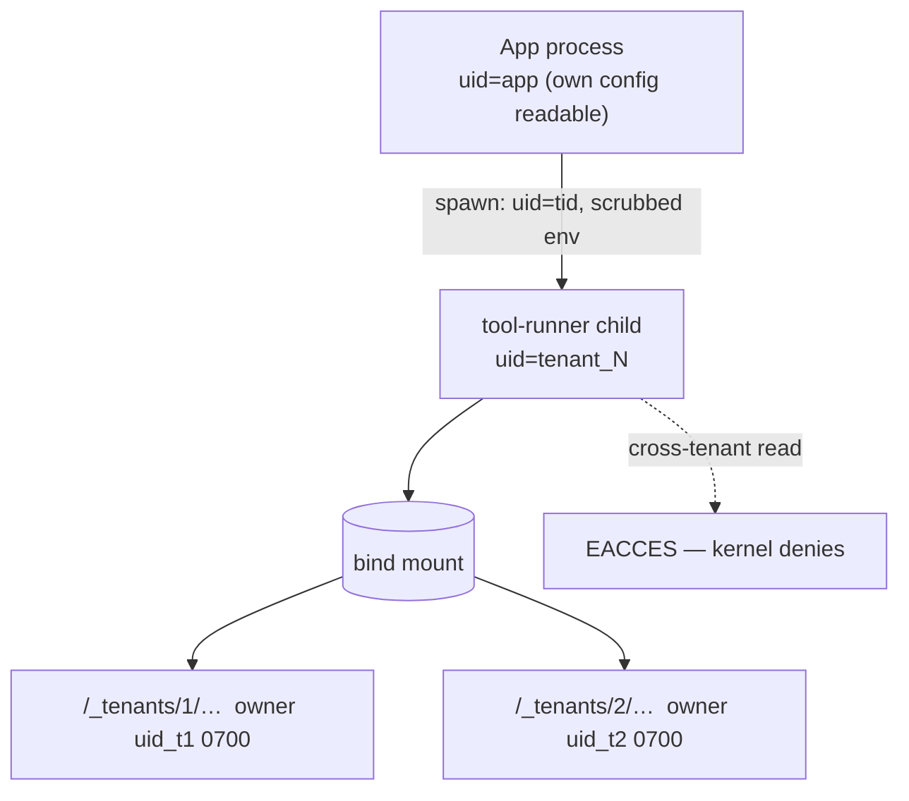

# ADR 0013: OS-level isolation for workspace execution

## Status

**Proposed.** Decision requested 2026-09-19; the direction chosen was
*"plan OS isolation"*. This ADR lays out the options and their costs. No code
has been written against it.

Companion reading: [`docs/security/rbac.md`](../security/rbac.md) §5 describes
the boundary layers as they exist today; [ADR
0009](0009-client-side-execution.md) covers client-vs-server workspace
execution, which this ADR does not change.

---

## 1. Context

### 1.1 What was fixed, and what that exposed

Commit `36f20bd` closed a path-containment hole in the nine `coding_*` file
tools. The root cause was Python's `Path.__truediv__`: it discards its left
operand when the right one is absolute, so `(root / rel).resolve()` was never
a boundary. Those tools now route through `resolve_in_workspace`.

Fixing the file tools made the remaining gap visible, because it turned out to
be much larger than the one that was closed.

### 1.2 Bash is not contained

`bash` guards its **`workdir` argument** with
`resolve_path_under_workspace` (`plugins/tools/workspace/lib/bash_policy.py:218-234`).
It says nothing about the command's own arguments. The blocklist
(`bash_policy.py:9-41`) is an accident-prevention list of destructive commands
(`rm -rf /`, `curl | sh`, `mkfs`, fork bombs).

Verified against the real tool, from inside a workspace:

```
'cat mine.txt'                  -> ok=True | 'mine'
'cat /etc/hostname'             -> ok=True | 'Gaming'      # escapes
'cat ../../../../etc/hostname'  -> ok=True | 'Gaming'      # escapes
'ls /etc | head -3'             -> blocked                 # pipes refused
```

Shell chaining is refused (one simple command per call, `shell=False`), which
removes convenience but not capability: a single `cat /absolute/path` is
enough.

### 1.3 There is no OS-level isolation to fall back on

Verified in this repo:

* `Dockerfile` has **no `USER` directive**;
* `scripts/alembic_entrypoint.sh:72` does `exec gosu "$HOST_UID:$HOST_GID"`
  — **one privilege drop for the entire process**;
* every tenant's workspaces live under **one bind mount**, owned by that one
  uid.

**File permissions therefore separate nothing between tenants.** Every
tenant's files are readable and writable by the same uid that runs the
application.

### 1.4 Why this is a tenant problem, not a directory problem

The instance now hosts multiple companies with delegated admins
(`docs/security/rbac.md` §12.3). A tool call that escapes the workspace is
not "a user reading a file they should not" — it is **company A's agent
reading company B's source code**, with no audit trail and no boundary. The
application-level check was the only boundary that existed, and for `bash` it
was absent.

### 1.5 Why an argument filter is not the answer

The tempting fix is to extend the blocklist to cover absolute paths and
`..` in arguments. It does not work, and a partial version is worse than
none because it reads as a control:

| Bypass shape | Example |
|---|---|
| Command substitution | `cat $(echo /etc/hostname)` |
| Environment expansion | `X=/etc/host; cat $Xname` |
| Interpreter one-liners | `python -c "print(open('/etc/hostname').read())"` |
| Any of ~200 installed binaries | `sed`, `awk`, `tail`, `dd`, `tar`, `git cat-file` … |
| Relative paths that are not `..` | a symlink created earlier inside the tree |
| `/proc/self/root/...`, `/proc/<pid>/cwd` | reachable without a literal `..` |

A boundary you can walk around is a warning label. **The kernel is the only
component in this stack that can enforce a filesystem boundary**, and it
currently has nothing to enforce with.

---

## 2. Decision drivers

1. **The boundary must be enforced by something that cannot be argued with.**
   Application code is inside the blast radius; the kernel is outside it.
2. **The boundary must be per-tenant, not per-workspace.** Within a tenant,
   users already share context by design. Across a tenant is the line that
   must not move.
3. **It must not depend on the application remembering to check.** Defence in
   depth means that if a future tool forgets its containment, the read still
   fails.
4. **It must survive the self-hosted reality.** One box, one Docker Compose,
   operated by one person. A design requiring Kubernetes is not deployable
   here.
5. **Cost must be honest.** This is comparable in size to the
   identity/membership split in ADR 0012 §5 (17–26 days). It should be
   presented that way, not as a config change.

---

## 3. Options

### Option A — Per-tenant uid, with a setuid runner *(recommended target)*

Each tenant gets a dedicated uid/gid. Workspace trees are `chown`ed to that
uid with mode `0700`. Every filesystem-touching tool execution happens in a
**child process that has switched to the tenant uid**.



**What it fixes.** Everything in §1. Even if every application-level check is
removed, a tenant-N process physically cannot read tenant M's tree. This also
makes the file-tool containment defence-in-depth rather than the sole
boundary, and it fixes the credential problem for tenant data.

**What it does not fix.**
* Reads of files the *app* uid can read but the tenant uid cannot — this is
  why the app must keep its own uid and only the runner switches. If the
  runner ran as the app uid, nothing is gained.
* Network egress. A confined process can still make outbound requests.
  Separate concern (egress proxy / network policy).
* Anything inside the tenant. Deliberate: the tenant is the boundary.

**The hard part, stated plainly.** A long-lived process cannot change uid
per-request — `os.setuid()` affects the whole process. So the switch must
happen in a child, and the child must be able to arrive at a different uid.
That requires one of:

| Mechanism | Trade-off |
|---|---|
| Runner binary with the **setuid bit**, owned by root | Classic; the runner's argv contract becomes a **new attack surface** and must itself be airtight (no shell, fixed argv, no env inheritance, validated uid) |
| App runs as **root** with `CAP_SETUID`/`CAP_SETGID` and forks+`setuid()` | Simpler control flow; makes the whole app privileged, which is a large regression in blast radius |
| A **long-lived per-tenant runner daemon**, each already running as its tenant uid | Cleanest security properties; adds N daemons, lifecycle, health, and an IPC layer |

The third is the best-shaped and the most work. The first is the smallest
change and puts the most weight on one small binary's input validation.

**Cost estimate: 10–18 working days.**

| Piece | Days |
|---|---|
| uid/gid allocation at tenant create; a durable tenant→uid map | 2–3 |
| `chown`/mode on workspace create, move, delete; backfill script for existing trees | 2–3 |
| The runner: spawn-as-uid, env scrubbing, cwd, timeout, exit/error mapping, no shell | 3–5 |
| Compose/image changes so the switch is possible without making the app root | 2–4 |
| Tests, including mutation (remove a check, confirm the kernel denies) | 1–3 |

**Deployment risk:** Docker bind mounts and uid mapping are the usual source
of pain. The host directory must permit the tenant uids to own files, and
recreating the container must not reset ownership. Prototype this first,
before committing to the design.

---

### Option B — One container per tenant

Each tenant runs in its own container, with its own uid namespace and its own
mount of only its own workspace subtree.

**What it fixes.** The strongest isolation available here. Also gives per-tenant
CPU/memory/disk limits and per-tenant restart, and contains network behaviour
far better than a uid split.

**Why it is probably the wrong first move.** It is not a filesystem change —
it is an orchestration change. The database stays shared, so the application
still needs every tenant predicate it has today; the container is an *added*
boundary, not a replacement. Per-tenant lifecycle (create, scale, update,
teardown, log routing, image pinning) is a permanent operational tax on a
single-box self-hosted instance.

**Cost estimate: 25–40 working days**, plus ongoing operational cost that never
goes away.

**When to prefer it:** if the requirement grows beyond "cannot read another
tenant's files" to "another tenant's load must not affect mine" or "each
tenant needs independent restart/upgrade". Not the current requirement.

---

### Option C — User namespaces per execution (`unshare -U`)

Spawn each tool execution in a fresh user namespace with only the tenant's
subtree mapped.

**What it fixes.** Roughly Option A's filesystem guarantee without allocating
system-wide uids, and without a setuid binary.

**What blocks it.** Requires **unprivileged user namespaces** enabled on the
host kernel. Many distributions and container runtimes disable them by
default, and Docker's default seccomp profile historically blocked
`unshare`. On a self-hosted box the operator may not control this, and a
design that silently degrades to "no isolation when the kernel says no" is
worse than an explicit one.

**Cost estimate: 8–14 working days** *if* the host supports it — plus a
support-matrix problem for every future deployment target.

**Verdict:** worth a one-hour spike to check host support. If
`unshare -Urm true` works in the container today, this becomes the cheapest
route to a real boundary and should be reconsidered as the primary. If it does
not, drop it.

---

### Option D — Confine `bash` to the external runtime *(recommended interim)*

The external-runtime path already exists and already validates its bound root
against `CODING_PATH_BLOCKLIST` before launching
(`chat_external_runtime.py:353`). The internal `bash` tool is the unguarded
surface.

**Change:** in a multi-tenant deployment, the internal `bash` tool refuses to
run and the caller is routed to the external runtime, which can be launched
per-workspace with its own root and its own uid.

**What it fixes.** Closes the escape for the surface that actually has the
capability — but only if the external runtime is itself isolated. **If the
external runtime runs as the same uid on the same host, this moves the hole
rather than closing it.** Its value is that it makes the isolation point
*single and explicit* — one launcher to harden, instead of an in-process tool
that shares the app's uid.

**What it does not fix.**
* The internal file tools remain app-level-contained only (acceptable — they
  are contained as of `36f20bd`, and they have no interpreter escape).
* Any future in-process tool that touches the filesystem.
* Deployments where the external runtime is disabled
  (`AGENT_EXTERNAL_RUNTIME_ENABLED=false`, the default) — there, disabling
  internal `bash` is a capability loss with no isolation gain.

**Cost estimate: 2–4 working days.**

**Verdict:** a genuine stopgap that buys time and concentrates the hardening
problem in one place. Not the answer on its own.

---

### Option E — Accept and document

Already done — `docs/security/rbac.md` §9 records the gap.

**When this is right:** if the deployment is single-tenant, or all tenants are
mutually trusted. Neither holds here — the instance hosts multiple companies
with delegated admins who are, correctly, treated as untrusted relative to
each other.

---

## 4. Comparison

| | A: per-tenant uid | B: container/tenant | C: userns | D: external runtime | E: accept |
|---|---|---|---|---|---|
| Kernel-enforced boundary | **Yes** | **Yes** | **Yes** | Only if the runtime is isolated | No |
| Survives a forgotten app check | **Yes** | **Yes** | **Yes** | Partially | No |
| Per-tenant resource limits | No | **Yes** | No | No | No |
| Single-box deployable | **Yes** | Heavy | **Yes** | **Yes** | **Yes** |
| New attack surface introduced | setuid runner argv | orchestration | kernel feature dependency | the launcher itself | the gap |
| Cost (days) | **10–18** | 25–40 | 8–14* | **2–4** | 0 |
| Kernel feature risk | No | No | **Yes** | No | No |

\* only if unprivileged user namespaces are available.

---

## 5. Decision

**Target: Option A (per-tenant uid), with Option D as the interim step.**

Rationale:

1. Option A is the only option that satisfies drivers 1–4 at a cost that is
   large but bounded. It makes the boundary a kernel fact, which is the only
   thing that survives a future developer forgetting a check.
2. Option B buys capability that is not currently required (resource
   isolation, independent restart) at roughly double the cost, and does not
   remove the need for any application-level tenant predicate.
3. Option C is strictly cheaper than A *if* the host allows it, so it should
   be tested before A is built — but it cannot be the plan while host support
   is unknown.
4. Option D is cheap enough to do now and improves the shape of the problem
   regardless of which final option is chosen, because it moves execution out
   of the application process.

**Sequencing:**

| Step | What | Days | Gate |
|---|---|---|---|
| 0 | Spike: does `unshare -Urm` work inside the current container? | 0.5 | If yes → re-evaluate C as primary before building A |
| 1 | Option D: internal `bash` refuses in multi-tenant; route to external runtime | 2–4 | Ships immediately; closes the live escape where a runtime exists |
| 2 | Spike: uid allocation + `chown` + bind-mount ownership survives a container recreate | 1–2 | **Hard gate.** If ownership does not survive, A is not viable as designed |
| 3 | Option A: the runner, per-tenant uid, tree ownership rules | 8–12 | Ships with mutation tests proving a removed app check still hits `EACCES` |
| 4 | Retire Option D's refusal once A holds | 0.5 | Only after step 3 is verified |

**Do not** start with the blocklist. Extending `bash_policy`'s denylist to
arguments is explicitly out of scope — §1.5 explains why it cannot hold, and a
half-version would read as a control while being bypassable.

---

## 6. Consequences

**Becomes possible**
* A tenant's data is unreadable by another tenant's code even if every
  application check is deleted.
* File-tool containment becomes defence-in-depth instead of the only wall.
* Tenant-scoped credential files stop being readable across tenants.
* A future in-process tool that forgets containment fails with `EACCES`
  instead of leaking.

**Becomes harder**
* Workspace create/move/delete must maintain ownership. A missed `chown`
  produces a permission error rather than a leak — fail-closed, which is the
  right direction, but noisier.
* Cross-tenant admin operations on files (a site_admin browsing any tree)
  need an explicit privileged path.
* Container recreate must preserve ownership; the operator runbook must say
  so.
* Debugging becomes uid-aware: "why can't it read this" gains a new answer.

**Explicitly not addressed by this ADR**
* **Network egress.** A uid-confined process can still exfiltrate. Needs an
  egress proxy or network policy — a separate decision.
* **Multi-membership** (a user in several tenants). Still ADR 0012 §5, still
  17–26 days, orthogonal to this.
* **Within-tenant isolation.** Deliberate: the tenant is the boundary.
* **The credential-read gap in the file tools** (`is_blocked_credential_path`
  is basename-only and write-only, `lib/common.py:130-141`). Option A fixes it
  for *tenant* data but not for a credential file placed inside the caller's
  own workspace. Separate, smaller fix.

---

## 7. Verification plan

The claim to prove is *"a tenant-N process cannot read tenant M's tree even
with all application checks removed"*. Not "the code looks right".

1. **Positive control.** Tenant A reads its own workspace — works.
2. **Cross-tenant read.** Tenant A's runner attempts `/…/_tenants/2/secret`
   → `EACCES`, not an application error.
3. **Mutation.** Delete `resolve_in_workspace` from a file tool entirely.
   Same-tenant read still works; cross-tenant still `EACCES`. **This is the
   test that proves the kernel is doing the work, not the Python.**
4. **Ownership survives a container recreate.** Recreate, re-run 1–3.
5. **Env scrubbing.** Confirm the runner child does not inherit the app's
   secrets.
6. **Fail-closed check.** A workspace with wrong ownership must produce a
   clear error, not a silent fallback to a privileged read.

---

## 8. Open questions for the operator

1. **Host kernel support** for unprivileged user namespaces (decides C vs A).
2. **Is per-tenant resource isolation wanted?** If yes, Option B moves up.
3. **Is the external runtime going to be deployed anyway?** If not, Option D
   delivers nothing and step 1 should be skipped.
4. **How many tenants is this instance realistically carrying?** Four today.
   A per-tenant uid scheme is fine at 4 and at 400; a per-tenant container is
   fine at 4 only if the operational tax is wanted.
5. **Acceptable downtime** for the ownership backfill on existing trees.
