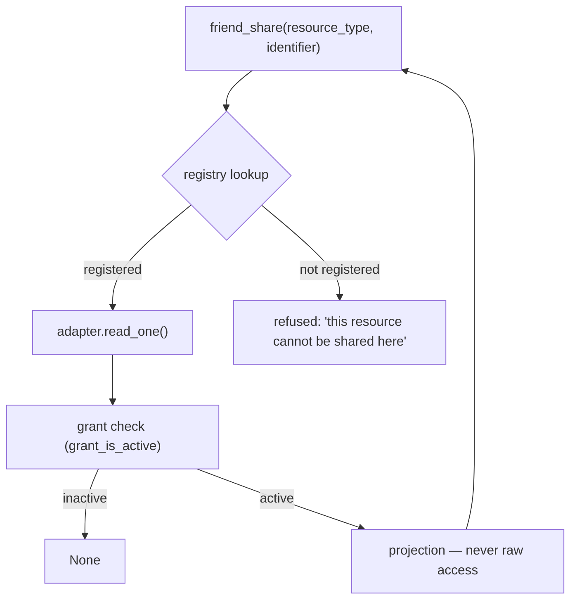
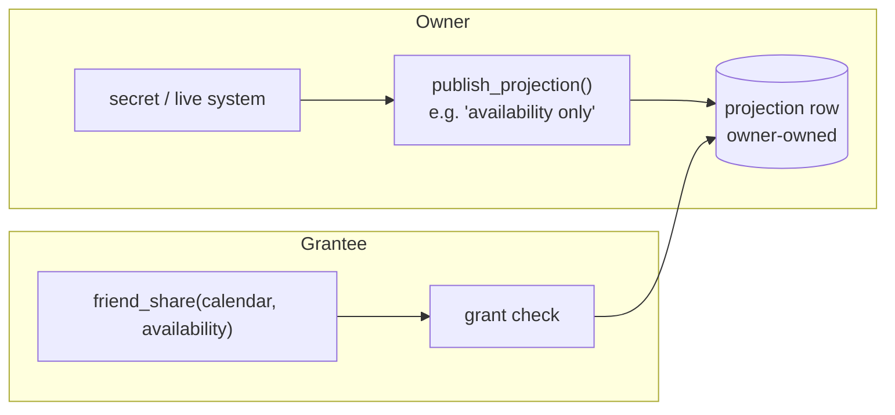

# ADR 0014: Generic resource-sharing adapters

## Status

**Proposed, partially implemented.** Raised 2026-09-20 as a design question,
not a change request.

Implemented so far:

- the always-deny collection grant (§1.3.1) — `15c2e58`
- the redirect bypass of the ICS SSRF guard (§1.6) — `b2bca1c`
- the calendar secret crossing, i.e. Principle 1 applied to the one path
  where it was violated (§1.7.1) — `ac6d4fa`
- **step 0**, the repeatable grant audit — `c9ced41`, see §7.1
- **steps 1–2**, the adapter protocol and registry wrapping the two
  working adapters without behaviour change — see §5.3
- **step 3**, per-type `policy_fields` enforced at write time — see §1.9.1
- **step 4**, the generic read action and the calendar as a thin alias —
  see §5.4. This also closed the `block_ids`-on-calendar gap early, which
  §1.9.1 had scheduled for step 7.
- **step 5**, the catalog and the share UI driven from the registry —
  see §5.5. This also retired the flat policy-field list the agent tool
  advertised, the open item §1.9.1 left behind.
- **step 6**, the projection contract: table, owner-chosen shape,
  freshness bound, revoke cascade — see §5.6. The calendar is the first
  real projection, so part of step 7 landed with this.

Not implemented: the rest of step 7 (the calendar's `publish_projection`
growing a refresh trigger beyond read-time) and step 8.

Companion reading: [ADR 0013](0013-os-level-workspace-isolation.md) covers
the *filesystem* boundary; this one covers the *peer-to-peer data* boundary.
[`docs/security/rbac.md`](../security/rbac.md) §12 covers delegated admin —
unrelated to friend sharing. The friend-system operator gate added in `a1020ee`
(`operator_settings.friend_system_enabled`) switches the whole subsystem on
or off and is orthogonal to everything below.

---

## 1. Context

### 1.1 The question

The instance can share several kinds of thing between two users. Each new kind
so far arrived with its own hand-written tool, its own checks, and its own
notion of what "shared" means. The question put was: **does adding friend
access to something new require another friend tool, or is there a generic
interface?**

The short answer, developed below: **one adapter per resource, one friend
tool forever.** The grant layer is already generic and should not change. What
is missing is the other half.

### 1.2 What is already generic, and good

`share_permissions` is a clean, uniform grant model:

```
(owner_user_id, grantee_user_id, resource_type, resource_identifier, policy)
```

Reads go through `share_permission_get` / `share_permission_check`
(`share_permissions_db.py`), writes through `share_permission_set`. The
`policy` dict carries the narrowing (`days_ahead`, `expires_at`,
`permission`, `block_ids`, `list_keys`), and `grant_is_active()`
(`domain/shares/policy.py`) is the single definition of "this grant still
counts" — revocation, expiry, all in one place.

**This half needs no work.** Do not replace it. Every option below keeps it.

### 1.3 The read side is missing or broken for most types

Seven resource types are declared as constants
(`infrastructure/db/share_permissions_db.py:19-25`). Verified by searching
every consumer in `apps/backend` and `plugins`, then **confirmed by running
the real code against a seeded database** (§7.1):

| Resource type | Reader that enforces the grant | Status |
|---|---|---|
| `dashboard` | `domain/shares/dashboard_grant.py:92` → `friend_dashboard_access_detail`, consumed at `dashboard_db.py:91`, `dashboard_persistence.py:74` | **Works** |
| `google_calendar` | grant check works; the read after it does not | **Broken** (§1.6, §1.7) |
| `collection` | enforced, but the enforcement always denied | **Was broken, fixed** (§1.3.1) |
| `github_activity` | none | **Grant does nothing** |
| `todoist` | none | **Grant does nothing** |
| `notes` | none | **Grant does nothing** |
| `roadmap` | none | **Grant does nothing** |

`github_activity`, `todoist` and `roadmap` appear in the backend **only** as
their own constant declarations and one docstring. `notes` appears only as
unrelated strings (delegate notes, a dashboard block prop, benchmark notes).

**Four of seven grant types are write-only.** A user can grant a friend access
to their roadmap; the grant is stored, listed in the UI as an active share,
and read by nothing.

`collection` is the instructive one. It *does* have an adapter
(`collection_grant.py:63` → `friend_collection_permission`, re-exported at
`collection_share_service.py:35`) — and that adapter has **no caller**. The
actual enforcement is a second, inline copy of the same logic in
`domain/collections/access.py`. Two implementations of the same grant check
for one resource, one of them dead.

#### 1.3.1 The collection grant always denied (found by live validation, fixed)

Both copies gated on a field the getter never returns:

```python
grant = share_permission_get(...)
if not grant or not grant.get("is_allowed"):
    return None
```

`share_permission_get` returns a **projection**, not the raw row. Its keys
are `owner_user_id`, `grantee_user_id`, `resource_type`,
`resource_identifier`, `policy`, `created_at`, `updated_at`. There is **no
`is_allowed`** and **no `revoked_at`**. So `grant.get("is_allowed")` was
always `None`, `not None` is always `True`, and **every friend collection
grant denied regardless of what was stored.**

Observed against the seeded database:

```
grant returned      : YES
keys in grant dict  : [created_at, grantee_user_id, owner_user_id, policy,
                      resource_identifier, resource_type, updated_at]
has is_allowed      : False
has revoked_at      : False
-> access_for_slug  : None
```

Why the dashboard path works and this one did not: the dashboard adapter reads
**raw DB rows** (`friend_dashboard_grant_rows` → keys include `is_allowed`
and `revoked_at`), while the collection paths read the getter's projection
and assumed the row's field names.

**Fixed** by dropping the phantom-field gate. `share_permission_get` already
filters `revoked_at IS NULL AND is_allowed = TRUE` in SQL and already applies
`grant_is_active` to the stored row before returning — so a returned grant is
active by contract and needs no re-check:

```python
if grant is None:
    return None
```

Applied at both sites (`access.py`, `collection_grant.py`); the now-unused
`grant_is_active` imports were removed.

**The second trap in the same line.** The removed block also read
`revoked_at=grant.get("revoked_at")` — also never present. Had the
`is_allowed` line been "fixed" by hardcoding `True`, the revocation check
would have silently become a no-op. It was harmless only because the SQL
already filters revoked rows; the trap itself was live for anyone editing
that line.

This is the same bug class as §1.7: **a field assumed from the getter's
contract that the getter does not provide.** Two of the seven resource types
hit it. That is the argument for Principle 2 (§5) in its most concrete form —
where per-type code hand-rolls its check against a shared getter, the drift is
invisible and the failure is silent.

Tests pinning this are in `tests/unit/test_friend_shares.py`
(`TestSharePermissionGetterShape`, `TestCollectionFriendGrantResolves`).
Four of them fail against the pre-fix code.

### 1.4 The write side is open on purpose — this ADR keeps it that way

`domain/shares/catalog.py` opens with:

> `"""Share resource type normalization — no hardcoded catalog of allowed types."""`

and `catalog_for_api()` returns `[]`. `canonical_resource_type()` validates
only the *shape* of a type id (`^[a-z0-9][a-z0-9_.-]{0,48}$`), not
membership of anything. Likewise `policy.py`:

> `# Same policy keys for every resource type — no per-type whitelist.`

So the type namespace is deliberately open, and any of five policy fields can
be set on any type. **This is a decision already made and this ADR does not
reverse it.** The registry proposed in §3 is *not* a whitelist of legal type
names. It is a manifest of **which types have a reader**. Those are
different things, and keeping the namespace open is what lets old grant rows
and legacy aliases keep working.

What must change is that "grantable" and "readable" stop diverging silently.
See §6.

### 1.5 The alias map is hand-grown

```python
SHARE_RESOURCE_ALIASES = {
    "google_calendar": ("calendar",),
    "dashboard":       ("board",),
    "collection":    ("pets", "haustier", "haustiere", "pet", "data"),
}
```

`collection` accepts five aliases, three of them German, one of which
(`data`) is so generic it could collide with any future type. This exists to
keep old rows readable. It works, and it is invisible: nothing tells a new
developer that `haustiere` is a share type, and nothing stops the next alias
making the collision real.

### 1.6 The credential problem (the actual crux)

The friend calendar path is the only place the question gets sharp, and it is
worth reading carefully because it decides the architecture.

`plugins/tools/integrations/friends/lib/common.py:128-135`:

```python
def friend_calendar_ics_url(friend_user_id: uuid.UUID) -> str | None:
    for service_key in CALENDAR_SECRET_KEYS:
        raw = db.user_secret_get_plaintext(friend_user_id, service_key)
        url = _parse_calendar_secret(raw)
        if url:
            return url
    return None
```

This reads **the friend's secret in plaintext**, in the **requester's** tool
execution, and hands the resulting URL to a fetch.

The Google "secret address in iCal format" is a **bearer credential**. Anyone
holding that URL can read the calendar until it is rotated — no
authentication, no scoping, no expiry, no audit. The architecture therefore
routes one person's bearer secret into another person's agent context. That
the current result dict happens not to echo the URL back is luck, not design.

There is a real SSRF guard on ICS URLs — `_url_host_safe()`
(`plugins/tools/personal/calendar/ics.py:86-109`) refuses non-http(s),
loopback, link-local, multicast, reserved, `localhost`, and the GCP metadata
host. Note where it lives: **inside `_ics_url_for_user()`**, i.e. it protects
the *own-user* path. A friend-path fetch that bypasses that function bypasses
the guard too.

### 1.7 The naive fix is worse than the bug

The friend tool currently delegates like this
(`plugins/tools/integrations/friends/calendar.py:100`):

```python
from plugins.tools.personal.calendar.ics import calendar_ics
```

**`calendar_ics` does not exist.** `ics.py` defines `list_events` (line 251)
and registers only `"list_events"` in `HANDLERS` (line 409). The import
raises `ImportError`, which the tool catches at line 126 and reports as
*"Calendar access granted but calendar parser is not available."*

The tempting fix — change the import to `list_events` — **produces a worse
bug.** `list_events` takes no URL argument. Its parameter schema is
`days_ahead`, `days_back`, `months_ahead`, `months_back`,
`include_by_month`. The URL comes exclusively from `_ics_url_for_user()`,
which calls `get_identity()` and reads **the calling user's** secret. So the
"fixed" friend calendar would silently return **the requester's own
calendar** labelled as the friend's.

That is the whole argument for this ADR in one line: a system with no
resource abstraction does not fail loudly when wired up wrong, it returns
**someone else's data with the right name on it**.

### 1.7.1 Resolved: the calendar secret no longer crosses

Principle 1 (§5) says an adapter returns a projection, not raw access. The
calendar path was the one place that violated it, and it is now the reference
implementation of the principle.

**What the boundary is.** Before writing anything the product intent was
checked rather than assumed: `ShareWidgetBlock.tsx` renders
`• {summary} — {start}` from the preview endpoint, so a friend's *event
titles are intended output*. Principle 1's prohibition is on
"a URL, a secret, a token, or a handle" — the credential, not the event
data. Stripping titles would have broken the widget while leaving the actual
exposure untouched. The fix therefore narrows to: **the ICS address must
never be a value the requesting side holds.**

**The change.** `plugins/tools/personal/calendar/ics.py` gained
`fetch_shared_calendar(owner_user_id, *, days_ahead)`. It resolves the
*owner's* own secret, applies `_url_host_safe`, fetches through the
per-hop redirect guard, and returns the event projection. The URL appears
nowhere in the result; only `source_hint` survives, a two-valued label
(`google_ical` / `ics_url`) that is not reversible into an address. The
fetch/parse/shape body was extracted into `_events_for_window()` and is
shared with `list_events`, so there is one fetch path, not two that can
drift.

`_resolve_ics_url(uid)` is the only function that reads a stored secret by
uid and deliberately applies **no** guard — its docstring says the caller
must guard. Both callers do.

**Dead code removed.** `friend_calendar_ics_url` and
`_parse_calendar_secret` are gone from
`plugins/tools/integrations/friends/lib/common.py`, along with their
re-exports from `lib/__init__.py` and the now-unused `CALENDAR_SECRET_KEYS`
and `json` imports. The module docstring records *why* there is no calendar
helper here, so nobody helpfully reintroduces one. Both call sites
(`friends/calendar.py`, `shares_api.py`) now import
`fetch_shared_calendar`; the `ImportError` branch that produced *"calendar
parser is not available"* is gone because the name resolves.

**The misleading test, and what it hid.** `tests/unit/test_friend_shares.py`
injected a fake `plugins.tools.personal.calendar.ics` module *providing*
`calendar_ics`. It asserted the policy-cap behaviour against a function the
real module never had, so it stayed green while every real call failed. It
now patches the real `fetch_shared_calendar` name. This is worth
generalising: **a test that stubs a symbol by name verifies the stub, not the
module.** Injecting a whole replacement module is the worst form of it,
because the replacement can be whatever the author assumed.

**Two gaps the live run caught that the unit tests missed.** Both are worth
recording because they are the reason §7 insists on running rather than
reading:

1. `source_hint` legitimately takes the literal string `"ics_url"` as its
   *value* for non-Google hosts. The unit assertion
   `assertNotIn("ics_url", blob)` passed only because its fixture URL
   pointed at `calendar.google.com` and produced `google_ical`. The check
   is now a recursive key scan against a credential-name set, plus a
   non-Google-host case so both label values are covered.
2. The unit tests never proved the adapter reads the *owner's encrypted*
   secret through the real decrypting getter. The fixture run does: it
   writes a real secret with the real encrypting upsert, spies on which uid
   the getter receives, and asserts the read targeted the owner and never
   the caller — the exact confusion §1.7 warns would produce "the
   requester's own calendar labelled as the friend's".

**Verified.** `tests/unit/test_shared_calendar_projection.py` (13 tests)
plus the seven new live checks in
`scripts/validate_friend_sharing_fixture.py` (32/32). Mutation-checked:
adding `| {"ics_url": url}` to the adapter's return fails the projection
test with the full secret visible in the failure text; replacing the owner
uid with `get_identity()` fails ten tests. Positive controls pass either
way by design.

### 1.8 The adapter shape already exists — twice

`dashboard_grant.py` and `collection_grant.py` are already adapters. Each
has:

* a `Protocol` naming its dependencies (`DashboardGrantDependencies`,
  `CollectionGrantDependencies`),
* a module-global injected `_deps` with a `register_*_grant_dependencies()`
  entry point, wired from infrastructure
  (`dashboards/dashboard_grant_service.py:88`,
  `collections/collection_share_service.py:32`),
* a single-item read that checks the grant and returns an access decision
  (`friend_dashboard_access_detail` → `DashboardAccessDetail(role,
  allowed_block_ids, granular_can_write)`),
* a list read that returns what the grantee can see
  (`list_friend_shared_dashboards`),
* a policy interpreter (`_access_from_policy`).

This is the contract. It was written twice, independently, and never named.
The recommendation in §5 derives from this existing code rather than
inventing a framework.

### 1.9 Policy fields are globally typed, locally honoured

`_ALLOWED_POLICY_FIELDS = {days_ahead, expires_at, permission, block_ids,
list_keys}` applies to every type. `block_ids` is a dashboard layout concept;
`list_keys` belongs to collections. Both can be set on a calendar grant,
where they are accepted and ignored.

The direction of this failure matters: the **owner** sets `block_ids` on a
calendar share believing they narrowed it. The system accepts the
restriction, nothing enforces it, and the owner's belief is wrong. That is a
**consent-precision** problem, not a cosmetic one.

`permission` has exactly two values, `view` and `edit`. There is no `manage`,
so a grant cannot express "you may add to my list but not delete my items" —
which is a thing users ask for.

#### 1.9.1 Resolved for registered types (step 3)

`normalize_policy` used to discard its `resource_type` argument
(`_ = resource_type`) and validate every type against the one global set.
It now asks the registry: a registered adapter's declared `policy_fields`
is authoritative and narrower, and a field outside it is a write-time
refusal naming the adapter as the authority —
`"policy field 'list_keys' is not allowed: the collection adapter does not
honour it"`.

**`list_keys` turned out to be worse than §1.9 described.** The section
above assumed `list_keys` "belongs to collections". It does not — nothing
anywhere reads it. Grepping the whole repo finds it only in the policy
validator that normalises it, the tool help text that advertises it to
agents, and tests that asserted it was accepted. The collection access path
(`collections/access.py`) reads `permission` and nothing else. So an owner
setting `list_keys: ["pets"]` believed they scoped a share to one list
while the reader granted the whole collection by slug and never looked at
the key.

The test that pinned that behaviour —
`test_agent_social_tools.py::TestCollectionSharePolicy` — was asserting
the defect, not the feature. It is rewritten to assert the refusal.

**What is now enforced.** `dashboard` accepts `permission`, `block_ids`,
`expires_at` and rejects `days_ahead`, `list_keys`. `collection` accepts
`permission`, `expires_at` and rejects `block_ids`, `days_ahead`,
`list_keys`. Both sets were read out of the reader code, not assumed.

**What is not.** A type with no adapter has nobody who can say a field is
meaningless, so it falls back to the global set — the write side stays
open on purpose (§1.4). At the time of writing that covered `notes`,
`todoist`, `roadmap`, `github_activity` and the unclassified
`payroll_export`: each still accepts `block_ids`.

**Update (step 4).** `google_calendar` no longer belongs on that list.
Registering `CalendarShareAdapter` gave the calendar a component that can
say "I read `days_ahead` and `expires_at`, nothing else", so `block_ids`
and `list_keys` are now refused on a calendar grant. The gap this section
scheduled for step 7 closed three steps early, as a side effect of the
adapter rather than as a separate fix. `TestCalendarGapIsClosed` replaced
`TestKnownGapIsVisible` and asserts the refusal on both the canonical id
and the legacy `calendar` alias, so the alias is not a way around it.

The pre-existing fixture row carrying
`block_ids: ['this-means-nothing-on-a-calendar']` is still in the table.
It is fixture data and the audit reports it as such; new grants cannot be
written that way.

**Was still open after step 3, and is now closed.** Step 3 left the
agent-facing help text advertising one flat set —
`{permission, block_ids, list_keys, days_ahead, expires_at}` — for every
type, which told an agent it could put `block_ids` on a calendar grant and
then refused it: a refusal the help had implied was impossible. Step 5
derives that text from the registry, so the advertised surface and the
enforced surface come from the same declaration and cannot drift.
See §5.5.

---

## 2. Decision drivers

1. **Adding a shareable resource must not require a new tool.** One adapter,
   one registration, one tool that already works.
2. **A grant that does nothing must not look like a grant.** The current
   silent-write-only state is the failure mode to eliminate.
3. **A credential must not cross between users.** The owner's bearer secret
   must not enter the grantee's agent context. This is the constraint that
   rules out the current shape as a template.
4. **The guarded path must be the only path.** If the underlying data can be
   read without going through the grant check, the check is optional and
   will eventually be skipped — as it was for four of seven types.
5. **Restrictions must mean what they say.** A policy field a resource does
   not honour must be rejected at write time, not accepted and ignored.
6. **Do not reverse the open type namespace.** Old rows and aliases must keep
   working (§1.4).
7. **Derive the contract from the two adapters that already work**, rather
   than designing one from scratch.

---

## 3. Options

### Option A — Adapter registry + one generic friend tool *(the shape)*

A registry maps `resource_type` → adapter. An adapter declares:

```
resource_type            canonical id
identifier_scheme        "primary" | uuid | slug   (how a resource is named)
policy_fields            which policy keys this type honours  (subset of the global set)
read_one(grantee, owner, identifier)   -> projection | None
list_for_grantee(grantee)              -> [projection]
list_for_owner(owner)                  -> [grant summary]
```

Registration is explicit and happens at startup, in the same style as the
existing `register_dashboard_grant_dependencies`.



**What it fixes.**
* Drivers 1, 2, 4, 5, 7. The grant check lives *inside* the only entry
  point, so a new resource cannot be read without it.
* The UI becomes self-populating: the share screen lists registered types,
  not a hardcoded list that drifts from reality.
* `catalog_for_api()` finally has something true to return.
* Policy fields become per-type: `block_ids` is valid on `dashboard`,
  rejected on `google_calendar`. Driver 5 satisfied at write time.
* The alias map gets a home: each adapter declares its own aliases, so
  `haustiere` is visible next to the thing it means.

**What it does not fix.**
* **The credential problem, on its own.** A registry that dispatches to
  "fetch the friend's ICS URL" is a well-organised version of the same
  leak. The registry makes the *shape* enforceable; what the adapter
  *returns* is still a choice. Hence driver 3 and the contract in §5.

**Cost: 6–9 working days** for the frame, with the two existing adapters
wrapped rather than rewritten.

| Piece | Days |
|---|---|
| Adapter protocol + registry, derived from `dashboard_grant` / `collection_grant` | 1–2 |
| Startup registration; import-order and DI wiring through the `ddd_layers` rules | 1–2 |
| Per-type `policy_fields` validation in `normalize_policy` (replaces the global set) | 1–2 |
| Generic `friend_share` tool replacing the per-type tools; keep old tool names as thin aliases | 1–2 |
| Share UI driven from the registry (types, identifiers, policy fields per type) | 1–2 |
| Tests: registry completeness, unregistered refusal, per-type policy | 1 |

**Layering note:** `apps.backend.api` may not import `apps.backend.infrastructure`,
and `application` may not import `api`/`dashboard`/`infrastructure.integrations`.
The registry belongs in `domain/shares/`, adapters registered *into* it from
infrastructure — exactly the direction the existing `register_*_dependencies`
already uses. No layering violation is introduced.

---

### Option B — Projection model *(the default adapter contract)*

The owner publishes a **narrowed derived view**; the friend reads the
projection. The credential never crosses.



For a calendar the projection is *busy/free slots* — not titles, not
attendees, not locations, not the ICS URL. The owner's adapter refreshes it
(on write, on a schedule, or lazily with a TTL). The friend's read touches
only the projection row.

**What it fixes.**
* Driver 3 completely. No bearer credential leaves the owner's side. The
  narrowing is real: a projection of free/busy cannot leak an event title,
  because the title was never in the projection.
* Driver 5: the projection *is* the policy. There is nothing to honour
  incorrectly.
* Reads are cheap and auditable — one row, owner-owned, easy to show the
  owner exactly what their friend sees.

**What it costs.**
* **Staleness.** A projection is a snapshot. "Is Anna free at 15:00" can be
  wrong if the refresh has not run. Needs an explicit freshness contract and
  a refresh trigger.
* **Storage and lifecycle** per projection: refresh, TTL, cascade on grant
  revoke (a revoked grant must delete or stop serving its projection).
* **Not every resource projects well.** Free/busy from a calendar: excellent.
  Notes: fine (a curated subset). A live GitHub activity feed: poor — a
  stale commit list is close to useless.

**Cost: +2–4 days on top of Option A for the first projection** (table,
refresh path, revoke cascade, freshness contract in the adapter protocol).
**Marginal after that: ~0.5–1 day per additional projected resource**,
because the machinery exists.

---

### Option C — Broker / scoped delegation token *(only where live is required)*

The owner's side exchanges its long-lived credential for a **short-lived,
narrowly-scoped** credential and hands *that* to the grantee's read. The
shaped analogue is OAuth: the grantee never obtains the owner's password,
only a token that expires and carries a scope.

For Google Calendar specifically: a real OAuth2 delegated read with a
read-only scope and a short access-token TTL, minted per read, never
persisted in the grantee's context.

**What it fixes.** Driver 3 while staying live — no staleness, no crossing
long-lived secret.

**What it costs.**
* Requires the upstream provider to support scoped delegation. The current
  design deliberately uses the **secret iCal URL precisely because it needs
  no OAuth** (see the German setup help at `ics.py:148-149` — "ohne OAuth").
  Moving to C means giving up that simplicity for the owner.
* Per-provider integration work that does not generalise. Google ≠ Nextcloud
  ≠ GitHub.
* Token lifecycle: mint, cache, refresh, revoke, clock skew, failure modes.
* Largest build by a wide margin.

**Cost: 10–16 working days for the first live resource**, most of it
provider-specific and largely *not* reusable for the second.

**When to prefer it:** only for a resource where (a) live data is genuinely
required, (b) projection is unacceptable, and (c) the provider supports
scoped delegation. That is a narrow set. Do not build C speculatively.

---

## 4. Comparison

| | A: registry | B: projection | C: broker/token |
|---|---|---|---|
| One tool per new resource? | **No** | **No** | No (per-provider tool) |
| Grant that does nothing still possible? | **No** (unregistered = refused) | No | No |
| Credential crosses users? | **Not fixed by A alone** | **Never** | **Never** |
| Restriction means what it says | **Yes** (per-type policy fields) | **Yes** (projection *is* the limit) | Partly (provider scope) |
| Data freshness | Live | Stale by design (TTL) | **Live** |
| Works for every resource type | Yes | Most; poor for live feeds | Only where provider supports it |
| Reuses code that already exists | **Yes — both adapters** | Yes + new table | Barely any |
| Cost | **6–9 d** | +2–4 d first, ~0.5–1 d each | 10–16 d first, ~same each |
| Upstream dependency introduced | None | None | **Yes, per provider** |

A and B are not competitors. A is the **frame**, B is the **contract** an
adapter inside that frame should default to. C is a special-case adapter for
one narrow requirement.

---

## 5. Decision

**Recommended: Option A as the shape, Option B as the default adapter
contract, Option C only where live data is genuinely required and projection
is unacceptable.**

Two principles govern everything built under this ADR:

> **Principle 1 — An adapter returns a projection, not raw access.**
> No adapter may return a URL, a secret, a token, or a handle that the
> grantee can use outside this path. If returning the thing would let the
> grantee read more than the grant allows, the thing must not be returned.

> **Principle 2 — The guarded path is the only path.**
> Nothing outside the registry may call an adapter's reader. One entry
> point, and it checks the grant first. If a caller can reach the data
> without the check, the check is decoration.

These are the two rules whose absence produced every finding in §1. §1.3 is
Principle 2 violated four times. §1.6 is Principle 1 violated once.

**Answer to the question as asked:** you do not add a friend tool per thing.
You add one adapter per thing, and there is exactly one friend tool,
forever. The share UI lists what is registered, so the UI needs no change
when a resource is added either.

### 5.1 Sequencing

| Step | What | Days | Why here |
|---|---|---|---|
| 0 ✅ | **Audit existing grant rows** for the four inert types; decide keep vs clear per type | 0.5 | See §6.1 — this must be a deliberate act, not a side effect |
| 1 ✅ | Extract the adapter protocol from `dashboard_grant.py` + `collection_grant.py`; build the registry | 2–3 | Both adapters already have the shape — this is extraction, not invention |
| 2 ✅ | Wrap those two adapters in the registry **without changing their behaviour** | 1 | Proves the contract against working code before anything new is built |
| 3 ✅ | Per-type `policy_fields`; reject unknown fields at write time | 1–2 | Fixes §1.9; forces each adapter to state what it honours |
| 4 ✅ | Generic `friend_share` tool; old tool names become thin aliases | 1–2 | Removes the per-tool growth |
| 5 ✅ | Share UI driven from the registry | 1–2 | Types, identifiers, policy fields — all derived |
| 6 ✅ | Add the projection contract (table, refresh, revoke cascade, freshness) | 2–4 | Enables B |
| 7 | Re-do the calendar as a **`publish_projection` adapter** ("share my availability") | 2–3 | Not a patched delegation. Makes the §1.6/§1.7 class of bug *impossible*, not merely gone |
| 8 | Option C for one resource, **only if** a real requirement appears | 10–16 | Do not pre-build |

**Total to a coherent state (steps 0–5): 7–11 working days.** Steps 0–3 are
done. Adding the projection layer and the calendar redone (steps 6–7):
**+4–7 days**.

**Do not** start with the calendar. Start with steps 1–2: wrapping the two
adapters that already work derives the contract from reality. The third
thing then becomes cheap, and the calendar arrives as a known shape rather
than as a design problem under time pressure.

### 5.2 What this explicitly is not

* **Not** a generic "read any resource" tool without a registry. That is an
  exfiltration machine: given a type string and an identifier, it reads
  whatever is behind them. The registry is precisely what makes *generic*
  safe — it bounds the set of things that can be read to the set of things
  someone wrote an adapter for and that enforce a grant.
* **Not** a friend tool that takes a URL, a secret, or a token as an
  argument. Any tool accepting a caller-supplied URL is an SSRF primitive.
  The existing `_url_host_safe` guard is real but is a mitigation, not a
  design; Principle 1 removes the need for it by never accepting a URL.
* **Not** per-resource friend tools. That is the "1000 tools" problem this
  ADR exists to close.

### 5.3 Steps 1–2 as implemented

Four new modules, no existing behaviour touched.

**`domain/shares/adapter.py`** — the `ShareAdapter` protocol, derived from
what `dashboard_grant` and `collection_grant` already do rather than
invented: `resource_types`, `policy_fields`, `normalize_identifier`,
`resolve`, `list_shared`. Same file holds `find_credential_keys`, the
Principle 1 predicate.

**`domain/shares/registry.py`** — `register_share_adapter`,
`get_share_adapter`, `registered_resource_types`, `describe_registered`,
and the guarded entry point `resolve_projection`. Two guarantees live here
that no individual adapter can provide for the others:

* **Unknown type is not readable.** A type with no adapter returns the
  refusal `no_adapter_registered`, even though it remains grantable. This
  closes the pre-registry failure mode where a stored grant looked like
  access.
* **A leaking adapter cannot serve.** Every projection is checked before it
  is handed back; a credential-shaped key raises `ShareRegistryError`
  rather than being logged and passed through. Principle 1 becomes
  structural on this path instead of per-adapter discipline.

`resolve_projection` returns a `ResolveOutcome` with a distinct `refusal`
reason (`no_adapter_registered` / `malformed_identifier` / `not_granted`).
Overloading `None` for all three would force the generic tool to guess, and
only one of those is the grantee's fault.

**`domain/shares/adapters/{dashboard,collection}_adapter.py`** — thin
wrappers delegating to the existing functions. `policy_fields` is declared
from what each reader *actually acts on*, read out of `policy.py` rather
than assumed: dashboard honours `permission`, `block_ids`, `expires_at`;
collection honours `permission`, `expires_at`. Neither honours
`days_ahead` or `list_keys`, which the global validator accepts for every
type — that gap is §1.9, and declaring the honoured set is what lets step 3
reject the rest at write time.

**Wiring** follows the existing import-for-side-effect pattern:
`infrastructure/shares/share_registry_service.py` calls
`register_default_share_adapters()`, imported by `server_lifecycle`. A
type not registered there is not readable through the generic path, which
fails closed.

**Verified** — `tests/unit/test_share_registry.py` (21 tests) plus seven
registry checks in the fixture run (**39/39**). The step-2 claim is proved
by comparison rather than assertion: the registry's dashboard and
collection resolutions are checked equal to the direct adapter calls on the
same fixture rows. Mutation-checked both ways — disabling the credential
gate fails three tests, and switching the gate to value-based matching
fails the `source_hint` false-positive test specifically.

**One caveat that no longer applies.** At step 2 `google_calendar` was
deliberately left out of the registry, so `registered_resource_types()`
*under-reported* what was readable and the generic tool had to treat the
list as incomplete. Step 4 registered the calendar and the caveat went
away: the registry is now the complete answer for the types it ships.
See §5.4.

### 5.4 Step 4 as implemented: the generic read, and the calendar as an alias

**What changed.** `shares(action="read")` is the single generic read entry
point. It resolves a friend, canonicalises the type, and hands the call to
`registry.resolve_projection` with the caller's parameters passed through
a new `request` argument. `plugins/tools/integrations/friends/calendar.py`
went from 163 lines that did a grant check, a horizon calculation and a
credential-bearing fetch, to an alias that sets
`action=read, resource_type=google_calendar` and reshapes the answer into
the JSON keys the tool already returned.

**Why the calendar was registered rather than left bespoke.** The ADR had
deferred the calendar to step 7. Registering it now was chosen because the
alternative keeps two read paths alive: the generic one and a per-type tool
that enforces its own grant. Every additional per-type read tool is another
place the enforcement can drift, and §1.3 counted four of seven types that
already drifted. With the adapter registered:

* the grant check lives inside `resolve`, so the generic path cannot reach
  a friend's calendar without passing it (driver 4);
* the §1.9 consent gap closes early — `block_ids` and `list_keys` are
  refused on calendar grants today, not at step 7;
* step 7 shrinks to swapping `CalendarShareDependencies.read_shared_calendar`
  from the live ICS fetch to a published availability projection. The
  adapter surface, the tool surface and the grant semantics do not move.

**Dependencies are injected, not imported.** The reader lives in
`plugins`, and the domain layer must not reach into `plugins`. The adapter
declares a `CalendarShareDependencies` protocol (`share_permission_get`,
`read_shared_calendar`) satisfied by an object built in
`infrastructure/shares/share_registry_service.py`. With no dependencies
registered the adapter returns `None` — fail closed, so a missing wiring
cannot become an unchecked read.

**Verified live, not only in unit tests.** Against the running fixture: a
grant of `days_ahead: 14` capped a request for 30 down to
`days_effective: 14`; an event two days out was returned and one forty
days out was not; the bearer URL appeared nowhere in the output. Reading
`notes` — grantable, no adapter — returned the refusal
`no_adapter_registered` rather than data. The legacy `calendar` alias
resolved through the same adapter instance, and `policy_fields_for`
returned the identical set for both names.

**A live-only bug this surfaced.** `resolve_friend_by_name` returns the raw
`friends_list` row, whose `friend_user_id` is a real `uuid.UUID`, while
`resolve_message_recipient` stringifies its own. Every call site doing
`uuid.UUID(friend["friend_user_id"])` raised
`'UUID' object has no attribute 'replace'` — including `check`, `grant`
and `revoke`, which had shipped in v2.0.0 and passed their tests because
those tests stubbed the id as a string. All five sites now go through one
`_friend_uuid` coercion. The unit tests could not have caught this: the
stub was the difference between green and broken, and the stub was wrong.

**Closed by step 5.** The agent-facing help text step 4 left advertising a
flat policy field list is now derived from the registry. See §5.5.

### 5.5 Step 5 as implemented: the catalog and the UI read the registry

**The gap this filled was already half-built.** `SharesSettings.tsx` had a
`CatalogResource` type and fetched `GET /v1/shares/catalog?lang=` from the
first day — but `catalog_for_api()` returned `[]` unconditionally under the
old "no fixed catalog" rule. So the frontend always fell through to
`id.replace(/_/g, " ")` and rendered whatever hand-coded assumptions it
had. The wiring existed; there was nothing true on the other end.

**`catalog_for_api()` now returns the registry.** `describe_shareable_types()`
groups the registry by adapter and reports the canonical id, the policy
fields that adapter declares, whether it lists, its aliases, and the
identifier it defaults to. Key names (`id`, `name`, `policy_fields`) match
what the frontend already coded against, so no rename was needed.

**Canonical-first matters more than it sounds.** The registry binds four
keys — `calendar`, `collection`, `dashboard`, `google_calendar` — because
`calendar` is a legacy alias with its own key. Rendering those keys directly
would offer the user *"calendar"* and *"google calendar"* as two separate
things to share. The adapter's **first declared type is canonical** and the
rest are reported as `aliases`, so the picker shows three types and a grant
written under either name still resolves to the same entry.

**Identifiers are derived, not assumed.** `default_identifier` comes from
`adapter.normalize_identifier("")`: `primary` for a calendar share, which
is genuinely one-per-user, and `null` for collection and dashboard, which
need a slug and a uuid. The UI shows an identifier field only when the type
has no usable default, and blocks the Share button until it is filled.
Hardcoding `"primary"`, as the component did, silently produced
unusable grants for those two types.

**The policy editor stopped lying.** It rendered `days_ahead` and
`expires_at` for *every* type, unconditionally. After step 3 the backend
rejects `days_ahead` on a dashboard grant — so the UI was offering an input
that produced an error, and offering no way to set `permission` or
`block_ids`, which the dashboard adapter does read. It now renders exactly
the type's `policy_fields`: calendar → `days_ahead`/`expires_at`,
collection → `permission`/`expires_at`, dashboard →
`permission`/`block_ids`/`expires_at`.

**The agent help is derived from the same source.** `_derived_policy_help()`
and `_derived_readable_help()` build the tool description from
`describe_shareable_types()`, so adding an adapter changes the enforced
behaviour and the advertised surface in one move. The plugin imports the
registry wiring itself rather than trusting load order, because a help text
built against an empty registry would claim nothing is shareable.

**Verified by mutation, not just by passing.** Reverting the driven policy
loop to the old fixed pair makes the frontend test fail with
`expected length 1 but got 2` — `days_ahead` appearing on the dashboard
card as well as the calendar card. The test covers the actual claim rather
than the shape of the mock.

**Deliberately left alone.** `ShareWidgetBlock.tsx` still hardcodes
`google_calendar` and gates anything else as unsupported. That gate is
honest today: `/v1/shares/preview/*` exists only for the calendar. Making
the widget registry-driven would advertise previewable types the backend
cannot serve, which is worse than the hardcode. It belongs with step 6, when
a generic preview exists.

### 5.6 Step 6 as implemented: the projection contract

`share_projections` (schema_138) plus `domain/shares/projections.py`, with
the calendar as the first adapter behind it. Option B is now the shape a
new adapter can default to rather than a proposal.

**The store is where Principle 1 bites hardest.** The registry already
gates a projection on the way out. Step 6 gates it on the way *in*:
`store_projection` runs `find_credential_keys` and refuses the write.
The asymmetry is the reason. A leak on a live read is one bad response
that is gone when the request ends; a leak here is a row sitting in the
database holding a bearer credential, discoverable by the next bug that
reads the table. `load_fresh` keeps the publish *and* the store inside the
same guarded region for that reason — a payload the store rejects must not
escape as an unhandled exception.

**Owner-owned, not grantee-keyed.** One row per
`(owner_user_id, resource_type, resource_identifier)`. The projection
answers *what shape exists*; the grant answers *who may read it*, and the
grant is checked on every read. Keying per grantee would multiply one
owner's data by their friend count for no benefit and would turn a revoke
into a delete that can be missed. There is also no by-grantee lookup at all
in the store port: a lookup path that accepts a grantee id is a path where
someone can eventually be talked into passing the wrong one.

**The owner chooses the shape, once, for everyone.**
`projection_kind` records what was published — for the calendar,
`events` (titles included) or `availability` (busy windows only). A
grantee cannot ask for a kind: `load_fresh` reads the kind that is
stored, so the shape stays the owner's decision. Only a resource never
published falls back to the adapter default.

The calendar's default is `events`, which is what a friend saw before
projections existed. That is a deliberate compatibility choice, not an
oversight: shipping the machinery should not silently change what a
friend sees. The narrower shape is the direction, and the owner opts into
it. `availability` drops `summary`, `location`, `uid`, `description`,
`attendees` and `organizer` by name rather than whitelisting what
survives, so adding a field to the live read cannot widen the disclosure
by omission.

**Freshness is bounded, never assumed.** `expires_at` is `NOT NULL`, and
the TTL is clamped to 60 seconds–24 hours: a one-second TTL turns every
read into a live fetch, a year-long one is a copy that never gets
corrected. A row with no bound reads as expired rather than as permanently
valid. When a republish fails the stale row is served with `stale=True`
rather than dropped — a five-minute-old free/busy view beats failing a
friend's question — but it is labelled, because an answer quietly out of
date is worse than one that says so.

**The cascade runs in the revoke's own transaction.** Deleting the
projection when the last live grant goes is done on the same cursor as
the revoke, not in a follow-up call. A delete on its own connection
commits *ahead* of the revoke it is cascading from, so a rollback would
leave the projection gone and the grant alive — worse than no cascade at
all. Hence `projection_delete_cursor(cur, …)`. And revoking one grantee
must not blind the others: the count is taken across the canonical id
**and its legacy aliases**, because grants are stored under whatever name
was written while the projection is keyed canonically. Counting only the
canonical id would report zero while a `calendar` grant is still live.

**Publishing goes through the registry.** `registry.publish_projection`
does the adapter lookup, the kind validation and the gated store. The
plugin never touches the adapter directly, so Principle 2 has one meaning
here too: nothing stands between a caller and the stored row except this
function and the store's own gate.

**Two defects this step's own tests caught, both in code that looked fine.**

*The store call sat outside the guard.* `load_fresh` wrapped
`publish_projection` in try/except and called `store_projection` after
it. A credential-shaped payload therefore escaped as an unhandled
exception instead of falling back to the last known-clean row. The
credential never reached the grantee, but the failure mode was a crash
rather than a refusal — and the test that asserted "no row is written"
caught it precisely because it asserted the row, not the exception.

*A cursor assumed the wrong row factory.* The cascade counted remaining
grants with `dict(r).get("policy")` on a plain tuple cursor, raising
`dictionary update sequence element #0 has length 1`. It surfaced only
against the live database, not the unit fakes — the same class of gap
§5.4 recorded, where the fake's shape differs from the driver's.

**A regression worth naming, because it was the tempting wrong answer.**
With projections in place, an owner who granted a calendar but never
configured one started reading as *"has not shared with you"* — the grant
was live, the projection was empty, and collapsing the two told the
grantee the opposite of the truth and sent them to ask for access they
already had. `ProjectionOutcome` now carries the publish error
separately, so `owner_has_no_calendar_configured` survives to the tool
and the "no grant" refusal stays distinct.

**Verified by mutation.** Removing the store's credential check fails
four tests, including the end-to-end alias test that asserts nothing
credential-shaped reaches the grantee. Making the cascade always delete
fails `another_live_grant_keeps_the_projection`. The claims are covered,
not merely accompanied.

**Left for step 7.** Republish is read-triggered: a stale projection is
refreshed when someone asks. There is no owner-side or scheduled refresh,
so the first reader after the TTL pays for the fetch. A scheduled worker
has a clear home (`scheduler_jobs_runner` is the pattern) and is a clean
addition; it is not needed for correctness, because nothing expired is
ever served.

---

## 6. Consequences

### 6.1 The inert grants become live — a widening, not a fix

This is the most important consequence and it must be decided before any
code is written.

Today a `github_activity` / `todoist` / `notes` / `roadmap` grant does
nothing. **The moment someone writes an adapter for one of those types, every
existing grant of that type starts working** — including grants made months
ago, possibly by users who have since forgotten them, possibly to friends
who have since fallen out.

Wiring up an adapter is therefore **not a neutral refactor. It is a
data-sharing event across all existing grants of that type.**

Step 0 exists for this reason. Before implementing, run the grant table and
answer per type: how many rows exist, between whom, and should they still be
live? Options are to leave the type unregistered (grant stays inert, which is
now at least *visible* as unregistered in the registry listing), clear the
rows, or notify affected owners before activating.

**Audit result, 2026-09-20 (this instance):** `share_permissions` held **zero
rows** — not just on the four inert types, on all seven. No friends, no
friend requests. Step 0 was a complete no-op here, which means the
architecture can be built **before any real sharing starts**. That is the
cheapest possible moment for it. Once real grants exist, every adapter
activation becomes a migration event with an audit obligation, and the
credential question in §1.6 stops being designable and becomes only
repairable.

**Re-audit after the fixture was seeded (same day).** The first audit
predated `scripts/seed_friend_sharing_fixture.sql`, so it was re-run with
`scripts/audit_share_grants.py`, which classifies every row's participants
as fixture or real rather than just counting rows:

| type | status | rows | origin |
|---|---|---|---|
| `collection` | live | 1 | fixture |
| `dashboard` | live | 2 | fixture |
| `google_calendar` | live | 4 (1 revoked) | fixture |
| `haustiere` | legacy alias | 1 | fixture |
| `github_activity` | inert | 1 | fixture |
| `notes` | inert | 1 | fixture |
| `roadmap` | inert | 1 | fixture |
| `todoist` | inert | 1 | fixture |
| `payroll_export` | unclassified | 1 | fixture |

**13 rows, none of them real.** The deployment has two real accounts
(`pa.boe90@gmail.com`, `qwen-validate-b@example.com`) and neither grants
anything nor receives anything. So the §6.1 hazard — "adapters activate
grants people forgot about" — has **no real instances to clear**. Step 0
remains a no-op on real data, and the cheap window is still open.

The one flagged hazard is `payroll_export`, and it is the fixture's own
probe: a type deliberately granted to show that nothing refuses an
unregistered type at write time and nothing refuses reading it. The audit
script labels any type absent from §1.3 `unknown` precisely so that a type
appearing after this ADR is written cannot pass unnoticed.

This is a snapshot of one deployment at one time, not a permanent property.
Re-run `scripts/audit_share_grants.py` before acting on §6.1 again.

### 6.2 Becomes possible

* A new shareable resource is one adapter file plus one registration.
* The share UI cannot drift from what is actually shareable, because it is
  generated from the registry.
* `catalog_for_api()` returns something true instead of `[]`.
* A grant that cannot be honoured is refused at write time rather than
  silently stored.
* A policy field the resource does not honour is a validation error, so the
  owner's restriction means what it says.
* Owner-visible: "here is exactly what your friend can see" becomes a
  projection dump rather than an explanation.
* The alias map becomes per-adapter and legible; the `data` alias collision
  risk gets an explicit decision instead of drifting.

### 6.3 Becomes harder / costs that stay

* Projections need refresh, TTL, and cascade-on-revoke. A revoked grant whose
  projection still serves is a leak — that cascade must be tested, not
  assumed.
* Staleness becomes a user-visible property needing honest surfacing ("as of
  14:02"), not a silent approximation.
* One more registry to keep registered at startup; a missed registration
  means a resource is unsharable — which fails closed, the right direction.
* The generic tool's schema is necessarily vaguer than a purpose-built one,
  so the LLM needs good per-type descriptions — which the registry can
  supply, but only if adapters carry them.

### 6.4 Explicitly not addressed here

* **`share_permissions` has no foreign keys at all** (schema_039). Grants
  pointing at deleted users or deleted resources are not prevented at the
  database level. Independent, smaller fix; worth doing before the registry
  makes grants more load-bearing.
* **Friendship remains cross-tenant by design.** `friends.tenant_id` is
  stamped from the requester and is not an isolation field; cross-tenant
  friend requests are explicitly allowed (`friends_api.py:49`, "TENANT
  CHECK REMOVED"). This ADR does not change that, and every adapter inherits
  it: **a friend can be in another company.** That makes Principle 1 not
  merely tidy but load-bearing.
* **The operator kill-switch** (`friend_system_enabled`, added in `a1020ee`)
  stays coarse on purpose — there is no per-user entitlement to key a finer
  switch on. A per-type operator switch would be easy to add on the registry
  and is a reasonable follow-up if the operator ever needs to disable
  calendar sharing while keeping dashboards.
* **Within-tenant sharing** (colleagues, not friends). Different model,
  out of scope.
* **OS-level isolation** — [ADR 0013](0013-os-level-workspace-isolation.md).
  Orthogonal.

---

## 7. Verification plan

The claim to prove is *"a grantee cannot obtain more than the grant allows,
and cannot obtain the owner's credential"*. Not "the code looks structured".

1. **Positive control.** Active grant → adapter returns the projection.
2. **Unregistered type refused.** `friend_share` with a type that has no
   adapter → explicit refusal, not a fallback, not a generic read.
3. **Revoked / expired grant.** `grant_is_active` false → nothing returned.
   Cover both revocation and `expires_at`.
4. **Principle 1 — credential never crosses.** Assert the adapter's return
   value contains no URL, no secret, no token. Grep the response shape in a
   test, do not trust that the code omits it. For the calendar: assert the
   friend's ICS URL is absent from every field of the tool result.
5. **Principle 2 — no unguarded reader.** Search for calls into each
   adapter's read function from outside the registry path. There must be
   none. This is the check that would have caught §1.3.
6. **Policy precision.** Set `block_ids` on a type that does not honour it
   → write rejected. Set it on `dashboard` → honoured. Same for `list_keys`.
7. **Revoke cascade (B).** Revoke a projection-backed grant → the
   projection stops being served immediately, and is deleted or marked dead.
   Test the window, not just the end state.
8. **Cross-tenant friend.** Grant from tenant A to a friend in tenant B, and
   the reverse. Confirm the projection respects the grant in both directions
   and that nothing tenant-scoped leaks further than the grant.
9. **Mutation.** Delete the grant check from the generic tool. The adapter
   must still not return the owner's credential — because it was never in
   the projection. This is the test that proves Principle 1 is structural
   and not enforced by the line that was just deleted.
10. **Step 0 audit re-check.** After implementation, re-run the grant audit
    and confirm no type became live without a recorded decision.

### 7.1 The fixture and the run that produced §1.3.1

Two scripts exist so the above is reproducible rather than re-argued:

* `scripts/seed_friend_sharing_fixture.sql` — idempotent, deterministic
  UUIDs. Three tenants (one same-tenant pair, one cross-tenant pair), six
  users, the full request-status spread including the shape that §1.3's
  precedence fix needed (bob→anna **declined** while anna→bob is **pending**),
  and 13 grants covering all seven types plus a legacy alias row and an
  unregistered type.
* `scripts/validate_friend_sharing_fixture.py` — drives the real
  `friends_db`, `share_permissions_db`, `dashboard_grant`,
  `collection_grant` and `collections.access` functions against those rows
  and prints a PASS/FAIL matrix.
* `scripts/audit_share_grants.py` — the step 0 audit itself. Reads the live
  `share_permissions` table, classifies each row's participants as fixture
  or real, labels each type live / alias / inert / unknown, and prints a
  keep-vs-clear decision table plus hazards. Run this before any adapter
  registration, not just once.

  ```bash
  docker compose run --rm -e PYTHONPATH=/code agent-layer \
      python /code/scripts/audit_share_grants.py
  ```

Run:

```bash
docker exec -i agent-layer-postgres psql -U agent -d agent \
    < scripts/seed_friend_sharing_fixture.sql

docker compose run --rm -e PYTHONPATH=/code agent-layer \
    python /code/scripts/validate_friend_sharing_fixture.py
```

Current result: **71/71**. Progression of the fixture run:

| added with | checks | total |
|---|---|---|
| the original grant audit | 25 | 25 |
| §1.7.1 calendar adapter | +7 | 32 |
| steps 1–2 registry | +7 | 39 |
| step 3 policy enforcement | +8 | 47 |
| step 4 generic read + calendar alias | +3 | 50 |
| step 5 registry-driven catalog + UI | +7 | 57 |
| step 6 projection contract | +14 | 71 |

The step-3 checks cover: `block_ids` rejected on a collection and still
accepted on a dashboard; `list_keys` rejected on both; the `list_keys`-on-
collection case §1.9.1 describes; unregistered types keeping the open
write side; a genuinely unknown field still refused; and the app wiring
being live in the container, which is what the enforcement silently
depends on.

Step 4 replaced the one check that asserted the `google_calendar` gap with
three that assert it is closed: the type is registry-backed, the legacy
`calendar` alias binds the same adapter instance, and the adapter declares
only `{days_ahead, expires_at}`.

The step-5 checks assert that what the catalog *advertises* is the same set
the backend *enforces*, rather than a third hand-maintained list that can
drift from both. Concretely: `catalog_for_api()` no longer returns `[]`;
each entry carries its own `policy_fields`; `default_identifier` is
`primary` for the calendar and `null` for collection and dashboard; the
catalog lists canonical ids only, with `calendar` reported as an alias of
`google_calendar` rather than as a second shareable thing; the agent help
text no longer mentions `list_keys` and names exactly the three readable
types; and for every advertised type the advertised field set equals
`policy_fields_for(type)` — the check that makes drift a failure instead
of a diff.

The step-6 checks run against the real `share_projections` table, because
the claims are about what lands in it. Concretely: the owner can publish
and the row is keyed on the owner rather than the reader; **no credential
is at rest** in the table, asserted by scanning the stored payload with
the same predicate that guards the read path; the freshness bound is a
future timestamp rather than null; the `availability` shape stores no
event titles; an unknown kind, a live-read type and an unregistered type
are each refused for their own reason; revoking one of two grantees keeps
the projection the other can still read while the last revoke takes the
row with it; an aged row reads as not fresh and the sweeper collects it;
and the catalog tells the UI which types actually have a shape to choose
rather than assuming every shareable type does.

The run is what turned §1.3 from a static grep into an observed behaviour —
and what surfaced the always-deny bug that the grep had mis-scored as
"enforced".

Two things worth carrying forward from how that happened:

* A grep that finds a grant check does not tell you whether the check
  **passes**. It found the collection check and recorded it as enforced.
  Only executing it showed it denied everything.
* The domain modules take their DB access through injected module-globals
  (`register_*_dependencies`). Running them outside the app needs the
  infrastructure services imported first, or they silently see zero rows —
  which looks identical to "no grant exists". The validation script imports
  `collection_share_service`, `collections_db_service` and
  `dashboard_grant_service` for exactly this reason.

---

## 8. Open questions for the operator

1. **Which of the four inert types is actually wanted?** `github_activity`,
   `todoist`, `notes`, `roadmap` — each needs a decision in step 0 before
   it can be registered, because registering it activates existing grants.
2. **How many live grants exist today** for those four types, and between
   whom? This decides whether step 0 is a no-op or a cleanup.
3. **Is staleness acceptable?** *Answered 2026-09-20: a TTL is acceptable.*
   Step 6 therefore ships with a bounded-TTL projection and Option C stays
   unbuilt. If a future requirement makes "is Anna free at 15:00" have to
   be exact, that is when C moves up — at 10–16 days and a real OAuth
   dependency.
4. **Is the `data` alias for `collection` kept?** It is generic enough to
   collide with a future type. Cheap to remove now, expensive later.
5. **Do projections live in Postgres, or in the resource's own store?**
   *Answered by step 6: Postgres* (`share_projections`), which is what
   keeps the revoke cascade in one place and in one transaction.
6. **Is per-type operator control wanted?** Trivial on a registry, and a
   natural follow-up to the coarse `friend_system_enabled` gate.
7. **How many cross-tenant friendships does this instance actually carry?**
   Every one of them is a data path between two companies. That is the
   number that decides how much weight Principle 1 has to carry.
