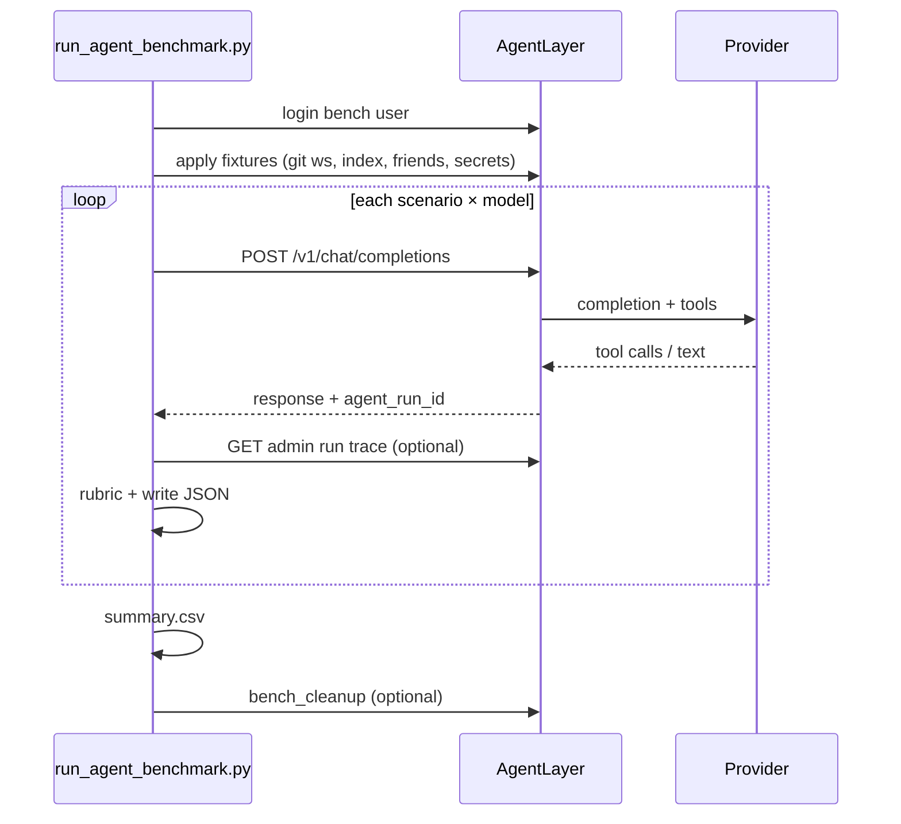

# LLM provider / model benchmark (no DB reset)

Goal: run **the same tasks** on **llama.cpp**, **Ollama (small)**, and optional cloud providers; store **comparable results**; **do not truncate** the production DB — isolate benchmark artifacts and clean up selectively later.

---

## 1. Reuse existing building blocks

| Building block | Location | Use |
|----------------|----------|-----|
| **Retrieval benchmark** | `tests/benchmarks/retrieval/`, `scripts/run_retrieval_benchmark.py` | Pattern: cases → harness → metrics → JSON |
| **E2E journeys** | `tests/e2e/`, `scripts/run-e2e-journeys.sh` | HTTP against a running instance + **live LLM** |
| **Run traces** | `GET /v1/admin/run-traces/...` | Tool calls, latency per agent run |
| **Project runs** | `POST /v1/project-runs` | End-to-end coding workflow |
| **Provider catalog** | `LLM_PROVIDER_*`, Admin LLM endpoints | Multiple providers in parallel |
| **Security preset** | `security_remediation_30m.json` | Template for “security fix” tasks |

**Recommendation:** `tests/benchmarks/agent/` following the retrieval pattern — not squeezed into pytest E2E.

---

## 2. Isolation instead of DB reset

```
┌─────────────────────────────────────────────────────────┐
│  Production (tenant 1, real users, real dashboards)     │
└─────────────────────────────────────────────────────────┘
                          ≠
┌─────────────────────────────────────────────────────────┐
│  Benchmark sandbox                                       │
│  • bench user (admin or bench-runner@…)                 │
│  • workspace: bench/{provider}/{model}/{run_id}/        │
│  • dashboards: title prefix bench-{run_id}-             │
│  • conversations: title/metadata benchmark_run_id       │
│  • git: fresh clone per run (filesystem), not DB        │
└─────────────────────────────────────────────────────────┘
```

**Cleanup:** sandbox only — delete `bench-*` workspaces, tagged conversations/dashboards. **No** `DROP DATABASE`.

Optional later: dedicated **`tenant_id=bench`** (admin creates “benchmark” tenant).

---

## 3. Two layers (do not mix)

| Layer | Purpose | LLM | When |
|-------|---------|-----|------|
| **A – Regression (E2E)** | Auth, IDOR, API | Live server (no LLM for most cases) | `./scripts/run-e2e-journeys.sh` |
| **B – Model benchmark** | Quality + speed per provider/model | **Live** | `AGENT_BENCH_LIVE=1` / Admin UI |

E2E regression does **not** prove Qwen on Ollama builds a dashboard. Benchmark **B** does.

---

## 4. Scenario suite

Each scenario = fixed **prompt** + **rubric** (automated) + **timeout**.

### Tier 1 – Smoke (~1–2 min/model)

| ID | Task | Rubric |
|----|------|--------|
| `S1_tool_catalog` | List tools for general agent | ≥1 `catalog` tool call, non-empty reply |
| `S2_simple_chat` | Fixed question, no tools | Reply &lt; 30s, no 5xx |
| `S3_read_file` | Read `README.md` in workspace | `read_file` call, path in result |

### Tier 2 – Product features (~5–15 min/model)

| ID | Task | Rubric |
|----|------|--------|
| `D1_dashboard_create` | Create custom dashboard title X | Dashboard exists via API or `dashboard.*` tool |
| `D2_layout_patch` | Add markdown block with `dataPath notes` | `ui_layout.blocks` contains `markdown` |
| `T1_delegate_general` | Short research task via general | ≥1 tool, sensible answer |

### Tier 3 – Coding / project (~15–60 min/model)

| ID | Task | Rubric |
|----|------|--------|
| `C1_workspace_git` | Clone hello-world, read file | Workspace exists, read ok |
| `C2_small_edit` | Add comment in file X (bench branch) | Git diff non-empty, no push |
| `P1_project_run` | `POST /v1/project-runs` with fixed instructions | Status `completed`, run trace present |

### Tier 4 – Security (hard, optional nightly)

| ID | Task | Rubric |
|----|------|--------|
| `SEC1_scan_only` | `security_scan_resolve` on **bench repo** | Scan `completed`, findings JSON |
| `SEC2_fix_one` | Fix highest LOW in file Y (fixture branch) | Diff + pytest green **or** finding gone |

Tier 4 needs a **dedicated git repo/branch with 1–2 known findings** — not the live repo.

---

## 5. Metrics per run

Per **(provider_id, model_id, scenario_id, run_id)**:

**Performance:** `latency_ms`, token counts, `tool_rounds`, `tool_call_count`, errors/retries.

**Quality:** `passed`, `score` (0–1), `failure_reason`, artifacts (dashboard_id, workspace_id, run_id, diff_path).

**Context:** `agent_id`, `catalog_owned_by`, `model`, timestamp, server git sha, optional context budget snapshot.

**Storage (phase 1–2):**

```
benchmarks/results/
  2026-06-08T120000/
    manifest.json
    llama_cpp__Qwen-35B/
      S1_tool_catalog.json
    ollama__qwen2.5-3b/
      ...
    summary.csv
```

Phase 3: `benchmark_runs` PG table (schema_090) — used by **Admin → Observability → Model benchmarks** (`/admin/benchmarks`).

---

## 6. Provider matrix

**CLI / Admin UI:** same provider catalog as chat — `LLM_PROVIDER_*` in `.env` plus Admin → Interfaces DB rows. Benchmark UI lists both; API key optional for local Ollama. Compare via `/admin/benchmarks` (up to 8 profiles per run).

**Manifest:** `benchmarks/manifests/*.yaml` — composable suites; shared profiles in `_profiles.yaml`.

| Suite | Command |
|-------|---------|
| Smoke (S1–S3) | `python scripts/run_agent_benchmark.py` |
| Workspace + index | `python scripts/run_agent_benchmark.py --manifest benchmarks/manifests/workspace.yaml` |
| Social / share | `python scripts/run_agent_benchmark.py --manifest benchmarks/manifests/social.yaml` |
| Gmail integration | `python scripts/run_agent_benchmark.py --manifest benchmarks/manifests/integrations.yaml` |
| **Full regression** | `python scripts/run_agent_benchmark.py --manifest benchmarks/manifests/full.yaml` |
| **Admin UI** | `/admin/benchmarks` — same suites, profile picker, run history |

Scenarios declare **`requires: [fixture_ids]`**; fixtures live in `tests/benchmarks/agent/fixtures.py`. Optional fixtures (index, gmail) **skip** scenarios when prerequisites are missing instead of failing the whole run.

Harness iterates **scenarios × profiles** with the same prompts and bench user.

---

## 7. Run flow



Chat request must include:

- `model` + `agent_model_catalog_owned_by` (or `X-Agent-Model-Override`)
- `agent_id` (`general` vs `coding` for tier 3)
- fresh conversation per scenario (no history leak)

---

## 8. Keep out of production DB

| Avoid | Instead |
|-------|---------|
| Global RAG re-ingest | Fixture docs in bench workspace |
| Operator settings changes | Document manifest per run |
| Production dashboards | Prefix `bench-{run_id}-` |
| `security_scan` on live repo | Dedicated bench git remote |
| DB truncate | Tag-based DELETE |

---

## 9. Mock vs live

| Test type | LLM | DB |
|-----------|-----|-----|
| `test_auth_idor_matrix` | any | real instance |
| E2E + mock | stub | ok |
| **Model benchmark** | **always live** | sandbox only |
| Retrieval bench | no LLM | fixture workspace |

---

## 10. Open decisions

1. **Bench tenant** vs prefix in same tenant → prefix is enough initially.
2. **Coding agent** for all tier 3 or only large models → separate manifest profiles.
3. **Cloud cost tracking** → tokens × price list in manifest.
4. **Parallel runs** → sequential first (GPU/VRAM).

---

**Summary:** Retrieval benchmark as template, **sandbox isolation**, **JSON/CSV** results, **tier 1–2** for quick provider comparison, **tier 3–4** for coding/security on nightly with fixture repo.
