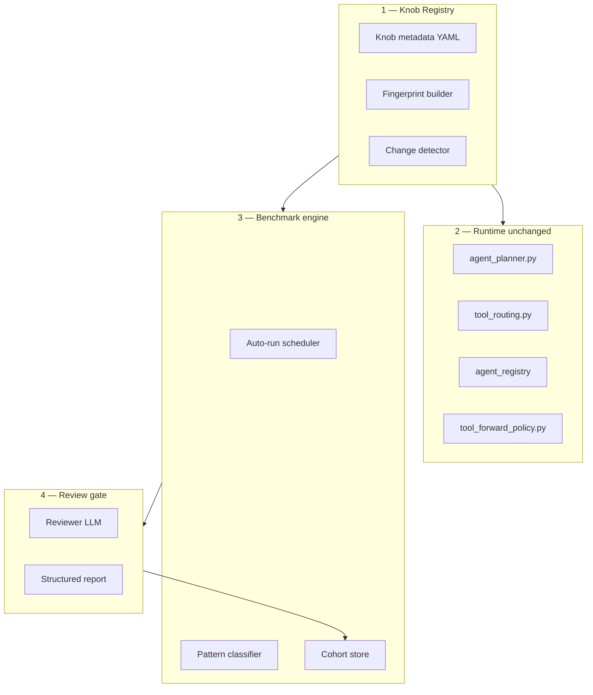

# Agent Tuning Platform — Master Plan

**Status:** Design / roadmap (not implemented end-to-end)  
**Extends:** [`agent-llm-benchmark.md`](./agent-llm-benchmark.md), [`pattern-analysis-roadmap.md`](./pattern-analysis-roadmap.md)  
**Knob catalog:** [`knob-registry.yaml`](./knob-registry.yaml)

## Purpose

Find and **lock in the best agent-layer configuration** (prompts, tool routing, agent routing, delegate paths, planner limits) — measured across a **model matrix**, not a single model.

Goals:

- Change a knob → automatic changelog + config fingerprint
- See impact in Admin Web UI
- Trigger benchmark runs (manual or automatic)
- Classify failures by mechanism (patterns), per scenario, across all models
- Optional **reviewer LLM** compares cohorts before accepting a config change

**Non-goal:** Optimizing one provider/model in isolation. The platform layer should lift **as many models as possible** on orchestration-heavy scenarios (S1, S3, S4, C*, D*, SEC*).

---

## 1. Vision (end-to-end flow)

```text
Change knob (code / YAML / operator / env)
        ↓
Registry detects change → changelog + fingerprint
        ↓
Web UI: what changed, affected clusters, last benchmark
        ↓
Auto-run (suite preset × model matrix)
        ↓
Pattern analysis (per scenario, all models)
        ↓
Reviewer LLM: regression? routing improved? next knob?
        ↓
Compare cohorts → accept / revert / iterate
```

---

## 2. Existing foundation (codebase audit)

Verified against the repo as of this document.

| Building block | Location | Gap |
|----------------|----------|-----|
| Benchmark harness (same path as chat) | `tests/benchmarks/agent/harness.py` → `POST /v1/chat/completions` | No harness preset in Admin UI |
| WS timeline capture | `AGENT_BENCH_CAPTURE_TIMELINE` (default on), `ws_runner.py` | Not stored as cohort metadata on run row |
| `report_json` + `bench_diagnostics` | `benchmark_runs.report_json`, History tab | Not aggregated in Stats |
| Failure pattern taxonomy (design) | [`pattern-analysis-roadmap.md`](./pattern-analysis-roadmap.md) | `patterns.py` not implemented |
| `git_sha` per run | `BenchRunReport.git_sha` inside `report_json` | Stats does not filter by it; no top-level DB column |
| Cross-run stats | `GET /v1/admin/benchmarks/stats` | No cohort / fingerprint filter |
| Run traces + subagents | `GET /v1/admin/run-traces/runs/{id}` | Not linked to config fingerprint |
| Operator settings UI | Admin → Interfaces, `PATCH /v1/admin/operator-settings` | No changelog, no benchmark trigger |
| Agent registry read API | `GET /v1/admin/agents`, `GET /v1/admin/agents/{id}` | Read-only; no experiment linkage |
| Tool domains API | `GET /v1/admin/tools/domains` | Not wired to tuning workflow |
| RAG fingerprint precedent | `apps/backend/domain/rag_ingest_common.py` | Reuse pattern for agent config fingerprint |
| Model matrix benchmarks | Admin → Benchmarks | No experiment workflow |
| On-disk exports | `benchmarks/results/{run_id}/` | Not exposed via HTTP API |

---

## 3. Architecture (four layers)



Runtime code stays the source of truth for behavior. The tuning platform adds **metadata, fingerprints, experiments, and analysis** — not a second config store (except optional drafts).

---

## 4. Layer 1 — Generic knob registry

### Problem

Knobs are scattered across `.env`, `apps/backend/core/config.py`, `operator_settings`, `plugins/agents/**`, router YAMLs, `tool_routing.py`, rubrics, and harness options — without unified metadata.

### Solution

**Source of truth:** [`knob-registry.yaml`](./knob-registry.yaml) (YAML + generated types / validation in a later phase).

Each knob entry:

| Field | Meaning |
|-------|---------|
| `id` | Stable id, e.g. `agent.max_tool_rounds` |
| `layer` | `env` \| `operator` \| `agent_yaml` \| `router_yaml` \| `code` \| `rubric` \| `bench` |
| `key` / `path` / `field` | How to resolve the value |
| `affects_agents` | Agent ids impacted |
| `affects_clusters` | Scenario prefix clusters: `S`, `C`, `W`, `D`, `SEC`, `SOC`, `INT` |
| `ui_group` | Admin UI grouping |
| `benchmark_sensitive` | Include in config fingerprint; suggest benchmark on change |
| `doc` | Human description |

### Knob categories (complete map)

| Category | Examples | Layer |
|----------|----------|-------|
| Tool routing | `tool_routing.py`, `AGENT_TOOL_DOMAIN_ORDER`, `TOOL_TRIGGERS` in tool modules | code + env |
| Tool forward / ranking | `tool_forward_policy.py`, `AGENT_TOOLS_RANKING_ENABLED`, pinned tools in `agent.yaml` | code + agent_yaml |
| Agent registry | `plugins/agents/*/agent.yaml`: domains, capabilities, discipline preset | agent_yaml |
| Delegate routers | `plugins/tools/platform/agents/delegate.router.yaml`, `catalog.router.yaml`, `task.router.yaml` | router_yaml |
| System prompts | `plugins/agents/*/system_prompt.md` | agent_yaml |
| Planner limits | `AGENT_MAX_TOOL_ROUNDS` (default **8**), `SUBAGENT_MAX_TOOL_ROUNDS`, thrash/doom loop | env |
| Model routing | `AGENT_MODEL_PROFILE_*`, subagent inherit in `model_routing.py` | env + code |
| Smart route (chat) | Operator `llm_smart_routing_*` | operator |
| Rubrics / scenarios | `tests/benchmarks/agent/rubrics.py`, scenario prompts | rubric |
| Benchmark harness | timeout, retries, `AGENT_BENCH_CAPTURE_TIMELINE`, suite, locale | bench |

Value resolution order (unchanged): **operator_settings > env > code defaults**. Registry holds metadata + read API + changelog — not a duplicate runtime config.

---

## 5. Layer 2 — Auto-documentation on change

On every benchmark-sensitive change:

1. Snapshot **before / after** for affected knob ids only
2. Compute **fingerprint delta**
3. Append **changelog** row (DB table `agent_config_changelog` — planned)
4. Optional **auto-doc** text (template; LLM optional): affected scenario clusters + expected effect
5. Link to triggered or suggested benchmark run

### Changelog record (planned schema)

```json
{
  "id": "uuid",
  "at": "2026-06-15T14:00:00Z",
  "source": "operator_patch | git_commit | agent_yaml_edit | bench_start",
  "git_sha": "abc123",
  "author_user_id": "uuid",
  "knob_ids": ["agent.general.pinned_tools"],
  "before": { "agent.general.pinned_tools": ["delegate", "catalog"] },
  "after": { "agent.general.pinned_tools": ["delegate", "catalog", "workspace.list"] },
  "fingerprint_before": "sha256:…",
  "fingerprint_after": "sha256:…",
  "hypothesis": "optional user note",
  "doc_auto": "General pinned_tools expanded. Expect S1/S3 pass rate up across matrix.",
  "experiment_id": "uuid | null"
}
```

**Git commits:** On benchmark start (or CI), diff against last cohort fingerprint → match changed paths to registry → append changelog if missing.

**Precedent:** `compute_rag_ingest_fingerprint()` in `rag_ingest_common.py` → `compute_agent_config_fingerprint()`.

---

## 6. Layer 3 — Cohorts and reproducibility

Each benchmark run should store **cohort metadata** (planned: `benchmark_runs.cohort_json` or inside `summary_json`):

```json
{
  "cohort_label": "routing-baseline-v3",
  "fingerprint": "sha256:…",
  "git_sha": "abc123",
  "manifest_path": "benchmarks/manifests/full.yaml",
  "manifest_hash": "sha256:…",
  "harness_preset": "observability | chat_parity",
  "capture_mode": "websocket | http",
  "model_matrix": [
    { "catalog_owned_by": "OLLAMA", "model": "nemotron-3-nano:4b" }
  ],
  "suite": "full",
  "scenario_subset": null,
  "suite_preset": "routing-core | full | custom"
}
```

**Today:** `git_sha` exists only inside `report_json` at run completion — not queryable from Stats.

**Planned Stats filters:** `cohort_label`, `fingerprint`, `git_sha`, `since_days`, `suite`.

**Cohort compare:** Cohort A vs B → delta per scenario cluster × count of models that passed (model-neutral platform score).

---

## 7. Layer 4 — Analysis (model-neutral)

Implement [`pattern-analysis-roadmap.md`](./pattern-analysis-roadmap.md):

- `tests/benchmarks/agent/patterns.py` → `classify_failure(result) -> list[str]` (A1, E1, …)
- Aggregate **per scenario across all models**: e.g. “S1: 9/10 failed; 70% A1, 20% E1”
- Scenario cluster view: `S*` / `C*` / `W*` / `D*` / `SEC*` / `SOC*` / `INT*`

### Per-scenario analysis output (planned)

| Field | Meaning |
|-------|---------|
| `models_passed` / `models_total` | Platform pass rate for this scenario |
| `top_patterns` | Dominant failure mechanisms |
| `likely_knobs` | Hints from registry |
| `sample_result_refs` | Pointers to History / run traces |

---

## 8. Layer 5 — Admin Web UI

New area **Admin → Agent tuning** (or extra tabs under Model benchmarks):

| Tab | Content |
|-----|---------|
| **Knobs** | Registry groups; effective value + source; benchmark-sensitive badge; apply → changelog |
| **Changelog / experiments** | Timeline; create experiment (hypothesis, knobs, target scenarios); status workflow |
| **Benchmarks (extended)** | Cohort filter; pattern + cluster views; cohort A vs B; harness preset; suite presets |
| **Review** | Reviewer LLM report; links to runs, traces, export |

### Suite presets (planned)

| Preset | Scenarios | Use |
|--------|-----------|-----|
| `routing-core` | S1, S3, S4, C1 | Fast routing iteration |
| `smoke` | Tier 1 from manifest | Sanity |
| `full` | `benchmarks/manifests/full.yaml` | Full matrix regression |
| `custom` | User multi-select (existing UI) | Ad hoc |

---

## 9. Layer 6 — Automatic runs

### Triggers (planned)

| Trigger | When |
|---------|------|
| `manual` | “Validate config” button |
| `on_knob_apply` | After apply if any changed knob is `benchmark_sensitive` |
| `on_git_push` | CI / webhook (optional) |
| `scheduled` | Nightly full matrix (optional) |
| `experiment` | Experiment workflow |

### Pipeline

```text
1. Resolve fingerprint + model matrix (experiment or default manifest)
2. POST /v1/admin/benchmarks/runs (existing)
3. Poll until completed / failed / cancelled
4. classify_failure on all results
5. Aggregate cohort report
6. Optional → reviewer LLM (Layer 7)
7. Update experiment status; notify UI
```

---

## 10. Layer 7 — LLM reviewer gate

The **reviewer model** (configurable — typically your current best profile from the matrix) evaluates **config changes**, not individual model rankings.

### Review input (generic JSON)

```json
{
  "experiment_label": "routing-v4-catalog-pin",
  "knob_changes": [{ "id": "agent.general.pinned_tools", "before": "…", "after": "…" }],
  "cohort_before": { "fingerprint": "…", "summary_by_cluster": {} },
  "cohort_after": { "fingerprint": "…", "summary_by_cluster": {} },
  "pattern_delta": { "S1_tool_catalog": { "A1": -5, "E1": -2 } },
  "sample_failures": [{
    "scenario_id": "S1_tool_catalog",
    "patterns": ["A1"],
    "failure_reason": "…",
    "tool_names": [],
    "agent_run_id": "…"
  }],
  "rubric_context": { "S1_tool_catalog": "catalog tool call + ≥3 agent_id names in reply" }
}
```

### Review output (generic JSON)

```json
{
  "verdict": "improved | regressed | mixed | inconclusive",
  "confidence": 0.82,
  "summary": "…",
  "cluster_deltas": [{
    "cluster": "S*",
    "models_gained": 4,
    "models_lost": 0,
    "assessment": "…"
  }],
  "regressions_to_investigate": [{ "scenario_id": "S2_simple_chat", "reason": "…" }],
  "recommended_next_knobs": [{ "knob_id": "agent.tools.ranking_enabled", "direction": "disable", "rationale": "…" }],
  "accept_experiment": false
}
```

**Guardrails:**

- Reviewer receives aggregated + sampled data only (no full DB dump)
- Human confirms accept (LLM recommends; operator decides)
- Every review call logged and attached to experiment

**Reviewer profile (planned operator / experiment fields):** `reviewer_catalog_owned_by`, `reviewer_model`.

---

## 11. Harness vs chat — selectable presets

| Preset | Behavior | Use |
|--------|----------|-----|
| `observability` | WebSocket timeline (`AGENT_BENCH_CAPTURE_TIMELINE=1`), `agent_stream_llm: true` | Tuning, deep diagnostics |
| `chat_parity` | HTTP `/v1/chat/completions`, same defaults as production chat UI | Verify bench matches chat |

Store preset in cohort metadata. Never compare runs across different presets in the same cohort.

**Implementation note:** `_build_chat_body()` in `harness.py` always sets `agent_stream_llm: true` today; parity preset requires harness changes.

---

## 12. API inventory

### 12.1 Existing admin APIs (use as-is)

#### Benchmarks — prefix `/v1/admin/benchmarks`

| Method | Path | Purpose |
|--------|------|---------|
| GET | `/suites` | List suite manifests |
| GET | `/catalog` | Fixtures, locales |
| GET | `/llm-providers` | Providers for model matrix |
| GET | `/run-readiness?user_id=` | Secrets + sandbox quota for run-as user |
| POST | `/cleanup-resources` | Sandbox cleanup (alias `/cleanup-workspaces`) |
| GET | `/stats` | Cross-run leaderboard (`suite`, `since_days`, badge filters) |
| POST | `/runs/bulk-delete` | Delete finished runs |
| GET | `/runs` | List runs |
| GET | `/runs/{run_id}` | Run detail + `report_json` |
| DELETE | `/runs/{run_id}` | Delete single run |
| POST | `/runs/{run_id}/cancel` | Cancel active run |
| POST | `/runs` | Start run (`StartBenchmarkBody`) |

#### Run traces — prefix `/v1/admin/run-traces`

| Method | Path | Purpose |
|--------|------|---------|
| GET | `/runs` | List agent runs (`task_id`, `conversation_id` filters) |
| GET | `/runs/{run_id}` | Run + tool invocations + **child_runs** (subagents) |
| GET | `/tool-invocations` | Filter by `run_id` |

#### Agents & tools

| Method | Path | Purpose |
|--------|------|---------|
| GET | `/v1/admin/agents` | List agents + tool counts |
| GET | `/v1/admin/agents/{agent_id}` | Agent detail |
| GET | `/v1/admin/tools/domains` | Tool domain catalog |

#### Operator & LLM endpoints

| Method | Path | Purpose |
|--------|------|---------|
| GET | `/v1/admin/operator-settings` | Effective operator config |
| PUT/PATCH | `/v1/admin/operator-settings` | Apply operator patch |
| GET | `/v1/admin/external-llm/endpoints` | LLM endpoint catalog |
| PUT | `/v1/admin/external-llm/endpoints` | Sync endpoints |
| POST | `/v1/admin/external-llm/models` | Probe / list models |

#### Chat runtime (benchmark harness uses these)

| Method | Path | Purpose |
|--------|------|---------|
| POST | `/v1/chat/completions` | Agent turn (HTTP) |
| WS | `/ws/v1/chat?token=` | Agent turn + timeline events |

### 12.2 Planned APIs — agent config

Prefix **`/v1/admin/agent-config`** (new router):

| Method | Path | Purpose |
|--------|------|---------|
| GET | `/knobs` | Registry + current effective values |
| GET | `/knobs/{knob_id}` | Single knob detail |
| GET | `/fingerprint` | Current `benchmark_sensitive` fingerprint + `git_sha` |
| GET | `/snapshot` | Full config snapshot for export |
| GET | `/changelog` | Paginated changelog (`limit`, `since`, `experiment_id`) |
| POST | `/draft` | Optional staged patch set |
| POST | `/apply` | Apply operator-eligible knobs + changelog + optional `trigger_benchmark` |

### 12.3 Planned APIs — benchmarks extension

Prefix **`/v1/admin/benchmarks`** (extend existing router):

| Method | Path | Purpose |
|--------|------|---------|
| GET | `/analysis` | Pattern + cluster aggregation (`cohort`, `fingerprint`, `git_sha`, `suite`) |
| GET | `/cohorts` | List distinct cohort labels / fingerprints |
| GET | `/cohorts/compare` | Query: `cohort_a`, `cohort_b` → delta report |
| GET | `/runs/{run_id}/export` | Stream on-disk export or generate JSON bundle |
| POST | `/experiments` | Create experiment |
| GET | `/experiments` | List experiments |
| GET | `/experiments/{id}` | Experiment detail |
| PATCH | `/experiments/{id}` | Update status, hypothesis, accept/reject |
| POST | `/experiments/{id}/run` | Queue benchmark with experiment metadata |
| GET | `/experiments/{id}/report` | Aggregated experiment report |
| POST | `/review` | Run reviewer LLM on experiment or cohort pair |
| GET | `/reviews/{id}` | Fetch review result |

### 12.4 Planned APIs — automation (optional)

| Method | Path | Purpose |
|--------|------|---------|
| POST | `/v1/admin/benchmarks/webhooks/git` | CI: push event → fingerprint diff → optional run |
| POST | `/v1/admin/benchmarks/schedules` | Nightly matrix config |

### 12.5 `StartBenchmarkBody` extensions (planned fields)

```json
{
  "cohort_label": "routing-v3",
  "experiment_id": "uuid",
  "harness_preset": "observability",
  "suite_preset": "routing-core",
  "trigger_review": false
}
```

---

## 13. Data contracts (summary)

| Contract | Shape |
|----------|--------|
| **Knob registry** | YAML → validated schema; drives OpenAPI types |
| **Config snapshot** | `{ fingerprint, git_sha, knobs: { id: effective_value }, captured_at }` |
| **Changelog event** | See §5 |
| **Cohort** | See §6 |
| **Analysis report** | `{ by_scenario[], by_cluster[], by_pattern[], meta }` |
| **Experiment** | `{ id, label, hypothesis, status, knob_changes[], run_ids[], review_ids[] }` |
| **Review** | Input/output §10; stored with `reviewer_model`, `prompt_version` |

Design rule: **reviewer backends are pluggable** (LLM, rules-only, human-only) using the same request/response shapes.

---

## 14. Repository layout (docs + code targets)

```
docs/benchmarks/
├── agent-llm-benchmark.md           # Harness, isolation, tiers
├── pattern-analysis-roadmap.md      # Failure taxonomy
├── agent-tuning-platform.md         # This document
├── knob-registry.yaml               # Knob source of truth (v1)
└── experiments/
    └── README.md                    # Optional human notes per experiment

docs/adr/
└── 0008-agent-config-experiments.md # ADR when implementation starts

apps/backend/
├── domain/agent_config_fingerprint.py   # planned
├── infrastructure/agent_config_changelog_store.py  # planned
├── infrastructure/benchmark_experiments_store.py   # planned
└── api/agent_config_admin_api.py        # planned

tests/benchmarks/agent/
└── patterns.py                        # planned

apps/frontend/src/features/admin/
├── agentTuning/                        # planned UI
└── benchmarks/                        # extend existing
```

---

## 15. Implementation phases

### Phase 0 — Documentation (this PR)

- [x] `agent-tuning-platform.md` (this file)
- [x] `knob-registry.yaml` v1
- [x] Cross-links in `docs/README.md`, `pattern-analysis-roadmap.md`
- [ ] ADR `0008-agent-config-experiments.md` when coding starts

### Phase 1 — Fingerprint + changelog (~1–2 weeks)

- [ ] `compute_agent_config_fingerprint()` (+ unit tests)
- [ ] DB migration: `agent_config_changelog`, `benchmark_runs.cohort_json`
- [ ] APIs: `/agent-config/fingerprint`, `/agent-config/changelog`
- [ ] Capture fingerprint at benchmark run start
- [ ] Minimal Admin changelog tab

### Phase 2 — Pattern analysis + cohort stats (~1–2 weeks)

- [ ] `patterns.py` + tests with frozen exports
- [ ] `GET /benchmarks/analysis`, cohort filters on `/stats`
- [ ] UI: cluster view + pattern breakdown

### Phase 3 — Knob registry Web UI (~1–2 weeks)

- [ ] `GET /agent-config/knobs`
- [ ] Grouped Admin UI; operator apply with changelog
- [ ] Git/YAML knobs: read-only + hash in fingerprint

### Phase 4 — Experiments + auto-run (~1 week)

- [ ] Experiment CRUD + `POST .../experiments/{id}/run`
- [ ] Suite presets (`routing-core`)
- [ ] Harness preset field on start run

### Phase 5 — LLM reviewer (~1 week)

- [ ] Review API + prompt template + Admin tab
- [ ] Human accept/reject on experiment

### Phase 6 — CI / nightly (optional)

- [ ] Git webhook → routing-core run → PR comment

**Recommended MVP:** Phase 0 + 1 + 2 + 4, then Phase 5.

---

## 16. Manual workflow (until Phase 1 ships)

1. One git commit per tuning hypothesis; message documents expected scenario clusters.
2. Run benchmark matrix; export from History / `benchmarks/results/`.
3. Clear history or filter Stats by time when starting a new config baseline.
4. Group failures by **scenario cluster**, not by single model.
5. Deep-dive via `agent_run_id` → Admin → Run traces.

---

## 17. References

| Area | Path |
|------|------|
| Harness | `tests/benchmarks/agent/harness.py` |
| Rubrics | `tests/benchmarks/agent/rubrics.py` |
| Stats | `apps/backend/infrastructure/benchmark_stats.py` |
| Benchmark API | `apps/backend/api/benchmarks_admin_api.py` |
| Tool routing | `apps/backend/domain/plugin_system/tool_routing.py` |
| Tool forward | `apps/backend/domain/tool_forward_policy.py` |
| Planner | `apps/backend/domain/agent_planner.py` |
| Model routing | `apps/backend/domain/model_routing.py` |
| Smart route | `apps/backend/domain/llm_smart_route.py` |
| Agent registry | `apps/backend/domain/agent_registry.py`, `plugins/agents/` |
| Delegate router | `plugins/tools/platform/agents/delegate.router.yaml` |
| RAG fingerprint | `apps/backend/domain/rag_ingest_common.py` |
