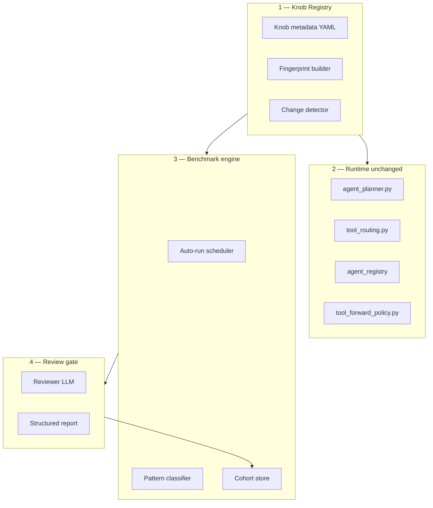

# Agent Tuning Platform — Master Plan

**Status:** Design / roadmap (not implemented end-to-end)  
**Extends:** [`agent-llm-benchmark.md`](./agent-llm-benchmark.md), [`pattern-analysis-roadmap.md`](./pattern-analysis-roadmap.md)  
**Knob catalog:** [`knob-registry.yaml`](./knob-registry.yaml)

## Purpose

Find and **lock in the best agent-layer configuration** (prompts, tool routing, agent routing, delegate paths, planner limits) — measured across a **model matrix**, not a single model.

Goals:

- Change a knob → changelog + fingerprint (on apply)
- See impact in Admin Web UI or Operator chat
- **Start benchmark when you ask** (Operator tools / WebUI Run button) — **not** automatic on every patch
- Classify failures by mechanism (patterns), per scenario, across all models
- **Reviewer LLM when you ask** — compares cohorts before you accept a config change

**Non-goal:** Optimizing one provider/model in isolation. The platform layer should lift **as many models as possible** on orchestration-heavy scenarios (S1, S3, S4, C*, D*, SEC*).

---

## 1. Vision (end-to-end flow)

```text
Change knob (code / YAML / operator / env)
        ↓
Registry detects change → changelog + fingerprint
        ↓
Web UI: what changed, affected clusters, last benchmark
        ↓
Auto-run (suite preset × model matrix)
        ↓
Pattern analysis (per scenario, all models)
        ↓
Reviewer LLM: regression? routing improved? next knob?
        ↓
Compare cohorts → accept / revert / iterate
```

---

## 2. Existing foundation (codebase audit)

Verified against the repo as of this document.

| Building block | Location | Gap |
|----------------|----------|-----|
| Benchmark harness (same path as chat) | `tests/benchmarks/agent/harness.py` → `POST /v1/chat/completions` | No harness preset in Admin UI |
| WS timeline capture | `AGENT_BENCH_CAPTURE_TIMELINE` (default on), `ws_runner.py` | Not stored as cohort metadata on run row |
| `report_json` + `bench_diagnostics` | `benchmark_runs.report_json`, History tab | Not aggregated in Stats |
| Failure pattern taxonomy (design) | [`pattern-analysis-roadmap.md`](./pattern-analysis-roadmap.md) | `patterns.py` not implemented |
| `git_sha` per run | `BenchRunReport.git_sha` inside `report_json` | Stats does not filter by it; no top-level DB column |
| Cross-run stats | `GET /v1/admin/benchmarks/stats` | No cohort / fingerprint filter |
| Run traces + subagents | `GET /v1/admin/run-traces/runs/{id}` | Not linked to config fingerprint |
| Operator settings UI | Admin → Interfaces, `PATCH /v1/admin/operator-settings` | No changelog, no benchmark trigger |
| Agent registry read API | `GET /v1/admin/agents`, `GET /v1/admin/agents/{id}` | Read-only; no experiment linkage |
| Tool domains API | `GET /v1/admin/tools/domains` | Not wired to tuning workflow |
| RAG fingerprint precedent | `apps/backend/domain/rag/ingest_common.py` | Reuse pattern for agent config fingerprint |
| Model matrix benchmarks | Admin → Benchmarks | No experiment workflow |
| On-disk exports | `benchmarks/results/{run_id}/` | Not exposed via HTTP API |
| **Runtime tuning mode** | — | **Not built** — no unified API-first tuning loop |

---

## 2.0 API-first config (design principle — not env UI)

**Your intent (correct):** All tunable knobs → **one generic HTTP API** → runtime effect without `.env` edits or redeploy. The Admin UI and any LLM are **clients of that API**, not separate config paths.

**Repo policy already states this** for product toggles ([`docs/api/http.md`](../api/http.md)): new runtime flags belong in **`operator_settings` / admin PATCH**, not new `AGENT_*` env vars.

### What exists today (the pattern to extend)

| Surface | Generic API? | LLM via Operator? |
|---------|--------------|-------------------|
| Bridges, RAG, memory, smart route, LLM queue | `PATCH /v1/admin/operator-settings` | **Yes** — Operator tools `settings_get`, `settings_patch` (`plugins/tools/platform/operator/admin.py`) |
| External LLM endpoints | `PUT /v1/admin/external-llm/endpoints` | **Yes** — `external_llm_endpoints_get/put` |
| Tool operator policies | `PUT /v1/admin/tool-policies` | **Yes** — operator admin tools |
| Agent list (read-only) | `GET /v1/admin/agents` | Could expose as operator tool |
| **Agent routing knobs** (`max_tool_rounds`, ranking, pins, delegate policy) | **No** — still `AGENT_*` env + code + YAML files | **No** |
| **Agent YAML** (pinned_tools, prompts) | **No** — files on disk | **No** |
| Benchmark experiments | Partial — `POST /v1/admin/benchmarks/runs` only | **No** |

So: **Operator agent is already the LLM↔API bridge** for operator_settings. The gap is that **routing/tuning knobs are not on that API yet**.

### Target architecture

```text
┌──────────────────────────────────────────────────────────────┐
│  /v1/admin/agent-config   (planned — generic, registry-driven) │
│  GET knobs · GET snapshot · PATCH apply · changelog · fingerprint │
└────────────────────────────┬─────────────────────────────────┘
                             │ single write path
         ┌───────────────────┼───────────────────┐
         │                   │                   │
   Admin Web UI        Operator agent         Automated reviewer
   (Tuning tab)        (admin chat tools)      (backend job: LLM → PATCH)
         │                   │                   │
         └───────────────────┴───────────────────┘
                             │
              DB: operator_settings + agent_config_overrides (planned)
                             │
              Runtime: planner / tool_routing read EFFECTIVE values
                             │ (env = bootstrap defaults only, not tuning path)
                             ▼
              Optional: POST …/benchmarks/…/validate after PATCH
```

**Env (`.env`) is not part of the tuning workflow.** It may remain as **install/bootstrap defaults** only. Tuning sessions, UI, and LLM never tell you to edit `.env`.

### Operator agent vs reviewer LLM — two clients, one API

| Mode | Who acts | How |
|------|----------|-----|
| **Interactive tuning** | You (admin) chat with **`agent_id: operator`** | Model calls `agent_config_patch`, `settings_patch`, `benchmark_experiment_run`, … |
| **Automated review** | Backend **reviewer job** after benchmark | LLM returns structured `{ knob_patches: [...] }`; server applies **same PATCH** (no separate code path) |
| **Manual UI** | Admin → Agent tuning tab | Form → **same PATCH** |

The reviewer LLM does **not** need to be “the operator agent” in chat — but it **must** use the **same generic API** the operator tools wrap. Operator agent = human-facing LLM client; reviewer = batch LLM client.

### Planned Operator tools (wrap agent-config API)

Extend `plugins/tools/platform/operator/admin.py` (or sibling module):

| Tool | Maps to |
|------|---------|
| `agent_config_get` | `GET /v1/admin/agent-config/knobs` + snapshot |
| `agent_config_patch` | `PATCH /v1/admin/agent-config/apply` |
| `benchmark_experiment_create` | `POST /v1/admin/benchmarks/experiments` |
| `benchmark_experiment_validate` | `POST …/experiments/{id}/run` + poll |
| `benchmark_analysis_get` | `GET /v1/admin/benchmarks/analysis` |

Existing `settings_patch` stays for bridge/RAG/smart-route fields already in `OperatorSettingsPatch`.

### Migrating routing knobs off env

Phase order:

1. Add DB columns or JSONB on `operator_settings` (or `agent_config` table) for `benchmark_sensitive` knobs from [`knob-registry.yaml`](./knob-registry.yaml).
2. Change `apps/backend/infrastructure/config.py` readers to **effective** = DB override ?? env default (same pattern as embedding base URL).
3. Expose via `agent-config` API + operator tools.
4. **Deprecate** tuning via `.env` in docs/UI (env remains for first boot only).

Agent YAML overrides (pinned_tools, prompts): **DB overlay** keyed by `agent_id` + field, merged at registry load (or hot-reload on patch). File YAML = factory default; API = runtime tuning.

---

## 2.1 Runtime Tuning Mode (missing — core product gap)

Observability + fingerprints alone are not enough. You need a **tuning loop** where every change goes through the **agent-config API**:

| Capability | Today | Tuning mode (planned) |
|------------|-------|------------------------|
| Change routing knobs | **Env/code/YAML** (wrong path for tuning) | **`PATCH /v1/admin/agent-config/apply`** only |
| Human UI | Admin → Interfaces (subset) | Agent tuning tab → **same API** |
| LLM changes config | Operator `settings_patch` (subset) | Operator **`agent_config_apply`** when you ask |
| Run benchmark | Manual Run tab | Operator **`benchmark_run_start`** when **you ask** in chat |
| Changelog / fingerprint | None | Written on every PATCH |

### Tuning session workflow (on-demand — you drive each step)

```text
POST /v1/admin/agent-config/sessions  { hypothesis, cohort_label }   # optional
  → POST …/apply  { patches }           # when you ask to change config
  → POST …/sessions/{id}/validate       # ONLY when you ask to run benchmark
  → GET  …/benchmarks/analysis          # when you ask for results
  → POST …/benchmarks/review            # when you ask Reviewer
  → POST …/sessions/{id}/close          # when you accept/revert
```

Operator runs the same steps **via tools when your chat message requests them** — see [`PLANNING.md`](./PLANNING.md) §2–3.

### What works at runtime today (legacy vs target)

| Layer | Tuning via API today? | Target |
|-------|----------------------|--------|
| Operator settings (RAG, smart route, queue) | **Yes** — PATCH + Operator `settings_patch` | Keep |
| Agent routing (`AGENT_MAX_TOOL_ROUNDS`, ranking, …) | **No** — env | **agent-config API** |
| Agent YAML (pins, prompts) | **No** — files | **DB overlay + API** |
| Tool / routing **code** | No — deploy | Git + CI; optional reload-tools for plugins |
| Benchmark matrix | **Yes** — POST runs | Keep + link to session |

---

## 2.2 Current agent architecture (as-built)

**Important correction:** `delegate` is **not** on every agent and **not** required for every benchmark scenario. Only **General** invokes the `delegate` tool. Specialists are **targets** of delegate (or run **directly** when the scenario sets `agent_id`).

### Two roles

```text
┌─────────────────────────────────────────────────────────────┐
│  general  — orchestrator                                     │
│  Tools: delegate, catalog, workspace.create/list, bind, …   │
│  delegatable: false  (never a delegate target)               │
└───────────────────────────┬─────────────────────────────────┘
                            │ delegate(run_subagent, agent_id, prompt)
                            ▼
┌─────────────────────────────────────────────────────────────┐
│  specialists — delegatable: true (each has own tool surface)   │
│  No delegate tool on specialists                             │
└─────────────────────────────────────────────────────────────┘
```

Delegate implementation: `plugins/tools/platform/agents/delegate.py`  
Allowed targets: `effective_delegatable_agent_ids()` in `embedded_subagent.py` (from registry `delegatable` / `admin_only_delegatable` flags).

### All agents today (`plugins/agents/*/agent.yaml`)

| agent_id | Role | delegatable | delegate tool | Notes |
|----------|------|-------------|---------------|--------|
| **general** | Orchestrator | **false** | **has `delegate`** | Only entry point for sub-agents |
| coding | Build / edit / bash / git | true | no | `model_profile: coding`, container |
| coding_plan | Read-only planning | true | no | strict workspace |
| math | math_* tools | true | no | |
| dashboard | create_dashboard, patch_layout, … | true | no | |
| security_auditor | SSC + read-only coding | true | no | `min_role: admin` |
| creative | build, inpainting | true | no | |
| research | search, RAG, memory | true | no | |
| communications | mail, calendar, shares | true | no | |
| media | media library / queue | true | no | |
| integrations | HTTP/RSS connectors | true | no | |
| outdoor | fishing / survival tools | true | no | |
| lifestyle | weather, calendar | true | no | |
| **operator** | Admin platform ops | false | no | **`admin_only_delegatable: true`** — delegate target for admins only |

**Standard delegate targets (any user):** coding, coding_plan, math, dashboard, security_auditor, creative, research, communications, media, integrations, outdoor, lifestyle.

**Admin-only delegate target:** operator.

### General’s tool surface (actual)

From `plugins/agents/general/agent.yaml`:

- `delegate`, `catalog`, `workspace.create`, `workspace.list`, `bind`, `user_secrets_status` (allowlist + pinned)

General **does not** have: `read_file`, `create_dashboard`, `security_scan`, `bash`, etc. Those live on specialists. So for most product work, General must either:

1. Call **`delegate`** → specialist runs with the right tools, or  
2. Call **`catalog`** / workspace tools to set up context first.

Tool forward policy (`tool_forward_policy.py`) **pins** registry `pinned_tools` so `delegate` and `catalog` survive ranking cuts.

### How routing works (runtime)

1. **Chat/benchmark** sends `agent_id` on `/v1/chat/completions` (harness: `_effective_agent_id()`).
2. **Planner** merges registry tools for that agent + routing filters (`tool_routing.py` categories from user text).
3. **Forward policy** applies pins / budget / ranking.
4. If model calls **`delegate`**, embedded sub-agent runs with target `agent_id` (inherits workspace); child trace under Run traces.

**`delegate.router.yaml`** only supplies **phrase hints** for tool-domain classification — it does not auto-invoke delegate. The model must still call the tool.

---

## 2.3 Benchmark scenarios: entry agent vs delegate

Default scenario `agent_id` is **`general`** (`scenarios/registry.py`). Exceptions run the **specialist directly** (no General, no delegate on that run):

| Scenario | Entry `agent_id` | Delegate expected? | Rubric accepts (summary) |
|----------|------------------|--------------------|---------------------------|
| S1_tool_catalog | general | No — use **`catalog`** | catalog call + ≥3 agent_id names in reply |
| S2_simple_chat | general | No — `plain_completion` | “Paris”, no tools |
| S3_read_file | general | Often yes | **delegate** and/or read_file + README line |
| S4_delegate_math | general | **Yes — mandatory** | delegate + “42” in reply |
| W1_git_readme | general | Optional | workspace.create + delegate or read_file |
| W2_find_octocat_* | general | No | workspace.create + search/read; Octocat in reply |
| D1_dashboard_create | general | Often (delegate→dashboard) | **API**: dashboard exists **or** create_dashboard on trace |
| **D2_layout_patch** | **dashboard** | **No** — direct dashboard tools | patch_layout / patch_data + API state |
| **SOC1_block_share_visible** | **dashboard** | **No** | dashboard tools + share; reply `bench-visible` |
| C1_bench_marker | general | Typical | workspace.create + **delegate or write** + git change |
| C2_small_edit | general | Typical | delegate or write + git diff |
| SEC1_scan | general | Typical | workspace.create + **delegate or security_scan** |
| SEC2_remediate | general | Typical | delegate or security tools + git/report |
| INT1_gmail_connected | general | No | gmail/mail tools or clear skip |

So: **delegate is the default path for coding/security/read scenarios on General**, but **dashboard scenarios D2 and SOC1 bypass General entirely**. That matches “delegate only on some tasks” — not a doc bug in the rubrics, but easy to misread in aggregate stats.

### How it **should** be (design intent)

| Layer | Intent |
|-------|--------|
| **Product chat** | User talks to **General**; General delegates to specialists when needed |
| **Benchmarks** | Mix: most scenarios test General orchestration; D2/SOC1 test **dashboard agent in isolation** |
| **Tuning** | Optimize General’s delegate + catalog + routing so **more models** pass S3/S4/C*/SEC*; dashboard agent separately for D2/SOC1 |
| **Future** | Optional suite flag “general-only” vs “per-scenario agent_id as today” for stricter orchestration regression |

### Gaps vs your expectations

1. **No runtime tuning UI** — only manual edits + Run tab (§2.1).  
2. **Subagent tool calls** may not all appear in parent `tool_names`; rubrics also check **API outcomes** (dashboard exists, git diff). Check **Run traces → child_runs** for delegate depth.  
3. **`operator.delegate_enabled`** kill-switch is in ADR only — **not in DB yet**.  
4. Stats do not show “failed because no delegate” vs “delegate ok, subagent failed” — pattern analysis (planned) should split this.

---

## 3. Architecture (four layers)



Runtime code stays the source of truth for behavior. The tuning platform adds **metadata, fingerprints, experiments, and analysis** — not a second config store (except optional drafts).

---

## 4. Layer 1 — Generic knob registry

### Problem

Knobs are scattered across `.env`, `apps/backend/infrastructure/config.py`, `operator_settings`, `plugins/agents/**`, router YAMLs, `tool_routing.py`, rubrics, and harness options — without unified metadata.

### Solution

**Source of truth:** [`knob-registry.yaml`](./knob-registry.yaml) (YAML + generated types / validation in a later phase).

Each knob entry:

| Field | Meaning |
|-------|---------|
| `id` | Stable id, e.g. `agent.max_tool_rounds` |
| `layer` | `env` \| `operator` \| `agent_yaml` \| `router_yaml` \| `code` \| `rubric` \| `bench` |
| `key` / `path` / `field` | How to resolve the value |
| `affects_agents` | Agent ids impacted |
| `affects_clusters` | Scenario prefix clusters: `S`, `C`, `W`, `D`, `SEC`, `SOC`, `INT` |
| `ui_group` | Admin UI grouping |
| `benchmark_sensitive` | Include in config fingerprint; suggest benchmark on change |
| `doc` | Human description |

### Knob categories (complete map)

| Category | Examples | Layer |
|----------|----------|-------|
| Tool routing | `tool_routing.py`, `AGENT_TOOL_DOMAIN_ORDER`, `TOOL_TRIGGERS` in tool modules | code + env |
| Tool forward / ranking | `tool_forward_policy.py`, `AGENT_TOOLS_RANKING_ENABLED`, pinned tools in `agent.yaml` | code + agent_yaml |
| Agent registry | `plugins/agents/*/agent.yaml`: domains, capabilities, discipline preset | agent_yaml |
| Delegate routers | `plugins/tools/platform/agents/delegate.router.yaml`, `catalog.router.yaml`, `task.router.yaml` | router_yaml |
| System prompts | `plugins/agents/*/system_prompt.md` | agent_yaml |
| Planner limits | `AGENT_MAX_TOOL_ROUNDS` (default **8**), `SUBAGENT_MAX_TOOL_ROUNDS`, thrash/doom loop | env |
| Model routing | `AGENT_MODEL_PROFILE_*`, subagent inherit in `model_routing/resolution.py` | env + code |
| Smart route (chat) | Operator `llm_smart_routing_*` | operator |
| Rubrics / scenarios | `tests/benchmarks/agent/rubrics.py`, scenario prompts | rubric |
| Benchmark harness | timeout, retries, `AGENT_BENCH_CAPTURE_TIMELINE`, suite, locale | bench |

Value resolution order (target, after migration): **API/DB override → env bootstrap default → code default**. Registry holds metadata; **`/v1/admin/agent-config`** is the only tuning write path (see §2.0).

**Not in scope for API tuning:** changing Python routing logic — that stays git + deploy; the API tunes **parameters** the code already reads.

## 5. Layer 2 — Auto-documentation on change

On every benchmark-sensitive change:

1. Snapshot **before / after** for affected knob ids only
2. Compute **fingerprint delta**
3. Append **changelog** row (DB table `agent_config_changelog` — planned)
4. Optional **auto-doc** text (template; LLM optional): affected scenario clusters + expected effect
5. Link to triggered or suggested benchmark run

### Changelog record (planned schema)

```json
{
  "id": "uuid",
  "at": "2026-06-15T14:00:00Z",
  "source": "operator_patch | git_commit | agent_yaml_edit | bench_start",
  "git_sha": "abc123",
  "author_user_id": "uuid",
  "knob_ids": ["agent.general.pinned_tools"],
  "before": { "agent.general.pinned_tools": ["delegate", "catalog"] },
  "after": { "agent.general.pinned_tools": ["delegate", "catalog", "workspace.list"] },
  "fingerprint_before": "sha256:…",
  "fingerprint_after": "sha256:…",
  "hypothesis": "optional user note",
  "doc_auto": "General pinned_tools expanded. Expect S1/S3 pass rate up across matrix.",
  "experiment_id": "uuid | null"
}
```

**Git commits:** On benchmark start (or CI), diff against last cohort fingerprint → match changed paths to registry → append changelog if missing.

**Precedent:** `compute_rag_ingest_fingerprint()` in `rag/ingest_common.py` -> `compute_agent_config_fingerprint()`.

---

## 6. Layer 3 — Cohorts and reproducibility

Each benchmark run should store **cohort metadata** (planned: `benchmark_runs.cohort_json` or inside `summary_json`):

```json
{
  "cohort_label": "routing-baseline-v3",
  "fingerprint": "sha256:…",
  "git_sha": "abc123",
  "manifest_path": "benchmarks/manifests/full.yaml",
  "manifest_hash": "sha256:…",
  "harness_preset": "observability | chat_parity",
  "capture_mode": "websocket | http",
  "model_matrix": [
    { "catalog_owned_by": "OLLAMA", "model": "nemotron-3-nano:4b" }
  ],
  "suite": "full",
  "scenario_subset": null,
  "suite_preset": "routing-core | full | custom"
}
```

**Today:** `git_sha` exists only inside `report_json` at run completion — not queryable from Stats.

**Planned Stats filters:** `cohort_label`, `fingerprint`, `git_sha`, `since_days`, `suite`.

**Cohort compare:** Cohort A vs B → delta per scenario cluster × count of models that passed (model-neutral platform score).

---

## 7. Layer 4 — Analysis (model-neutral)

Implement [`pattern-analysis-roadmap.md`](./pattern-analysis-roadmap.md):

- `tests/benchmarks/agent/patterns.py` → `classify_failure(result) -> list[str]` (A1, E1, …)
- Aggregate **per scenario across all models**: e.g. “S1: 9/10 failed; 70% A1, 20% E1”
- Scenario cluster view: `S*` / `C*` / `W*` / `D*` / `SEC*` / `SOC*` / `INT*`

### Per-scenario analysis output (planned)

| Field | Meaning |
|-------|---------|
| `models_passed` / `models_total` | Platform pass rate for this scenario |
| `top_patterns` | Dominant failure mechanisms |
| `likely_knobs` | Hints from registry |
| `sample_result_refs` | Pointers to History / run traces |

---

## 8. Layer 5 — Admin Web UI

New area **Admin → Agent tuning** (or extra tabs under Model benchmarks):

| Tab | Content |
|-----|---------|
| **Knobs** | Registry groups; effective value + source; benchmark-sensitive badge; apply → changelog |
| **Changelog / experiments** | Timeline; create experiment (hypothesis, knobs, target scenarios); status workflow |
| **Benchmarks (extended)** | Cohort filter; pattern + cluster views; cohort A vs B; harness preset; suite presets |
| **Review** | Reviewer LLM report; links to runs, traces, export |

### Suite presets (planned)

| Preset | Scenarios | Use |
|--------|-----------|-----|
| `routing-core` | S1, S3, S4, C1 | Fast routing iteration |
| `smoke` | Tier 1 from manifest | Sanity |
| `full` | `benchmarks/manifests/full.yaml` | Full matrix regression |
| `custom` | User multi-select (existing UI) | Ad hoc |

---

## 9. Layer 6 — Benchmark runs (on user request)

### Who starts a run

| Trigger | When |
|---------|------|
| **`manual` / chat** | **Default.** You ask Operator or click Run in WebUI |
| `session_validate` | You explicitly validate a session (same as asking for a run) |
| `experiment` | You start an experiment run |
| ~~`on_knob_apply`~~ | **Not planned** — patch alone must not start bench |
| `on_git_push` / `scheduled` | Phase 6 optional only; off by default |

Policy: [`PLANNING.md`](./PLANNING.md) § Core policy.

### Pipeline

```text
1. Resolve fingerprint + model matrix (experiment or default manifest)
2. POST /v1/admin/benchmarks/runs (existing)
3. Poll until completed / failed / cancelled
4. classify_failure on all results
5. Aggregate cohort report
6. Optional → reviewer LLM (Layer 7)
7. Update experiment status; notify UI
```

---

## 10. Layer 7 — LLM reviewer gate

**Agent design:** dedicated **`reviewer`** agent (read + verdict); **Operator** remains actuator only. See [`implementation-plan.md`](./implementation-plan.md) §1.

**Schemas:** [`schemas/openapi.yaml`](./schemas/openapi.yaml) — `ReviewInput`, `ReviewOutput`, `ReviewCreateRequest`, `ReviewRecord`.

The **reviewer model** (configurable — typically your current best profile from the matrix) evaluates **config changes**, not individual model rankings.

### Review input (generic JSON)

```json
{
  "experiment_label": "routing-v4-catalog-pin",
  "knob_changes": [{ "id": "agent.general.pinned_tools", "before": "…", "after": "…" }],
  "cohort_before": { "fingerprint": "…", "summary_by_cluster": {} },
  "cohort_after": { "fingerprint": "…", "summary_by_cluster": {} },
  "pattern_delta": { "S1_tool_catalog": { "A1": -5, "E1": -2 } },
  "sample_failures": [{
    "scenario_id": "S1_tool_catalog",
    "patterns": ["A1"],
    "failure_reason": "…",
    "tool_names": [],
    "agent_run_id": "…"
  }],
  "rubric_context": { "S1_tool_catalog": "catalog tool call + ≥3 agent_id names in reply" }
}
```

### Review output (generic JSON)

```json
{
  "verdict": "improved | regressed | mixed | inconclusive",
  "confidence": 0.82,
  "summary": "…",
  "cluster_deltas": [{
    "cluster": "S*",
    "models_gained": 4,
    "models_lost": 0,
    "assessment": "…"
  }],
  "regressions_to_investigate": [{ "scenario_id": "S2_simple_chat", "reason": "…" }],
  "recommended_next_knobs": [{ "knob_id": "agent.tools.ranking_enabled", "direction": "disable", "rationale": "…" }],
  "accept_experiment": false
}
```

**Guardrails:**

- Reviewer receives aggregated + sampled data only (no full DB dump)
- Human confirms accept (LLM recommends; operator decides)
- Every review call logged and attached to experiment

**Reviewer profile (planned operator / experiment fields):** `reviewer_catalog_owned_by`, `reviewer_model`.

---

## 11. Harness vs chat — selectable presets

| Preset | Behavior | Use |
|--------|----------|-----|
| `observability` | WebSocket timeline (`AGENT_BENCH_CAPTURE_TIMELINE=1`), `agent_stream_llm: true` | Tuning, deep diagnostics |
| `chat_parity` | HTTP `/v1/chat/completions`, same defaults as production chat UI | Verify bench matches chat |

Store preset in cohort metadata. Never compare runs across different presets in the same cohort.

**Implementation note:** `_build_chat_body()` in `harness.py` always sets `agent_stream_llm: true` today; parity preset requires harness changes.

---

## 12. API inventory

Full target design (request/response shapes, flows, Operator mirror): **[`api-surface.md`](./api-surface.md)**.  
OpenAPI contracts: **[`schemas/openapi.yaml`](./schemas/openapi.yaml)**.  
**Build order, on-demand Operator chat:** **[`PLANNING.md`](./PLANNING.md)** §1–3.

### 12.1 Existing admin APIs (use as-is)

#### Benchmarks — prefix `/v1/admin/benchmarks`

| Method | Path | Purpose |
|--------|------|---------|
| GET | `/suites` | List suite manifests |
| GET | `/catalog` | Fixtures, locales |
| GET | `/llm-providers` | Providers for model matrix |
| GET | `/run-readiness?user_id=` | Secrets + sandbox quota for run-as user |
| POST | `/cleanup-resources` | Sandbox cleanup (alias `/cleanup-workspaces`) |
| GET | `/stats` | Cross-run leaderboard (`suite`, `since_days`, badge filters) |
| POST | `/runs/bulk-delete` | Delete finished runs |
| GET | `/runs` | List runs |
| GET | `/runs/{run_id}` | Run detail + `report_json` |
| DELETE | `/runs/{run_id}` | Delete single run |
| POST | `/runs/{run_id}/cancel` | Cancel active run |
| POST | `/runs` | Start run (`StartBenchmarkBody`) |

#### Run traces — prefix `/v1/admin/run-traces`

| Method | Path | Purpose |
|--------|------|---------|
| GET | `/runs` | List agent runs (`task_id`, `conversation_id` filters) |
| GET | `/runs/{run_id}` | Run + tool invocations + **child_runs** (subagents) |
| GET | `/tool-invocations` | Filter by `run_id` |

#### Agents & tools

| Method | Path | Purpose |
|--------|------|---------|
| GET | `/v1/admin/agents` | List agents + tool counts |
| GET | `/v1/admin/agents/{agent_id}` | Agent detail |
| GET | `/v1/admin/tools/domains` | Tool domain catalog |

#### Operator & LLM endpoints

| Method | Path | Purpose |
|--------|------|---------|
| GET | `/v1/admin/operator-settings` | Effective operator config |
| PUT/PATCH | `/v1/admin/operator-settings` | Apply operator patch |
| GET | `/v1/admin/external-llm/endpoints` | LLM endpoint catalog |
| PUT | `/v1/admin/external-llm/endpoints` | Sync endpoints |
| POST | `/v1/admin/external-llm/models` | Probe / list models |

#### Chat runtime (benchmark harness uses these)

| Method | Path | Purpose |
|--------|------|---------|
| POST | `/v1/chat/completions` | Agent turn (HTTP) |
| WS | `/ws/v1/chat?token=` | Agent turn + timeline events |

### 12.2 Planned APIs — agent config

Prefix **`/v1/admin/agent-config`** (new router):

| Method | Path | Purpose |
|--------|------|---------|
| GET | `/knobs` | Registry + current effective values |
| GET | `/knobs/{knob_id}` | Single knob detail |
| GET | `/fingerprint` | Current `benchmark_sensitive` fingerprint + `git_sha` |
| GET | `/snapshot` | Full config snapshot for export |
| GET | `/changelog` | Paginated changelog (`limit`, `since`, `experiment_id`) |
| POST | `/draft` | Optional staged patch set |
| POST | `/apply` | Apply knobs + changelog. **`trigger_benchmark` default false** — bench only if user/UI explicitly asks (prefer separate `benchmark_run_start` from Operator). |

### 12.3 Planned APIs — benchmarks extension

Prefix **`/v1/admin/benchmarks`** (extend existing router):

| Method | Path | Purpose |
|--------|------|---------|
| GET | `/analysis` | Pattern + cluster aggregation (`cohort`, `fingerprint`, `git_sha`, `suite`) |
| GET | `/cohorts` | List distinct cohort labels / fingerprints |
| GET | `/cohorts/compare` | Query: `cohort_a`, `cohort_b` → delta report |
| GET | `/runs/{run_id}/export` | Stream on-disk export or generate JSON bundle |
| POST | `/experiments` | Create experiment |
| GET | `/experiments` | List experiments |
| GET | `/experiments/{id}` | Experiment detail |
| PATCH | `/experiments/{id}` | Update status, hypothesis, accept/reject |
| POST | `/experiments/{id}/run` | Queue benchmark with experiment metadata |
| GET | `/experiments/{id}/report` | Aggregated experiment report |
| POST | `/review` | Run reviewer LLM on experiment or cohort pair |
| GET | `/reviews/{id}` | Fetch review result |

### 12.4 Planned APIs — automation (optional)

| Method | Path | Purpose |
|--------|------|---------|
| POST | `/v1/admin/benchmarks/webhooks/git` | CI: push event → fingerprint diff → optional run |
| POST | `/v1/admin/benchmarks/schedules` | Nightly matrix config |

### 12.5 `StartBenchmarkBody` extensions (planned fields)

```json
{
  "cohort_label": "routing-v3",
  "experiment_id": "uuid",
  "harness_preset": "observability",
  "suite_preset": "routing-core",
  "trigger_review": false
}
```

---

## 13. Data contracts (summary)

| Contract | Shape |
|----------|--------|
| **Knob registry** | YAML → validated schema; drives OpenAPI types |
| **Config snapshot** | `{ fingerprint, git_sha, knobs: { id: effective_value }, captured_at }` |
| **Changelog event** | See §5 |
| **Cohort** | See §6 |
| **Analysis report** | `{ by_scenario[], by_cluster[], by_pattern[], meta }` |
| **Experiment** | `{ id, label, hypothesis, status, knob_changes[], run_ids[], review_ids[] }` |
| **Review** | Input/output §10; stored with `reviewer_model`, `prompt_version` |

Design rule: **reviewer backends are pluggable** (LLM, rules-only, human-only) using the same request/response shapes.

---

## 14. Repository layout (docs + code targets)

```
docs/benchmarks/
├── agent-llm-benchmark.md           # Harness, isolation, tiers
├── pattern-analysis-roadmap.md      # Failure taxonomy
├── agent-tuning-platform.md         # This document
├── knob-registry.yaml               # Knob source of truth (v1)
└── experiments/
    └── README.md                    # Optional human notes per experiment

docs/adr/
└── 0008-agent-config-experiments.md # ADR when implementation starts

apps/backend/
├── domain/agent_config_fingerprint.py   # planned
├── infrastructure/agent_config_changelog_store.py  # planned
├── infrastructure/benchmark_experiments_store.py   # planned
└── api/agent_config_admin_api.py        # planned

tests/benchmarks/agent/
└── patterns.py                        # planned

apps/frontend/src/features/admin/
├── agentTuning/                        # planned UI
└── benchmarks/                        # extend existing
```

---

## 15. Implementation phases

### Phase 0 — Documentation (this PR)

- [x] `agent-tuning-platform.md` (this file) — includes runtime tuning mode + agent/delegate truth table
- [x] `knob-registry.yaml` v1
- [x] Cross-links in `docs/README.md`, `pattern-analysis-roadmap.md`
- [ ] ADR `0008-agent-config-experiments.md` when coding starts

### Phase 0.5 — API-first tuning (before full fingerprint stack)

- [ ] **`/v1/admin/agent-config`** router (registry-driven GET/PATCH)
- [ ] Migrate first routing knobs from env → DB effective config (e.g. max_tool_rounds, ranking)
- [ ] Operator tools: `agent_config_get`, `agent_config_patch`, `benchmark_experiment_validate`
- [ ] Admin tuning tab as **API client** (not env forms)
- [ ] Automated reviewer calls same PATCH (structured output → apply)

### Phase 1 — Fingerprint + changelog (~1–2 weeks)

- [ ] `compute_agent_config_fingerprint()` (+ unit tests)
- [ ] DB migration: `agent_config_changelog`, `benchmark_runs.cohort_json`
- [ ] APIs: `/agent-config/fingerprint`, `/agent-config/changelog`
- [ ] Capture fingerprint at benchmark run start
- [ ] Minimal Admin changelog tab

### Phase 2 — Pattern analysis + cohort stats (~1–2 weeks)

- [ ] `patterns.py` + tests with frozen exports
- [ ] `GET /benchmarks/analysis`, cohort filters on `/stats`
- [ ] UI: cluster view + pattern breakdown

### Phase 3 — Knob registry Web UI (~1–2 weeks)

- [ ] `GET /agent-config/knobs`
- [ ] Grouped Admin UI; operator apply with changelog
- [ ] Git/YAML knobs: read-only + hash in fingerprint

### Phase 4 — Experiments + auto-run (~1 week)

- [ ] Experiment CRUD + `POST .../experiments/{id}/run`
- [ ] Suite presets (`routing-core`)
- [ ] Harness preset field on start run

### Phase 5 — LLM reviewer (~1 week)

- [ ] Review API + prompt template + Admin tab
- [ ] Human accept/reject on experiment

### Phase 6 — CI / nightly (optional)

- [ ] Git webhook → routing-core run → PR comment

**Recommended MVP:** Phase 0 + **0.5** + 1 + 2, then Phase 5 (reviewer LLM).

---

## 18. Quick reference — delegate vs direct

```text
User / benchmark
    │
    ├─ agent_id=general (most scenarios)
    │     tools: delegate | catalog | workspace.*
    │     ├─ S1: catalog only
    │     ├─ S4: must delegate → math
    │     ├─ C1/C2/SEC*: delegate → coding | security_auditor (typical)
    │     └─ D1: delegate → dashboard OR API proves dashboard created
    │
    └─ agent_id=dashboard (D2, SOC1)
          tools: create_dashboard, patch_layout, … directly
          no delegate on this run
```

See §2.2–2.3 for full tables.

---

## 16. Manual workflow (until Phase 1 ships)

1. One git commit per tuning hypothesis; message documents expected scenario clusters.
2. Run benchmark matrix; export from History / `benchmarks/results/`.
3. Clear history or filter Stats by time when starting a new config baseline.
4. Group failures by **scenario cluster**, not by single model.
5. Deep-dive via `agent_run_id` → Admin → Run traces.

---

## 17. References

| Area | Path |
|------|------|
| Harness | `tests/benchmarks/agent/harness.py` |
| Rubrics | `tests/benchmarks/agent/rubrics.py` |
| Stats | `apps/backend/infrastructure/benchmark_stats.py` |
| Benchmark API | `apps/backend/api/benchmarks_admin_api.py` |
| Tool routing | `apps/backend/domain/plugin_system/tool_routing.py` |
| Tool forward | `apps/backend/domain/tool_forward_policy.py` |
| Planner | `apps/backend/domain/agent_planner.py` |
| Model routing | `apps/backend/domain/model_routing/resolution.py` |
| Smart route | `apps/backend/domain/model_routing/smart_route.py` |
| Agent registry | `apps/backend/domain/agent_registry.py`, `plugins/agents/` |
| Delegate router | `plugins/tools/platform/agents/delegate.router.yaml` |
| RAG fingerprint | `apps/backend/domain/rag/ingest_common.py` |
