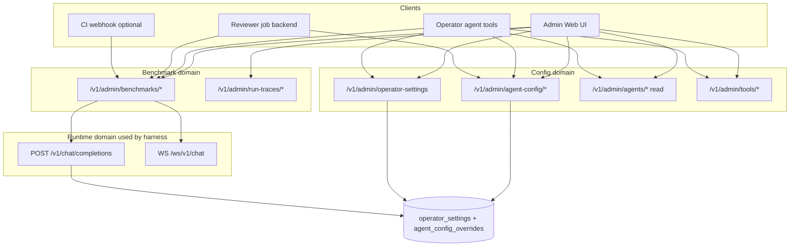

# Agent tuning — API surface (target design)

Companion to [`agent-tuning-platform.md`](./agent-tuning-platform.md) and [`knob-registry.yaml`](./knob-registry.yaml).

**Principle:** One write path per tunable layer. Admin UI, Operator agent tools, and automated reviewer jobs are **clients** — they never bypass HTTP handlers.

---

## 1. API map (four domains)



| Domain | Prefix | Role |
|--------|--------|------|
| **Agent config** | `/v1/admin/agent-config` | Registry-driven knobs, fingerprint, changelog, tuning sessions |
| **Operator settings** | `/v1/admin/operator-settings` | Product toggles (RAG, smart route, bridges, queue) — **already live** |
| **Benchmarks** | `/v1/admin/benchmarks` | Runs, stats, experiments, analysis, review |
| **Observability** | `/v1/admin/run-traces` | Per-turn traces, subagents, tool invocations |
| **Read-only introspection** | `/v1/admin/agents`, `/v1/admin/tools` | Agent/tool catalog for UI and LLM context |

---

## 2. Knob layers → API routing

From `knob-registry.yaml` `layer` field:

| Layer | Tunable via API? | Write API | Read in fingerprint? |
|-------|------------------|-----------|------------------------|
| `operator` | **Yes (today)** | `PATCH /v1/admin/operator-settings` | Yes |
| `runtime_config` | **Yes (planned)** | `POST /v1/admin/agent-config/apply` → **DB** | Yes |
| `agent_yaml` | **Yes (planned)** | `POST …/apply` → `agent_config_overrides` | Yes |
| `router_yaml` | **Yes (planned)** | `POST …/apply` → DB overlay or structured patch | Yes |
| `bench` | **Yes** | `POST /v1/admin/benchmarks/runs` (+ experiment run) | Per-run metadata only |
| `rubric` | Git / test repo | Read-only in UI; hash in fingerprint | Hash only |
| `code` | Git + deploy | Read-only + `git_sha` in fingerprint | Hash only |

**Effective value resolution (target):**

```text
effective(knob) = db_override[knob] ?? registry.default ?? bootstrap_env_key (install only)
```

**`.env` is never the tuning path.** `bootstrap_env_key` documents the legacy install default until DB has a value.

---

## 3. Existing APIs (unchanged clients)

### 3.1 Operator settings

```
GET    /v1/admin/operator-settings
PUT    /v1/admin/operator-settings      # full replace (legacy)
PATCH  /v1/admin/operator-settings      # partial — preferred
```

Body: `OperatorSettingsPatch` (`apps/backend/infrastructure/operator_settings.py`) — ~70 fields (RAG, memory, smart route, scheduler, media, voice, …).

**Operator mirror:** `settings_get`, `settings_patch` (schema generated from same Pydantic model).

**Tuning note:** Smart-route knobs (`llm_smart_routing_enabled`, …) stay here — benchmarks use explicit model profiles, but fingerprint still records them.

### 3.2 External LLM

```
GET  /v1/admin/external-llm/endpoints
PUT  /v1/admin/external-llm/endpoints
POST /v1/admin/external-llm/models       # probe catalog
```

**Operator mirror:** `external_llm_endpoints_get`, `external_llm_endpoints_put`, `external_llm_models_list`.

### 3.3 Tools & agents (read + policies)

```
GET /v1/admin/agents
GET /v1/admin/agents/{agent_id}?role=&tenant_id=
GET /v1/admin/tools
GET /v1/admin/tools/domains?domain=
PUT /v1/admin/tool-policies
POST /v1/admin/reload-tools
```

**Operator mirror:** `tools_catalog`, `tool_policies_put`, `reload_tools`.  
**Planned:** `agents_get` (list + optional detail) for Operator context — no write (agent identity is not a runtime knob).

### 3.4 Benchmarks (current)

```
GET    /v1/admin/benchmarks/suites
GET    /v1/admin/benchmarks/catalog
GET    /v1/admin/benchmarks/llm-providers
GET    /v1/admin/benchmarks/run-readiness?user_id=
POST   /v1/admin/benchmarks/cleanup-resources
GET    /v1/admin/benchmarks/stats?suite=&since_days=&…
POST   /v1/admin/benchmarks/runs/bulk-delete
GET    /v1/admin/benchmarks/runs
GET    /v1/admin/benchmarks/runs/{run_id}
DELETE /v1/admin/benchmarks/runs/{run_id}
POST   /v1/admin/benchmarks/runs/{run_id}/cancel
POST   /v1/admin/benchmarks/runs
```

**StartBenchmarkBody (today):**

```json
{
  "suite": "full",
  "profiles": [{ "label": "qwen", "model": "…", "agent_id": "general", "endpoint_id": 1 }],
  "scenarios": null,
  "fixtures": null,
  "tier_max": null,
  "run_as_user_id": null,
  "friend_user_id": null,
  "scenario_timeout_sec": null,
  "max_tool_rounds_override": null,
  "scenario_failure_retries": 0,
  "retain_workspaces": false,
  "prompt_locale": "en"
}
```

### 3.5 Run traces

```
GET /v1/admin/run-traces/runs?task_id=&conversation_id=&limit=
GET /v1/admin/run-traces/runs/{run_id}    # includes child_runs, tool invocations
GET /v1/admin/run-traces/tool-invocations?run_id=
```

---

## 4. Planned — `/v1/admin/agent-config`

New router: `apps/backend/api/agent_config_admin_api.py` (planned).

Registry YAML drives OpenAPI: each knob gets `id`, `type`, `ui_group`, `writable`, `layer`, validation.

### 4.1 Read endpoints

#### `GET /v1/admin/agent-config/knobs`

Query: `ui_group=`, `layer=`, `benchmark_sensitive=`, `agent_id=`, `writable_only=`

```json
{
  "ok": true,
  "registry_version": 1,
  "ui_groups": [{ "id": "agent_limits", "label": "Agent loop limits" }],
  "knobs": [
    {
      "id": "agent.max_tool_rounds",
      "layer": "env",
      "ui_group": "agent_limits",
      "writable": true,
      "type": "integer",
      "default": 8,
      "effective": 8,
      "source": "db_override",
      "bootstrap_env": "AGENT_MAX_TOOL_ROUNDS",
      "affects_agents": ["general", "coding"],
      "affects_clusters": ["S", "C"],
      "benchmark_sensitive": true,
      "doc": "Max LLM-tool rounds per chat turn."
    },
    {
      "id": "planner.tool_merge",
      "layer": "code",
      "writable": false,
      "effective": null,
      "source": "git",
      "source_path": "apps/backend/domain/agent_planner.py",
      "content_hash": "sha256:…"
    }
  ]
}
```

`source` enum: `db_override` | `env_bootstrap` | `file_default` | `git` | `operator_settings`.

#### `GET /v1/admin/agent-config/knobs/{knob_id}`

Single knob + validation schema + last changelog entry.

#### `GET /v1/admin/agent-config/fingerprint`

```json
{
  "ok": true,
  "fingerprint": "sha256:abc…",
  "git_sha": "deadbeef",
  "benchmark_sensitive_knob_count": 18,
  "computed_at": "2026-06-15T12:00:00Z"
}
```

Only `benchmark_sensitive: true` knobs + code/router/agent file hashes.

#### `GET /v1/admin/agent-config/snapshot`

Full export for experiment attachment:

```json
{
  "ok": true,
  "fingerprint": "sha256:…",
  "git_sha": "…",
  "knobs": { "agent.max_tool_rounds": 8, "operator.llm_smart_routing_enabled": true },
  "non_writable_hashes": { "planner.tool_merge": "sha256:…" },
  "captured_at": "…"
}
```

#### `GET /v1/admin/agent-config/changelog`

Query: `limit=50`, `since=`, `experiment_id=`, `session_id=`

```json
{
  "ok": true,
  "events": [
    {
      "id": "uuid",
      "at": "…",
      "actor": { "type": "user|operator_agent|reviewer_job", "user_id": "…" },
      "session_id": "uuid|null",
      "experiment_id": "uuid|null",
      "patches": [{ "knob_id": "agent.max_tool_rounds", "old": 8, "new": 12 }],
      "fingerprint_before": "sha256:…",
      "fingerprint_after": "sha256:…"
    }
  ]
}
```

### 4.2 Write endpoints

#### `POST /v1/admin/agent-config/draft` (optional)

Stage patches without applying — for UI preview / LLM plan review.

```json
// Request
{
  "patches": [
    { "knob_id": "agent.max_tool_rounds", "value": 12 },
    { "knob_id": "agent.general.pinned_tools", "value": ["delegate", "catalog", "workspace.create"] }
  ],
  "hypothesis": "More rounds fixes S4 on small models"
}

// Response
{
  "ok": true,
  "draft_id": "uuid",
  "validation": {
    "valid": true,
    "fingerprint_preview": "sha256:…",
    "warnings": []
  }
}
```

#### `POST /v1/admin/agent-config/apply`

**Primary tuning write path** for env/agent_yaml/router_yaml knobs.

```json
// Request
{
  "patches": [{ "knob_id": "agent.max_tool_rounds", "value": 12 }],
  "session_id": "uuid|null",
  "experiment_id": "uuid|null",
  "hypothesis": "optional",
  "trigger_benchmark": false,
  "benchmark": {
    "suite_preset": "routing-core",
    "harness_preset": "observability",
    "profiles_from_saved_matrix": true
  }
}

// Response
{
  "ok": true,
  "applied": [{ "knob_id": "agent.max_tool_rounds", "old": 8, "new": 12 }],
  "skipped": [{ "knob_id": "planner.tool_merge", "reason": "not_writable" }],
  "fingerprint": "sha256:…",
  "changelog_event_id": "uuid",
  "benchmark_run_id": "uuid|null"
}
```

**Routing inside handler:**

- `layer: operator` → delegate to `apply_operator_settings_patch` (same DB path as PATCH operator-settings)
- `layer: env` → `agent_config_overrides` or dedicated columns on `operator_settings`
- `layer: agent_yaml` → DB overlay merged at registry read; optional hot-reload signal
- `layer: router_yaml` → structured JSON patch in DB
- `layer: code|rubric` → 400 `not_writable`

#### Tuning sessions (orchestration wrapper)

```
POST   /v1/admin/agent-config/sessions
GET    /v1/admin/agent-config/sessions
GET    /v1/admin/agent-config/sessions/{id}
PATCH  /v1/admin/agent-config/sessions/{id}     # metadata only
POST   /v1/admin/agent-config/sessions/{id}/validate
POST   /v1/admin/agent-config/sessions/{id}/close
```

**Create session:**

```json
// POST /sessions
{ "label": "routing-v4", "hypothesis": "Disable ranking for S1", "cohort_label": "routing-v4" }

// Response
{
  "ok": true,
  "session": {
    "id": "uuid",
    "status": "open",
    "baseline_fingerprint": "sha256:…",
    "cohort_label": "routing-v4",
    "experiment_ids": [],
    "run_ids": []
  }
}
```

**Validate** → queues benchmark, links `session_id` + `cohort_label` + current fingerprint on run.

**Close:**

```json
{ "accept": true, "revert_patches": false }
// accept=false + revert_patches=true → apply inverse patches from session changelog
```

---

## 5. Planned — `/v1/admin/benchmarks` extensions

### 5.1 Experiments

```
POST   /v1/admin/benchmarks/experiments
GET    /v1/admin/benchmarks/experiments
GET    /v1/admin/benchmarks/experiments/{id}
PATCH  /v1/admin/benchmarks/experiments/{id}
POST   /v1/admin/benchmarks/experiments/{id}/run
GET    /v1/admin/benchmarks/experiments/{id}/report
```

**Create:**

```json
{
  "label": "ranking-off-s1",
  "hypothesis": "S1 passes without tool ranking",
  "session_id": "uuid|null",
  "knob_patches": [{ "knob_id": "tool_forward.ranking_enabled", "value": false }],
  "suite_preset": "routing-core",
  "harness_preset": "observability"
}
```

Experiment record:

```json
{
  "id": "uuid",
  "label": "…",
  "hypothesis": "…",
  "status": "draft|running|completed|accepted|rejected",
  "session_id": "uuid|null",
  "fingerprint_at_start": "sha256:…",
  "knob_changes": [],
  "run_ids": ["uuid"],
  "review_ids": ["uuid"],
  "created_at": "…",
  "closed_at": null
}
```

**`POST …/experiments/{id}/run`:** applies pending patches (if not yet applied), then `POST /runs` with metadata:

```json
{
  "cohort_label": "exp-ranking-off-s1",
  "experiment_id": "uuid",
  "fingerprint": "sha256:…",
  "harness_preset": "observability",
  "suite_preset": "routing-core"
}
```

### 5.2 Analysis & cohorts

```
GET /v1/admin/benchmarks/analysis?cohort=&fingerprint=&git_sha=&suite=&since_days=
GET /v1/admin/benchmarks/cohorts
GET /v1/admin/benchmarks/cohorts/compare?cohort_a=&cohort_b=
GET /v1/admin/benchmarks/runs/{run_id}/export
```

**Analysis response (sketch):**

```json
{
  "ok": true,
  "meta": { "cohort": "routing-v4", "run_count": 3, "fingerprint": "…" },
  "by_scenario": [{ "scenario_id": "S1_tool_catalog", "pass_rate": 0.4, "patterns": ["no_catalog_call"] }],
  "by_cluster": [{ "cluster": "S", "pass_rate": 0.55 }],
  "by_pattern": [{ "pattern_id": "delegate_missing", "count": 12, "scenarios": ["S4_delegate_math"] }]
}
```

**Stats extension:** add query params `cohort=`, `fingerprint=` to existing `GET /stats`.

### 5.3 Reviewer LLM

```
POST /v1/admin/benchmarks/review
GET  /v1/admin/benchmarks/reviews/{id}
```

**Request:**

```json
{
  "experiment_id": "uuid",
  "cohort_a": "routing-v3",
  "cohort_b": "routing-v4",
  "reviewer_model": "…",
  "auto_apply_recommended_patches": false
}
```

**Response:** structured verdict (see agent-tuning-platform §10) + optional `applied_patches` if `auto_apply` and human policy allows.

Reviewer **never** writes env files — only `POST /agent-config/apply`.

### 5.4 StartBenchmarkBody extensions

```json
{
  "cohort_label": "routing-v3",
  "experiment_id": "uuid",
  "session_id": "uuid",
  "fingerprint": "sha256:…",
  "harness_preset": "observability",
  "suite_preset": "routing-core",
  "trigger_review": false
}
```

Stored on run row (`cohort_json` column planned).

---

## 6. Operator agent — tool mirror (complete target)

See also **Reviewer agent** tools in [`implementation-plan.md`](./implementation-plan.md) §2.2.

Pattern: each HTTP endpoint → thin tool handler calling same domain function (as `settings_patch` today).

| Tool name | HTTP | Notes |
|-----------|------|-------|
| `settings_get` | GET operator-settings | **exists** |
| `settings_patch` | PATCH operator-settings | **exists** |
| `interfaces_get` / `interfaces_put` | GET/PUT interfaces | **exists** |
| `external_llm_endpoints_get/put` | GET/PUT external-llm | **exists** |
| `tools_catalog` | GET tools | **exists** |
| `tool_policies_put` | PUT tool-policies | **exists** |
| `reload_tools` | POST reload-tools | **exists** |
| `agents_list` | GET agents | **planned** |
| `agents_get` | GET agents/{id} | **planned** |
| `agent_config_knobs` | GET agent-config/knobs | **planned** |
| `agent_config_snapshot` | GET agent-config/snapshot | **planned** |
| `agent_config_apply` | POST agent-config/apply | **planned** — primary LLM tuning tool |
| `agent_config_changelog` | GET agent-config/changelog | **planned** |
| `tuning_session_create` | POST agent-config/sessions | **planned** |
| `tuning_session_validate` | POST …/sessions/{id}/validate | **planned** |
| `benchmark_stats` | GET benchmarks/stats | **planned** |
| `benchmark_analysis` | GET benchmarks/analysis | **planned** |
| `benchmark_run_start` | POST benchmarks/runs | **planned** |
| `benchmark_run_get` | GET benchmarks/runs/{id} | **planned** |
| `benchmark_experiment_create` | POST benchmarks/experiments | **planned** |
| `benchmark_experiment_run` | POST …/experiments/{id}/run | **planned** |
| `benchmark_review` | POST benchmarks/review | **planned** |
| `run_trace_get` | GET run-traces/runs/{id} | **planned** — debug failures |

Tool parameters for `agent_config_apply` generated from registry (like `OperatorSettingsPatch` schema today).

---

## 7. End-to-end tuning flows

### 7.1 Human via Admin UI

```text
1. GET  /agent-config/knobs?writable_only=true
2. POST /agent-config/sessions  { label, hypothesis, cohort_label }
3. POST /agent-config/apply     { patches, session_id }
4. POST /sessions/{id}/validate { suite_preset: routing-core }
5. Poll GET /benchmarks/runs/{id}
6. GET  /benchmarks/analysis?cohort=…
7. POST /benchmarks/review      { experiment_id }   (optional)
8. POST /sessions/{id}/close    { accept: true }
```

### 7.2 Human via Operator chat

Same steps; Operator calls tools 1–8. User: *"Disable tool ranking and run routing-core on my saved matrix."*

### 7.3 Automated reviewer (no chat)

```text
1. Benchmark completes → webhook or job
2. GET  /benchmarks/analysis?experiment_id=…
3. LLM → JSON { recommended_patches, accept_experiment }
4. POST /agent-config/apply  { patches, experiment_id }  if accept
5. POST /experiments/{id}/run  if iterate
```

---

## 8. DB tables (planned)

| Table | Purpose |
|-------|---------|
| `operator_settings` | Existing; extend JSONB `agent_config` or add columns for routing knobs |
| `agent_config_overrides` | `tenant_id`, `knob_id`, `value_json`, `updated_at` |
| `agent_config_changelog` | Append-only audit |
| `agent_config_sessions` | Tuning session state |
| `benchmark_experiments` | Experiment CRUD |
| `benchmark_reviews` | Reviewer LLM I/O |
| `benchmark_runs.cohort_json` | `{ cohort_label, fingerprint, experiment_id, session_id, harness_preset }` |

---

## 9. Implementation order (API-first)

| Step | Deliverable | Unblocks |
|------|-------------|----------|
| 1 | `GET /agent-config/knobs` + registry loader | UI read, Operator context |
| 2 | DB overrides + `POST /apply` for first env knobs | Real runtime tuning |
| 3 | `fingerprint` + `changelog` | Experiment isolation |
| 4 | Operator `agent_config_apply` | LLM interactive tuning |
| 5 | Sessions + `validate` | One-click loop |
| 6 | Experiments + analysis + review | Full platform |

**Do not** add tuning fields to `.env` or Admin env forms. **Do** extend `OperatorSettingsPatch` only for knobs that truly belong in operator product settings (smart route, RAG); routing knobs go through `agent-config/apply`.

---

## 10. References

| Item | Path |
|------|------|
| Master plan | `docs/benchmarks/agent-tuning-platform.md` |
| Knob registry | `docs/benchmarks/knob-registry.yaml` |
| Benchmark API | `apps/backend/api/benchmarks_admin_api.py` |
| Operator tools | `plugins/tools/platform/operator/admin.py` |
| HTTP policy | `docs/api/http.md` |
