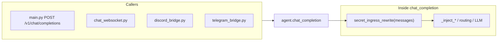

## Purpose

**Status (2026-05):** MVP is **implemented** in code (vault table migration `schema_043`, `chat_secret_ingress`, hooks in `chat_completion` + conversations API, placeholder resolution in selected operator tools). Defaults remain **off** until `CHAT_SECRET_INGRESS_ENABLED=1` and a Fernet key are set.

This document **narrows where** the chat secret ingress pipeline (ADR [`0006-chat-secret-ingress-pipeline.md`](../adr/0006-chat-secret-ingress-pipeline.md)) attaches in the AgentLayer codebase, **in what order** relative to existing injections, and **which entrypoints** must be covered so secrets do not only disappear for the LLM but also do not linger incorrectly in Postgres.

## Single planner choke point (minimum viable hook)

**Primary target:** `chat_completion` in `apps/backend/domain/agent.py`.

Today the request `body` is normalized, then a **copy** of chat history is built and progressively augmented:

```2072:2087:apps/backend/domain/agent.py
        messages = _inject_system_prompt(list(body.get("messages") or []))
        messages = _inject_dashboard_context(messages, dashboard_ctx)
        if agent_id:
            messages = _inject_agent_system_prompt(messages, agent_id)
        if agent_id and agent_id in config.AGENT_SKILLS_PROMPT_AGENT_IDS:
            from apps.backend.infrastructure.plugins.skills_prompt import load_combined_skills_prompt

            skills_snip = load_combined_skills_prompt(agent_id)
            if skills_snip:
                messages = _append_system_block(messages, skills_snip)
        pf = body.get("tool_prefetch")
        if isinstance(pf, dict):
            _apply_tool_prefetch(messages, pf)
        messages = apply_user_persona_system(messages)
        messages = _inject_user_memory_context(messages, dashboard_ctx)
        messages = _inject_workspace_dot_agentlayer_hints(messages, workspace)
```

**Recommended insertion:** immediately **after** `list(body.get("messages") or [])` is taken and **before** `_inject_system_prompt`, or immediately **after** `_inject_system_prompt` and **before** `_inject_dashboard_context`.

- **Before** system injection: only user/system messages from the client are present; ingress logic does not need to skip injected blocks.
- **After** system injection: same for user turns; system blocks added by the server are trusted.

Either is fine; pick one and keep it stable for tests.

**Why here:** everything downstream uses `messages` — `last_user_text(messages)` for router categories (`~2125`), `resolve_effective_model(messages=…)`, smart routing, and finally HTTP calls to the LLM. If ingress rewrites **user** `content` in place, the model never sees raw secrets **for this request**.

**Identity for vault rows:** `get_identity()` is already used later in the same function (`tenant_id, user_id` from `~1916` area). Ingress must run **after** the caller has `set_identity` (HTTP `main.py` and WebSocket both do this before `chat_completion`).

### Call sites that already funnel through `chat_completion`

| Call site | File (approx.) | Notes |
|-----------|----------------|--------|
| HTTP OpenAI-style chat | `apps/backend/api/main.py` (`POST /v1/chat/completions`, `~1117–1144`) | Body contains full `messages[]`. |
| WebSocket chat | `apps/backend/api/chat_websocket.py` (`~165–175`) | `work` dict is the same shape; `stream` ignored. |
| Discord bridge | `apps/backend/infrastructure/integrations/discord_bridge.py` (`~239`) | Builds `work` via bridge session helpers; user text can contain secrets. |
| Telegram bridge | `apps/backend/infrastructure/integrations/telegram_bridge.py` (`~255`) | Same pattern. |
| Scheduler / jobs | `apps/backend/infrastructure/scheduler.py`, `scheduler_jobs_runner.py` | Same `chat_completion` entry; usually no user secrets — still safe to run ingress (no-op). |

No change required at each call site if ingress is **inside** `chat_completion`.



## Second persistence path (web conversations API) — **must** be addressed

The Web UI syncs threads via **`/v1/user/conversations`**, not only via `chat_completion`:

| Operation | File | What happens |
|-----------|------|----------------|
| `POST /v1/user/conversations` | `apps/backend/api/conversations_api.py` (`~62–87`) | `conversation_create(..., messages=[...])` persists the **client-supplied** message list. |
| `PUT /v1/user/conversations/{id}` | same (`~99–118`) | `conversation_replace` overwrites messages from the client. |

So even if `chat_completion` redacts `messages` for the LLM, **raw secrets can already be in `chat_messages` rows** if the frontend saved the thread before or after the completion.

**Options (pick in implementation):**

1. **Server-side ingress on write** — call the same `secret_ingress_rewrite` (or a shared `ingress_user_messages_for_persistence(messages) -> (rewritten, vault_ops)`) inside `conversation_create` / `conversation_replace` in `apps/backend/infrastructure/conversations_db.py`, or in `conversations_api.py` immediately before `conversation_create` / `conversation_replace`.
2. **Client-side pre-strip** — weaker (bypass, extensions, bugs); only as UX hint, not as security boundary.
3. **Dual write policy** — document that persistence always goes through API that runs ingress; forbid raw bulk tools from writing `chat_messages` without passing ingress (grep other writers).

**Recommendation:** **(1)** shared module `apps/backend/infrastructure/chat_secret_ingress.py` (name TBD) with pure functions + DB vault; invoked from **both** `chat_completion` and conversation create/replace paths.

## Tool execution path (secondary)

Secrets can also appear in **tool arguments** (`settings_patch`, `external_llm_endpoints_put`, …). ADR 0006 focuses on **user message** ingress; tool-args are a separate decision:

- Either **reject** raw token keys in tool args when feature flag on and require placeholders only, or
- Run a **narrow** redaction on `arguments` dict inside `run_tool` / `log_tool_invocation` only for logging (already partially supported via `tool_log_redact_keys` in `apps/backend/infrastructure/db/db.py` `log_tool_invocation`).

Do not conflate the two; message ingress does not sanitize tool JSON automatically.

## Memory / other ingest paths (optional cross-check)

`apps/backend/api/memory.py` uses `_reject_secrets` for some memory writes — unrelated to chat ingress but shows existing “no secrets in this channel” thinking. New ingress should not weaken that; align policies in docs.

## Ordering constraints (inside `chat_completion`)

1. **After** identity is available (`get_identity()`).
2. **Before** any use of `last_user_text(messages)` for routing if you want router to see **redacted** text (usually **yes** for logging; routing rarely needs raw secrets).
3. **Before** first LLM HTTP call.
4. If ingress **fails** ambiguous extraction (policy: block), return `400` / structured error **without** calling the LLM.

## Feature flag and testing hooks

- Config/env gate in `apps/backend/infrastructure/config.py` (pattern used elsewhere).
- Unit tests: golden user strings → expected rewritten `messages` + vault fixture (no real crypto in CI if using abstract interface).
- Integration: one HTTP `chat_completion` and one `POST /v1/user/conversations` with the same payload to ensure **both** paths match.

## Summary table

| Layer | Location | Action |
|-------|----------|--------|
| **LLM boundary** | `agent.chat_completion` | Run ingress rewrite on `messages` (user parts). |
| **DB thread sync** | `conversations_api` + `conversations_db` create/replace | Same rewrite before INSERT. |
| **Bridges** | No extra hook if they use `chat_completion` only | Ingress in `chat_completion` covers them. |
| **Tool args** | `run_tool` / operator tools | Separate policy (placeholder-only or log redaction). |

## See also

- [`docs/adr/0006-chat-secret-ingress-pipeline.md`](../adr/0006-chat-secret-ingress-pipeline.md) — product/security spec.
- [`docs/features/operator-agent.md`](../features/operator-agent.md) — Tier C setup links vs chat ingress.
