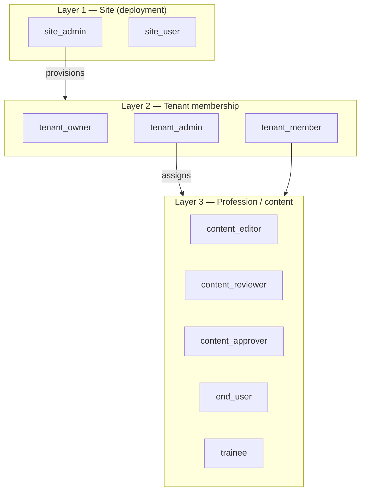

## Roles and scopes — canonical model

**Status:** agreed direction, **not fully implemented** in AgentLayer yet.  
This document separates **deployment-wide** roles from **tenant-scoped** roles and
from **profession/content** roles. Use it before Task 03b / 05 implementation.

Related:

- Platform plan: [`../knowledge-companion-plan.md`](../knowledge-companion-plan.md)
- Task 03b: [`./03b-identity-roles-and-surfaces.md`](./03b-identity-roles-and-surfaces.md)
- Task 05: [`./05-profession-rbac.md`](./05-profession-rbac.md)
- Task 07: [`./07-tenant-templates.md`](./07-tenant-templates.md)

---

## Deployment mode (chosen once in `/app/setup`)

**Important:** the **instance setup wizard** (`/setup`) is not the same as
**tenant org setup** (`/org/setup`). The first chooses whether this installation
even **has a tenant/organization product layer**.

| Mode | ID (target) | Who it's for | Visible concepts |
|------|-------------|--------------|------------------|
| **Agent system** | `agent_system` | Homelab, small team, personal Jetson — **no firms/groups** | `site_admin`, `site_user`, chat, agents, optional team RAG |
| **Multi-tenant system** | `multi_tenant` | Knowledge companion product — **clinics, companies, departments** | Site Admin + Tenant Admin + `/org` + templates + isolation |

**Target field:** `operator_settings.deployment_mode` ∈ `{ agent_system, multi_tenant }`  
(chosen in setup step 1, **immutable** after bootstrap except break-glass Site Admin migration)

```text
/app/setup
  Step 0 (new): deployment mode
    → agent_system     … single implicit org, no firm UI
    → multi_tenant     … full tenant system (knowledge companion)
  Step 1+: admin account, LLM/RAG (both modes)
```

### Agent system mode (`agent_system`)

- **No** Organization menu (`/app/org` hidden).
- **No** Site Admin “create tenant”, tenant switch, or tenant templates.
- **No** Tenant Admin / tenant_owner / profession RBAC UI (Layers 2–3 collapsed).
- **Roles:** Layer 1 only — `site_admin` and `site_user`.
- **Users:** admin invites users; everyone shares one implicit org (DB may still use
  `tenant_id = 1` internally — not exposed in UI).
- **Team knowledge:** Site Admin publishes to `tenant_knowledge` from a **single-org**
  surface (e.g. Admin → Team knowledge or Settings → Knowledge) — not `/org`.
- **Knowledge companion:** still works; RAG domain `tenant_knowledge` for shared notes.

Use when you want **AgentLayer as an agent platform**, not as a B2B multi-customer product.

### Multi-tenant system mode (`multi_tenant`)

- Full model in this document: Site Admin + Tenant Admin + `/org` + Task 03b–07.
- Site Admin provisions customer orgs (tenants).
- Tenant Admin runs **mandatory** `/org/setup` on first login.
- Strict isolation between orgs; profession roles (Layer 3) apply.

Use for **knowledge companion** and selling to multiple organizations.

### Mode comparison

| Feature | `agent_system` | `multi_tenant` |
|---------|----------------|----------------|
| `/app/setup` deployment choice | yes | yes |
| `/app/admin` (operator) | yes | yes |
| `/app/org` | **hidden** | yes |
| Create tenant / firm | no | Site Admin |
| Tenant setup wizard | no | mandatory `/org/setup` |
| Tenant Admin role | no (admin = site admin) | yes |
| Profession roles (Task 05) | optional / deferred | yes |
| `tenant_knowledge` RAG | yes (one team) | yes (per org) |
| Vertical profiles | optional | yes (`healthcare_ops`, …) |

---

## Problem today

AgentLayer collapses too much into one flag:

| What exists now | Meaning in practice |
|-----------------|---------------------|
| `users.role = admin` | Site operator **and** tenant power-user **and** RAG ingest |
| `users.role = user` | Chat + search only |
| `users.tenant_id` | Org membership (one tenant per user today) |

That is enough for a solo pilot but **wrong for multi-tenant product**:

- A clinic Tenant Admin must **not** see embedding URLs, LLM endpoints, or other tenants.
- A Site Admin must **not** be confused with “administrator of the anesthesia department”.
- Content permissions (editor / reviewer) are **not** the same as org admin.

---

## Three layers (orthogonal)

Think in **three layers**, not one `role` column — **only in `multi_tenant` mode**.
In `agent_system` mode, **Layer 1 alone** is sufficient (admin + user).

```text
Layer 1 — Deployment (site)     Who runs the AgentLayer installation?
Layer 2 — Tenant membership     Which org(s) is the user in, and with what org role?
Layer 3 — Tenant profession     What job function / content hat inside the org?
```



**Rule:** higher layers do not replace lower layers. A user can be
`site_user` + `tenant_admin` + `content_editor` at the same time.

---

## Layer 1 — Site (deployment) roles

**Scope:** entire installation (all tenants, operator settings, infrastructure).

| Role | ID (target) | UI | Can do (examples) |
|------|-------------|-----|-------------------|
| **Site Admin** | `site_admin` | `/app/admin` | Operator settings, LLM/embedding/RAG config, create tenants, templates, global tools/agents |
| **Site User** | `site_user` | no `/admin` | Normal product use; may still be Tenant Admin in Layer 2 |

**Naming:** in UI say **Site Admin** / **Plattform-Admin**, not plain “Admin”.

**Today:** `users.role = admin` ≈ Site Admin; `users.role = user` ≈ Site User.

**Target field:** `users.site_role` ∈ `{ site_admin, site_user }`  
(or rename current `users.role` → `site_role` in a migration).

---

## Layer 2 — Tenant membership roles

**Scope:** one row per `(user_id, tenant_id)` — org administration, not platform ops.

| Role | ID (target) | UI | Can do (examples) |
|------|-------------|-----|-------------------|
| **Tenant Owner** | `tenant_owner` | `/app/org` | Full org control; billing handoff; delete tenant (future) |
| **Tenant Admin** | `tenant_admin` | `/app/org` | Invite users, departments, publish policy, tenant profile |
| **Tenant Member** | `tenant_member` | Chat, `/app/org` read-only areas | Use knowledge companion; no org settings |

**Today:** no membership table — only `users.tenant_id`. Tenant power = Site Admin.

**Target table:** `tenant_memberships(user_id, tenant_id, membership_role, …)`

**Rules:**

- Tenant roles never grant `/app/admin`.
- Site Admin may act on any tenant for **support/provisioning** (audited); default UI
  still separates `/admin` vs `/org`.
- MVP: one tenant per user; multi-tenant membership is a later extension.

---

## Layer 3 — Profession / content roles (tenant-local)

**Scope:** inside a tenant only; configured by Tenant Admin (Task 05).

| Role | Purpose |
|------|---------|
| `content_editor` | Draft CMS notes |
| `content_reviewer` | Review drafts |
| `content_approver` | Publish → RAG ingest |
| `domain_admin` | Manage profession templates / departments |
| `end_user` | Search published knowledge |
| `trainee` | Limited categories until qualified |

These are **not** site roles and **not** a substitute for `tenant_admin`.

See MVP matrix in [`knowledge-companion-plan.md`](../knowledge-companion-plan.md#tenant-admin-operations).

---

## UI surfaces vs roles

| Surface | Route | `agent_system` | `multi_tenant` |
|---------|-------|----------------|----------------|
| Instance setup | `/app/setup` | mode choice + site_admin + LLM | same |
| Site admin | `/app/admin` | site_admin | site_admin |
| Organization | `/app/org` | **hidden** | tenant_owner / tenant_admin |
| Team knowledge publish | admin or `/org/knowledge` | **Admin → Team knowledge** | **Organization → Knowledge** |
| Chat / companion | `/app/chat` | all users | tenant members |

**Pilot (today):** both `/admin` and `/org` require `users.role = admin` — temporary.
Task **03b** fixes `/org` for tenant admins without site access.

---

## Setup and operating modes

Depends on **`deployment_mode`** from `/app/setup`:

### A. Instance bootstrap (`/app/setup`) — both modes

1. Choose **`agent_system`** or **`multi_tenant`**
2. Create first `site_admin`
3. Configure LLM / embedding / RAG

**Agent system:** setup complete → use chat/admin.  
**Multi-tenant:** continue with B–D.

### B. Site provisioning (`multi_tenant` only)

Site Admin → `/app/admin` → create tenant (+ Task 07 templates).

### C. Tenant org setup (`multi_tenant` only)

Tenant Admin first login → **mandatory** `/app/org/setup` (disclaimer; publish or empty checkbox).

### D. Steady state

| Mode | Admin publishes knowledge | Users |
|------|---------------------------|-------|
| `agent_system` | Site Admin (no `/org`) | admin invites users; all search shared team RAG |
| `multi_tenant` | Tenant Admin via `/org` | per-org isolation |

```text
/setup              → A (+ deployment_mode)
/admin/tenants      → B (multi_tenant only)
/org/setup          → C (multi_tenant only)
/admin/team-knowledge OR /org/knowledge → D publish
/chat               → D consume
```

---

## Permission examples

| Action | site_admin | tenant_admin | tenant_member | content_editor |
|--------|------------|--------------|---------------|----------------|
| Change embedding model | yes | no | no | no |
| Create tenant | yes | no | no | no |
| Add `tenant_knowledge` to shared domains | yes | no* | no | no |
| Invite user to own tenant | yes† | yes | no | no |
| Publish note to `tenant_knowledge` | yes† | yes | no | no‡ |
| Chat with knowledge_companion | yes | yes | yes | yes |
| POST `/v1/admin/rag/ingest` | yes† | yes§ | no | no‡ |

\* Tenant Admin may *request* domain enablement; Site Admin applies operator settings.  
† Site Admin acting on a tenant for support — audited, not the normal customer path.  
‡ After Task 04/06: publish via CMS workflow, not raw ingest API.  
§ Task 03b: tenant-scoped ingest API or CMS publish, not platform admin routes.

---

## Migration from today

| Step | Task | Change |
|------|------|--------|
| 0 | setup wizard | Add `deployment_mode` choice; branch UI (`/org` vs admin team knowledge) |
| 1 | 03 | Colleagues as `site_user` + same `tenant_id`; verify RAG isolation |
| 2 | **03b** | Introduce `tenant_memberships`; `/org` for `tenant_admin`; split ingest auth |
| 3 | 04 | CMS replaces raw publish for tenant content |
| 4 | 05 | Profession roles + department filters |
| 5 | 06 | Review / approve workflow |
| 6 | 07 | Site Admin: create tenant from template |

**Pilot shortcut (solo dev):** one account holds `site_admin` + `tenant_owner` —
document that this is **dual hat**, not the production model.

---

## Decisions (resolved)

| # | Question | **Decision** | Rationale |
|---|----------|--------------|-----------|
| 1 | `users.role` naming | **Add `users.site_role`**, keep `role` as read alias during migration | No breaking API/SQL rename; map `admin`→`site_admin`, `user`→`site_user`; drop alias in later release |
| 2 | Site Admin cross-tenant support | **Explicit tenant switch** in `/admin`, not impersonation | Support sees “Acting on tenant X” banner; actions logged with `actor_user_id` + `target_tenant_id`; no hidden login-as-user |
| 3 | Tenant setup | **Mandatory blocking wizard** at first Tenant Admin login (`/org/setup`) | Step 3: publish first note **or** explicit “empty knowledge base” checkbox |
| 4 | Multi-tenant users | **Membership table now**, single row in MVP UI | Schema supports multiple rows later |
| 5 | API prefix for tenant ops | **`/v1/org/*`** | Matches UI route `/app/org` |
| 6 | Deployment mode at setup | **`agent_system` vs `multi_tenant`** in `/app/setup` step 0 | Agent platform vs knowledge-companion product; `/org` only when `multi_tenant` |

### Decision 1 — why not rename in place?

Renaming `users.role` → `site_role` in one step breaks:

- every `require_admin()` check and test fixture
- frontend `user.role === "admin"`
- external docs and Bearer clients

**Better path:** add column → backfill → code reads `site_role` with fallback to `role` → later remove `role`.

### Decision 2 — tenant switch vs impersonation (plain language)

| Approach | What happens | Pros | Cons |
|----------|--------------|------|------|
| **Tenant switch** | Site Admin picks tenant “Klinik Süd” in `/admin`; UI shows banner “Managing tenant: Klinik Süd”; APIs send `X-Target-Tenant-Id` or session scope | Transparent, auditable, no password sharing | Site Admin UI must always show which tenant is active |
| **Impersonation** | Site Admin clicks “Login as user@klinik…” and becomes that user in the app | Good for reproducing exact user bugs | Easy to abuse; hard to audit; blurs Site vs Tenant boundary |

**Chosen:** tenant switch only for MVP. Impersonation deferred unless support tooling requires it (would need separate audited break-glass flow).

### Decision 3 — mandatory tenant setup wizard

First login as `tenant_owner` or `tenant_admin` → redirect to `/org/setup` until complete.

**Minimum steps (blocking):**

1. Confirm org display name and `vertical_profile`
2. Accept content disclaimer / learning-aid policy
3. **Either** publish first self-authored note **or** check **“Start with empty knowledge base”**
   (explicit choice required — cannot finish wizard without one of the two)
4. Optional in wizard but encouraged: first department name, invite first colleague

**After complete:** `tenant.setup_completed_at` set; normal `/org` access.

Site Admin **Mode 2** (create tenant from template) does **not** replace this — the wizard runs when the **customer** Tenant Admin first signs in.

---

## Open decisions

_None blocking 03b — see table above._


## Terminology cheat sheet

| Say | Do not say | Meaning |
|-----|------------|---------|
| Site Admin | Admin (alone) | Deployment operator |
| Tenant Admin | Admin (alone) | Organization administrator |
| Tenant Member | User (alone) | Colleague in the org |
| Profession role | Role (alone) | Job function inside tenant |
| Platform docs domain | — | `agentlayer_docs` (site/product help) |
| Team knowledge domain | — | `tenant_knowledge` (org notes) |
