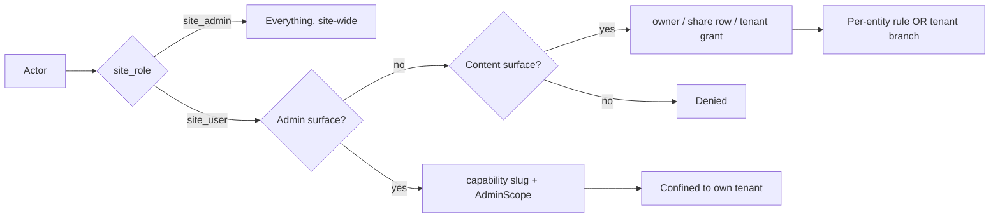
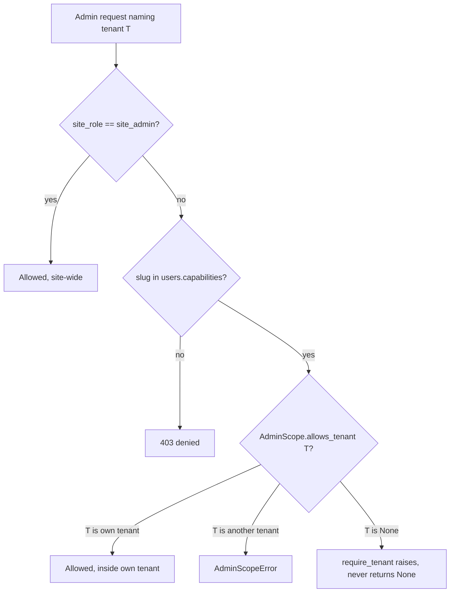
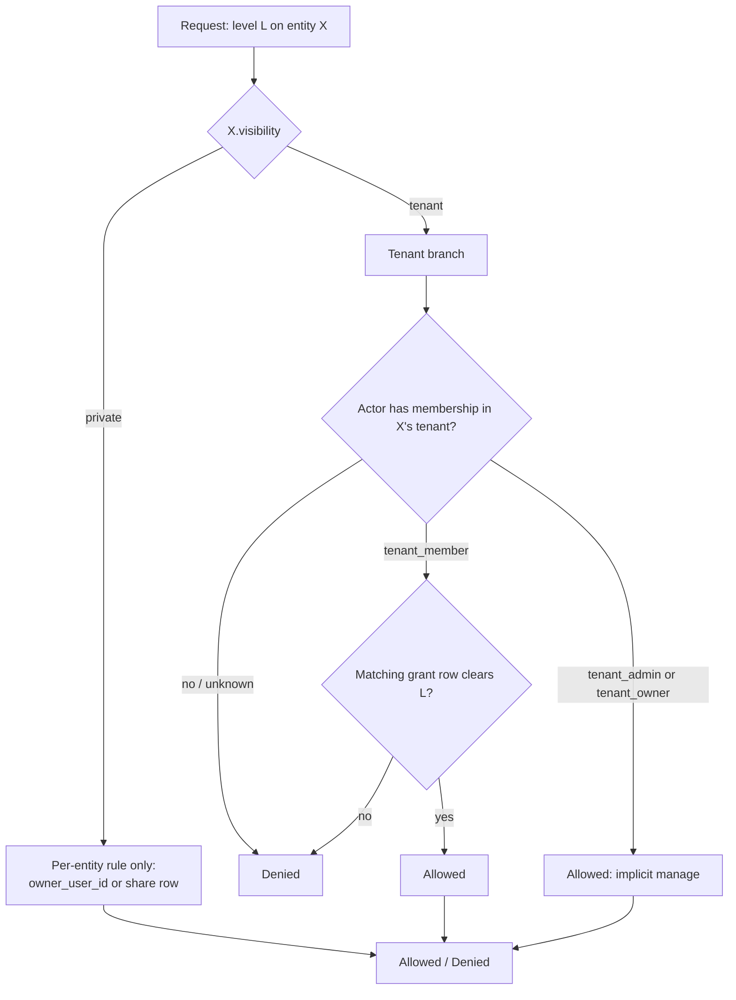
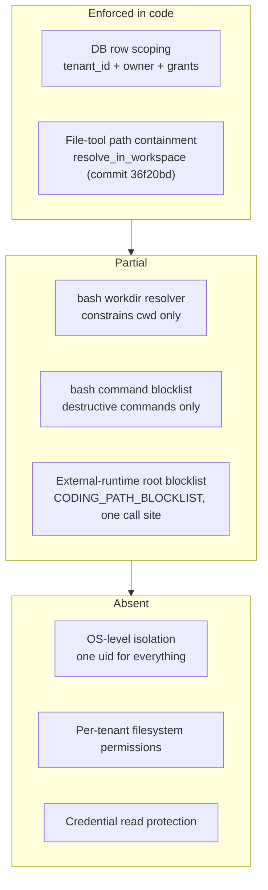
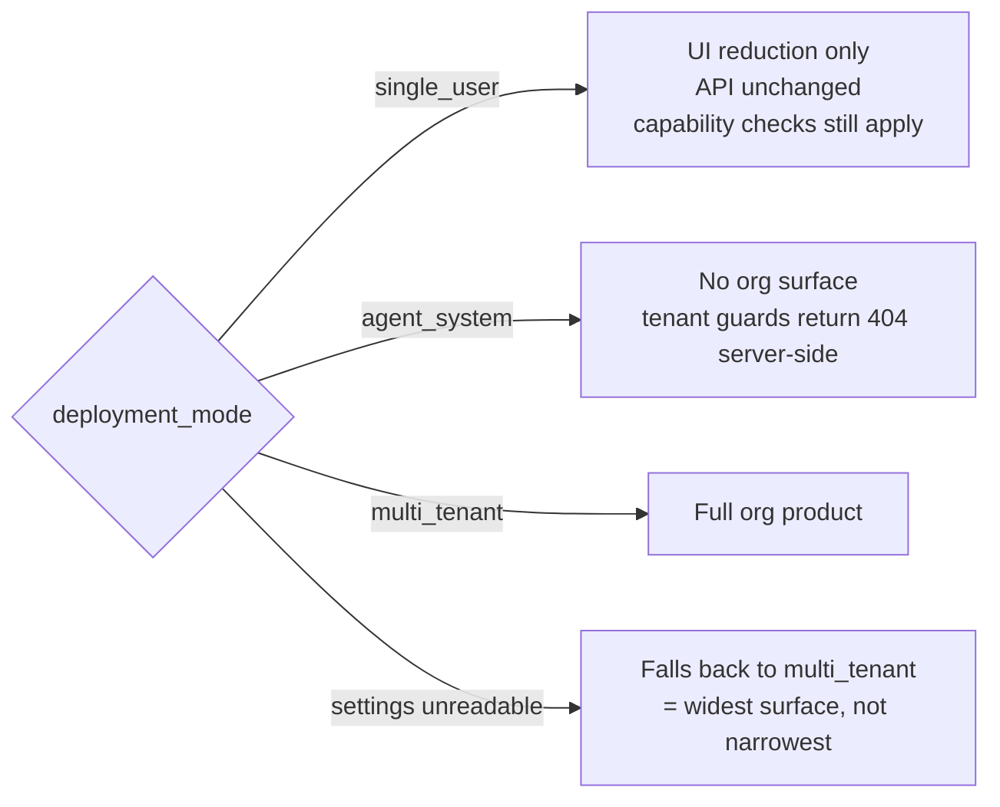
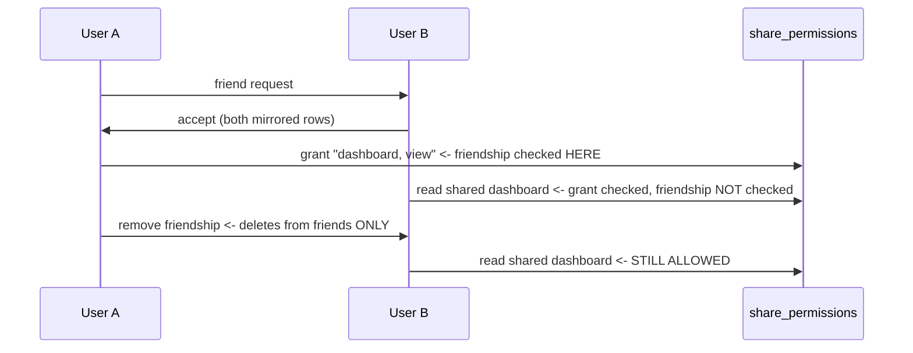
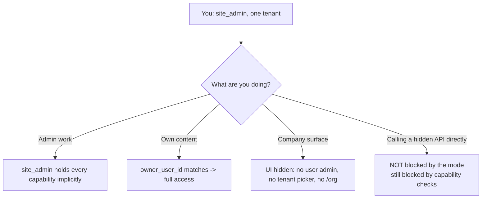
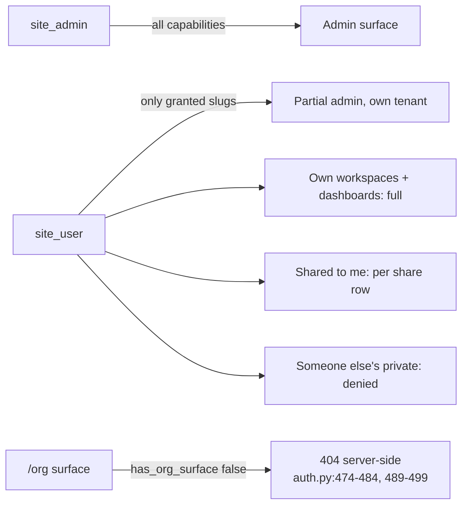
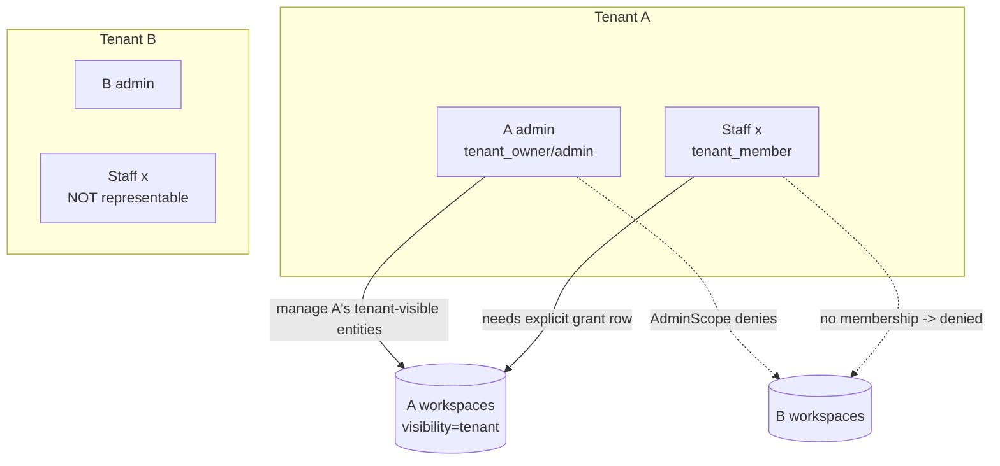

# RBAC in AgentLayer

How permissions actually work: what is enforced, where, and what is *not*.

This document describes the system as it exists in the code, not as it was
intended. Where the two differ, that is stated explicitly and linked to the
file that proves it. Every claim carries a `path:line`.

**Read this first if you are:** granting access, deploying an instance,
reviewing a feature that touches who-can-see-what, or trying to understand why
a specific action was denied.

---

## 1. The shape of it: three independent axes

AgentLayer does not have one permission system. It has three, plus a
deployment mode that changes how much of the UI exists. Conflating them is the
main source of confusion, so keep them separate:

| Axis | Question it answers | Where it lives | Enforced |
|---|---|---|---|
| **Site role** | Are you a platform operator? | `users.site_role` | Everywhere |
| **Admin capability** | May you administer *this domain*, and how far does that reach? | `users.capabilities` + `AdminScope` | Admin API only |
| **Entity access** | May you view/edit/manage *this specific workspace or dashboard*? | owner column + share rows + `visibility` + grants | Content API |
| **Deployment mode** | How much of the product exists on this instance? | `operator_settings.deployment_mode` | Mixed — see §6 |

A request is usually checked against more than one. They are not a single rank
ladder and deliberately do not collapse into one: `domain/access/entity_access.py:5-8`
explains why the two entity models are not isomorphic.



---

## 2. Identity and roles

Literal DB strings — these are the values the `CHECK` constraints accept.
Spelling matters.

| Column | Allowed values | Default | Constraint |
|---|---|---|---|
| `users.site_role` | `site_admin`, `site_user` | `site_user` | `schema_111_identity_roles_deployment_mode.py:52-53` |
| `tenant_memberships.membership_role` | `tenant_owner`, `tenant_admin`, `tenant_member` | `tenant_member` | `schema_111:78-79` |
| `users.role` (legacy) | `admin`, `user` (inferred from code usage) | — | literal CHECK **unverified** |

Note `site_user`, not `site_member`.

**Home tenant.** `users.tenant_id` is the source of truth for which tenant a
user belongs to. Even membership readers are seeded from it: `auth.py:499-500`
reads `db.user_tenant_id(user.id)` first and only then looks at the role row.
The membership row qualifies *the role within the home tenant*; it does not
establish membership independently.

**Multi-tenant membership is actively prevented, not merely unsupported.** The
primary key `(user_id, tenant_id)` would allow N rows per user, but:

- `tenant_membership_upsert` raises on any cross-tenant row;
- both readers select a single row;
- **there is no `list_tenants_for_user` anywhere in the codebase**;
- `set_identity(tenant_id, user_id)` is a 2-tuple — there is no notion of a
  session-carried active tenant;
- grepping `apps/` and `plugins/` for `active_tenant`, `switch_tenant`,
  `X-Tenant`, `tenant_override` returns **zero matches**.

Separating identity from membership (a user who can switch between tenants) is
costed at **17–26 working days** in `docs/adr/0012-admin-tenant-scope.md` §5.
The driver is `user_tenant_id()`, which has **184 call sites** (166 under
`apps/`), plus `resolve_chat_identity()` at 24 and `set_identity` at 16. The
same ADR warns explicitly against starting by adding a
`tenant_memberships.active` column.

---

## 3. Axis 1 — Admin capabilities and scope

Capabilities answer *"may this user administer this domain"*. The slug is
tenant-independent (`user.manage` means the same thing everywhere); the
**range it reaches** is not. That separation is what stops a company admin
from reaching into another company.

`apps/backend/domain/access/capabilities.py`

| Slug | Line | Gates |
|---|---|---|
| `agent.assign` | :24 | `agents_admin_api.py:45,111,363`; `agent_config_admin_api.py:133-433` |
| `user.manage` | :25 | `admin_users_api.py:124,139,289`; `model_catalog_api.py:89,102` |
| `workspace.manage` | :26 | `workspaces_admin_api.py:28`; grants `admin_grants_api.py:50` |
| `dashboard.manage` | :27 | `project_runs_api.py:34,79,98`; grants `admin_grants_api.py:51` |
| `schedule.manage` | :32 | `scheduler_jobs_admin_api.py:82-224`; `scheduler_job_runs_api.py:83,94` |
| `observability.read` | :33 | `run_traces_admin_api.py:37,50,79` |
| `feedback.read` | :34 | `message_feedback_api.py:80` |
| `knowledge.manage` | :35 | `rag_api.py:54` |

There is deliberately **no slug for benchmarks** — running one consumes shared
provider compute, so it stays site-admin-only (`capabilities.py:29-31`).

**Evaluation** (`capabilities.py:58-70`): `site_admin` holds every capability
implicitly. Everyone else must carry the literal slug in `users.capabilities`
(JSONB array, default `[]`, `schema_130_capabilities_rbac.py:34-38`). An
unknown or missing slug **denies**.

**Scope** (`AdminScope`, `capabilities.py:84-135`): a site admin is
`site_wide`. A delegated holder is confined to `tenant_ids` — today exactly
their own tenant. Before that confinement existed, a delegated admin of
company A could list, create, move and grant against users of company B.
`site_wide` is carried as an explicit boolean rather than as "all tenants in
the set", so widening the delegated case later cannot accidentally read as
site-wide.



`require_site_wide()` (`capabilities.py:118-122`) protects operations that
must never be delegated, e.g. moving a user between tenants.

---

## 4. Axis 2 — Entity access (workspaces and dashboards)

`apps/backend/domain/access/entity_access.py` is the single pure place where
"may this principal do X to this entity" is decided for content.

Two levels of access are ranked: `view` < `edit` < `manage`. `owned` sits
outside the ranking — it is pure ownership and cannot be delegated.

### Workspace: owner-centric, with a real asymmetry

`project_workspaces.access_role` ∈ `owner | editor | viewer`, plus
`owner_user_id`. The rules mirror the existing SQL guards verbatim
(`entity_access.py:88-92`):

```
view    <- owner_user_id == actor  OR  access_role IN ('editor','viewer')
edit    <- owner_user_id == actor  AND access_role IN ('owner','editor')
manage  <- owner_user_id == actor  AND access_role == 'owner'
owned   <- owner_user_id == actor
```

Read that `edit` line again: **`edit` requires the actor to be the owner.** A
row shared with `access_role='editor'` can be *viewed* but not edited. This
is not a bug introduced here — it is the pre-existing behaviour, preserved
deliberately (`entity_access.py:8-11`) because unifying it would silently
change semantics. It is worth knowing before you share something as "editor"
and wonder why the editor cannot edit.

### Dashboard: a genuine rank ladder

`dashboard_members.role` ∈ `viewer | editor | co_owner`, and the owner ranks
above all of them at 4 (`entity_access.py:46-52`, `:105-114`). `co_owner` is
a member, not the owner — `owned` bypasses the ladder.

### The tenant layer

Sits on top of both and **only ever adds access**, and only for an entity whose
`visibility = 'tenant'`.

Storage: `visibility` on `project_workspaces` and `user_dashboards`
(`schema_135_tenant_entity_visibility.py`), plus `tenant_entity_grants`:

```
(entity_type, entity_id, tenant_id, min_role) -> access
  entity_type ∈ workspace | dashboard
  min_role    ∈ tenant_member | tenant_admin | tenant_owner
  access      ∈ view | edit | manage
```

Three rules the schema itself encodes (migration docstring `:20-42`, logic
`entity_access.py:143-187`):

1. **`private` wins outright.** Grants are not consulted for a private entity.
   A grant row left behind by a visibility flip back to private grants nothing.
   For a security switch, the fail-safe direction is the one that reads "no".
2. **Grants are looked up by the *entity's* `tenant_id`, never the actor's.**
   Keyed on the actor's tenant, a company B admin could write
   `(workspace, <company A workspace>, tenant B, tenant_member, view)` and
   read company A's data through their own tenant. Keyed on the entity's
   tenant, that row can never match — it is inert regardless of who wrote it.
   The write path must still validate against the actor's admin scope; this is
   the second lock, not a substitute for the first.
3. **`tenant_admin` / `tenant_owner` hold `manage` implicitly** on a
   tenant-visible entity, so the delegated company admin can work with no
   grant rows. **`tenant_member` gets nothing without an explicit grant row.**

What the tenant branch deliberately cannot do (`entity_access.py:152-165`):

* satisfy `owned` — a tenant admin who can `manage` a company workspace is
  still not the person it belongs to, and the schema refuses to grant `owned`;
* reach an actor with no membership — an absent or unknown role ranks below
  `tenant_member` and denies.



---

## 5. The workspace boundary — what actually stops you

This is the question behind "how do we stop someone reading another tenant's
workspace via the LLM or a script?". The answer is layered, and the layers are
**not equally strong**.



### 5.1 Enforced: database scoping

Row-level scoping is real and is keyed on the entity, not the request. The
tenant is resolved from the caller (`db.user_tenant_id(user.id)`), never taken
from a parameter — so there is no request field through which the query can be
pointed at another company.

### 5.2 Enforced: file-tool path containment (new)

Until commit `36f20bd` the file tools did `resolved = (root / rel).resolve()`.
`Path.__truediv__` **discards its left operand when the right one is
absolute**, so `path="/etc/hostname"` silently dropped the workspace root.
Confirmed empirically before the fix:

```
'mine.txt'                       -> ok=True | 'my own file'
'/etc/hostname'                  -> ok=True | 'Gaming'
'../../../../../../etc/hostname' -> ok=True | 'Gaming'
```

Nine tools now route through `resolve_in_workspace`
(`plugins/tools/workspace/lib/common.py`), which wraps the resolver the bash
jail already used and raises `WorkspacePathEscape`. Symlinks are resolved
before the containment test, so a link pointing out of the tree fails too.

### 5.3 Partial: the bash jail does **not** contain paths

`resolve_path_under_workspace` (`plugins/tools/workspace/lib/bash_policy.py:218-234`)
rejects an absolute or escaping **`workdir` argument**. It says nothing about
the command's own arguments. The blocklist (`bash_policy.py:9-41`) targets
destructive commands (`rm -rf /`, `curl | sh`, `mkfs`, fork bombs) — it is an
accident-prevention list, not a containment boundary.

Verified empirically against the real tool:

```
'cat mine.txt'                  -> ok=True | 'mine'
'cat /etc/hostname'             -> ok=True | 'Gaming'
'cat ../../../../etc/hostname'  -> ok=True | 'Gaming'
'ls /etc | head -3'             -> blocked  (shell pipes are refused; one simple command per call)
```

**This is the remaining hole.** Shell chaining is blocked, which removes some
convenience but not the capability: a single `cat /absolute/path` is enough.

It is not fixable by inspecting arguments. `cat $(...)`, environment
variables, `env` expansion, interpreter one-liners (`python -c`, `node -e`)
and dozens of other shapes defeat any argv denylist, and a denylist you can
walk around is not a boundary — it is a warning label. **Real containment for
bash requires OS-level isolation**, not more pattern matching. The options and
their costs are in [ADR 0013](../adr/0013-os-level-workspace-isolation.md).

### 5.4 Absent: OS-level isolation

There is none. Verified:

* `Dockerfile` has **no `USER` directive**;
* `scripts/alembic_entrypoint.sh:72` does `exec gosu "$HOST_UID:$HOST_GID"`
  — a single privilege drop for the whole process;
* every tenant's workspaces live under one bind mount, owned by that one uid.

**File permissions therefore provide zero tenant separation.** Any code path
that reaches the filesystem as this process can reach every tenant's files.
This is why §5.2 mattered so much: with no OS boundary, the application-level
check was the only boundary, and it was missing.

### 5.5 Partial: credential protection

`is_blocked_credential_path` (`lib/common.py:130-141`) inspects only the
**last path component** and is called on **writes only**. It is not consulted
by `read_file`. So `.env` cannot be written by a tool, but nothing stops a
tool from *reading* a credential file that sits inside the workspace — and
`CODING_PATH_BLOCKLIST` is read in exactly one place
(`chat_external_runtime.py:353`, validating the bound root before launching an
external runtime), not by any file tool or bash call.

---

## 6. Deployment mode

`DEPLOYMENT_MODES = ("single_user", "agent_system", "multi_tenant")`
(`apps/backend/domain/setup/instance.py:33`). There is **no** `multi_user`
value.

Selected by **DB column only** — `operator_settings.deployment_mode`, default
`multi_tenant` (`schema_111:14-19`, third value added by `schema_134:27-40`).
**No environment variable exists**, despite `docs/adr/0012` mentioning a
`DEPLOYMENT_MODE key`. Written at first-start setup (`instance.py:371-385`,
409 after first boot) or later via `PATCH /v1/admin/operator-settings`.

Readers use a 2-second TTL cache. **The fail-safe default is `multi_tenant`**
— the *widest* surface — including on DB error (`operator_settings.py:204`).
That is worth flagging: a transient settings failure opens the org surface
rather than closing it.

| Mode | What changes | Enforced where |
|---|---|---|
| `single_user` | Hides user admin, tenant picker, `/org` UI | **UI only.** Explicitly "a UI reduction, not a security boundary" (`instance.py:26-28`, `RequireUserAdmin.tsx:10-12`). Safety rests on capability checks. |
| `agent_system` | No `/org` surface | **Server-enforced.** `require_tenant_admin` / `require_tenant_member` raise **404** when `not has_org_surface()` (`auth.py:474-484`, `:489-499`). |
| `multi_tenant` | Full org product | Default. |



### 6.1 Which reductions are enforced and which are only hidden

This is the part that matters most about deployment mode, and the answer is not
uniform. The frontend mirrors the mode via `hasOrgSurface()` /
`isSingleUser()` (`apps/frontend/src/auth/deploymentMode.ts:35-45`, which
also falls back to `multi_tenant` on a missing value).

| Reduction | Frontend | Backend | Net |
|---|---|---|---|
| `/org` routes and nav | `RequireOrgAdmin.tsx:26` redirects | `require_tenant_admin` / `require_tenant_member` raise **404** when `!has_org_surface()` (`auth.py:478-482`, `:494-498`) | **Enforced** |
| User management in `single_user` | `RequireUserAdmin.tsx:32` redirect, `AdminLayout.tsx:27` hides the nav group | **Nothing.** `is_single_user()` is defined at `operator_settings_readers.py:46` and has **zero callers** in `apps/` and `plugins/` — only the definition and a re-export at `operator_settings.py:526` | **UI-only.** `/v1/admin/users` GET/PATCH/POST stay fully functional for any `user.manage` holder in any mode (`admin_users_api.py:124,139,289`) |
| Tenant create/list in `single_user` / `agent_system` | Hidden behind `hasOrgSurface` | `/v1/admin/tenants` GET/POST still work for `site_admin` in any mode (`admin_users_api.py:87-94`) | **UI-only** |
| Tenant-scope option in agent/model policy | Hidden **and coerced** client-side (`AdminAgents.tsx:136-139`, `AdminInterfacesLlmSection.tsx:280`) | Accepts `tenant_id` params regardless of mode; only `require_admin_scope` limits reach (`model_catalog_api.py:67-102`) | **UI-only** |
| `allowed_nav` chrome filtering | `RestrictedNavRedirect` / `tenantSurface.ts` | Backend only *serves* `allowed_nav` (`auth_api.py:350-356`); no per-route nav check | **UI-only.** Deep-linked routes under `RequireSession` still work |
| Agent-assign column, row editability | `accessGating.ts:38-55` | `CAP_AGENT_ASSIGN` at `agents_admin_api.py:45,111,363`; `admin_users_api.py:158-159` | **Dual-enforced** |

The asymmetry to remember: **`agent_system` is the only mode the backend acts
on.** `single_user` is a rendering rule. That is stated as intentional in
`instance.py:26-28` — the mode is not a security boundary — but it means a
`single_user` instance is *not* a hardened instance. If the goal is "one
person, nobody else can administer", the mechanism is capabilities, not the
mode.

**The frontend site-admin check is looser than the backend's.**
`RequireSiteAdmin.tsx:24-25` accepts `site_role === "site_admin"` **or**
`role?.toLowerCase() === "admin"` (legacy field), while the backend requires
`db.user_site_role == "site_admin"` and 403s otherwise
(`auth.py:422-426`). The backend is authoritative, so this is a UX
discrepancy rather than a hole — but a user who passes the frontend gate and
fails the backend one sees a screen that 403s on every action.

---

## 7. Feature toggles

Operator settings unless noted. Runtime-configurable via
`PATCH /v1/admin/operator-settings` (2s cache) unless marked *redeploy*.

| Key | Default | Enforced |
|---|---|---|
| `dashboards_allowed` | `true` | `dashboard_access.py:47-54` — **fail-open on error** `:52-54` |
| `users.dashboards_allowed` | `true` | `dashboard_access.py:57-71` — **fail-open** |
| `users.dashboard_quota` | `1` | `dashboard_access.py:74-91` |
| `users.schedules_allowed` | `false` | `schedules_access.py:55-61` |
| `scheduler_enabled` | `false` | stops the worker loop (`scheduler.py:118,240`) |
| `scheduler_jobs_worker_enabled` | `true` | `operator_settings_patch_writer.py:308-309` |
| `workspace_allow_self_editing` | `false` | `workspace_service.py:47` |
| `server_workspaces_admin_only` | `true` | `client_surface_policy.py:109-150` |
| `web_ui_enabled` / `api_key_clients_enabled` | `true` / `true` | `client_surface_policy.py:93-99`; presets `WEB_ONLY` / `WEB_AND_TUI` / `TUI_ONLY` `:160-186` |
| `delegate_enabled` | `true` | `operator_settings_readers.py:28-30` |
| `memory_enabled` / `memory_graph_enabled` | `true` / `true` | `readers.py:246-248`, `:226-238` |
| `rag_enabled` | `true` | `readers.py:281-293` |
| `discord_bot_enabled` / `telegram_bot_enabled` | `false` | bridges |
| `media_sharing_enabled` | `false` | `media_policy.py:121-130`; env override `AGENT_MEDIA_SHARING_ENABLED` |
| `legal_enabled` / `legal_terms_enabled` | `false` | `readers.py` `public_dict()` |
| `expose_internal_errors` | `false` | — |
| `AGENT_MCP_ENABLED` | `false` | **redeploy.** `mcp_runtime.py:182` — but **workspace-supplied MCP config bypasses it** `:172-177, 307` |
| `AGENT_EXTERNAL_RUNTIME_ENABLED` | `false` | **redeploy.** `config_external_runtimes.py:20`; plus `ALLOW_YOLO :22`, `FALLBACK_INTERNAL :31` |

**There is no toggle for:** friendship, generic sharing, registration, or
benchmarks. See §9.

---

## 8. Friendship and friend-sharing

This subsystem behaves differently from the rest of the model and is the
weakest part of it.

**Data model.** `friend_requests` (pending → accepted/declined) and `friends`
(`schema_037_friend_system.py:18-55`). `friends` rows are directional with
symmetric semantics — acceptance inserts both mirrored rows at once
(`friends_db.py:124-130`). There is **no `status` column** on `friends`: row
presence *is* the friendship, and **no `blocked` state exists anywhere**.

`share_permissions` (`schema_039` + `policy` JSONB from `schema_074`) is
polymorphic by **string**, not by FK: `resource_type` matches
`^[a-z0-9][a-z0-9_.-]{0,48}$` (`domain/shares/catalog.py:8`). Named
constants exist (`share_permissions_db.py:17-24`: `google_calendar`,
`github_activity`, `todoist`, `notes`, `roadmap`, `dashboard`, `collection`)
with **no enforcement**, and `catalog_for_api()` returns `[]` by design
(`catalog.py:27-31`). The table has **zero foreign keys**.

**Friendship is cosmetic at read time.** It is checked only when a grant is
*created* (`shares_api.py:61-62`). The read path checks the grant row alone —
`share_permission_get` filters on owner, grantee, resource type/identifier,
`revoked_at IS NULL`, `is_allowed = TRUE`, and **does not re-verify
friendship** (`share_permissions_db.py:138-178`).

Consequence: **`friend_remove` deletes only from `friends`.** The string
`share_permissions` appears **zero times** in `friends_db.py`. Breaking a
friendship leaves every prior grant live and readable.



**Cross-tenant friendship is explicitly allowed.** The check was deliberately
removed (`friends_api.py:44-46`):

```python
# TENANT CHECK REMOVED - allow cross tenant friend requests
# if user_tenant_id(target.id) != tid:
#     raise HTTPException(400, "User must be in the same tenant")
```

`friends.tenant_id` is therefore **not an isolation field and must not be
trusted as one**: on accept, the *requester's* tenant is stamped onto both
rows (`friends_api.py:92-93`), so in a cross-tenant friendship the accepter's
own row carries a `tenant_id` the accepter does not belong to. There is no
tenant predicate on `friend_get` (`friends_db.py:186-190`), and
`share_permissions` has no `tenant_id` column at all.

The codebase does this correctly elsewhere — media sharing enforces
`if db.user_tenant_id(viewer_user_id) != tenant_id: return None`
(`media_db.py:473`). The friend/share path has no equivalent.

**Broken today:**

1. `friends.calendar` raises `NameError` **whenever access is granted** —
   `calendar.py:103,115` use `grant`, which is never assigned (L72 assigns
   `has_access`). The exception is swallowed at `:131`, so the flagship
   friend-share read tool only "works" when access is denied.
2. SQL precedence bug — `friends_db.py:53-55` has
   `WHERE (A) OR (B) AND status='pending'`, which parses as
   `(A) OR (B AND pending)`. The first branch has no status filter, so after a
   request is **declined** the sender can never re-request:
   `friends_api.py:57-59` sees the stale row and returns
   `400 "Friend request already pending"`.
3. No share cascade on friendship removal (above).
4. No FK integrity on `share_permissions`.
5. `github_activity`, `todoist`, `notes`, `roadmap` have **no read adapter** —
   a grant row exists but nothing enforces it.
6. `apps/backend/application/sharing/` is an empty shell (only `__init__.py`
   files plus a pure re-export).

**To gate friendship you would need a new server-side router dependency** on
`friends_router` / `shares_router` in `api/main.py:139-140`. The existing nav
allowlist cannot reach it: `KNOWN_NAV_ITEMS`
(`domain/tenant_capability/policy.py:9`) does not contain `"friends"`, so a
`"friends"` value in `ui.allowed_nav` is silently filtered out. Note the
frontend asymmetry: `/settings/shares` is wrapped in
`<RestrictedNavRedirect nav="shares">` (`App.tsx:119-125`) while
`/settings/friends` is **completely unguarded** (`App.tsx:111`) — and
`RestrictedNavRedirect` is client-side only.

---

## 9. What is *not* enforced

Collected in one place, because this is the part that bites.

| Gap | Detail | Impact |
|---|---|---|
| **bash path containment** | Workdir resolver guards cwd only; blocklist is destructive-command only | A tool call can read/write anywhere the process uid can reach — **across tenants** |
| **No OS-level isolation** | No `USER`, one `gosu` drop, one bind mount | File permissions separate nothing between tenants |
| **Credential reads** | Blocklist is basename-only and write-only | `.env` inside a workspace is readable |
| **`single_user` is UI-only** | API unchanged | Hiding a screen is not access control |
| **`is_single_user()` has zero callers** | Defined at `operator_settings_readers.py:46`, re-exported at `operator_settings.py:526`, never used | The mode cannot reduce any server behaviour today; `/v1/admin/users*` works in every mode |
| **Fail-open settings** | `dashboards_allowed` and `users.dashboards_allowed` return `true` on exception; unreadable `operator_settings` ⇒ `multi_tenant` | A settings failure **widens** access |
| **MCP workspace bypass** | Workspace-supplied MCP servers work with `AGENT_MCP_ENABLED=false` | Global kill switch is not global |
| **No friendship/share toggle** | `/v1/friends*`, `/v1/shares*` served in all modes with login only | Cannot be turned off without a code change |
| **No registration toggle** | Only the first-start setup gate + OTP rate limits | Cannot disable self-registration |
| **No share cascade on unfriend** | Grants outlive the friendship | Revoking trust does not revoke access |
| **Cross-tenant friendship** | Tenant check deliberately removed | Shares cross company boundaries |
| **Grant admin has no UI** | `/v1/admin/entity-grants` exists; no frontend surface | A tenant admin can make a workspace company-visible but **cannot grant a `tenant_member` access to it** |
| **`move_user_tenant` asymmetry** | No `user_dashboards.tenant_id` equivalent | A moved user keeps workspaces and **loses dashboards** |
| **`db.move_user_tenant` unguarded** | Raw primitive; manual `DELETE FROM users` still destroys tenant-visible company data | App-level protection only, by choice |

---

## 10. Recommended defaults

Reasoned positions on what should default where. "Configurable" means an
operator can change it; the default is what a fresh install gets.

### Should be default-on, configurable
- **Workspaces** — core primitive; nothing else works without them.
- **Dashboards** — already default-on. Change the *fail-open* to fail-closed.
- **RAG / memory** — already on; these are the product's value.
- **Tenant layer (`visibility`)** — on as a capability, but every entity
  defaults to `private`. Company visibility should be a deliberate act.

### Should be default-off, configurable
- **Friendship and friend-sharing** — see §11.
- **Cross-tenant friendship** — should default to denied, with an explicit
  operator opt-in if the product really wants it.
- **`expose_internal_errors`** — already off; keep it that way.
- **Media sharing** — already off.
- **External runtimes / MCP** — already off, but close the workspace bypass.

### Should NOT be configurable (invariant, not a knob)
- **Tenant keying of grants** — always the entity's tenant. A toggle here is a
  misconfiguration waiting to happen.
- **`private` winning over grants.**
- **`owned` being non-grantable.**
- **Path containment in file tools** — a knob that can turn off containment is
  not a boundary.

### Fail-safe direction
Every authorization read should default to the **narrower** value on error.
Today three reads default wider. `normalize_visibility` (`entity_access.py:66-72`)
gets this right — anything unrecognised means `private`, the same direction as
`normalize_execution_mode`. That pattern should be applied to the settings
readers too.

---

## 11. The four "is it optional?" questions, answered

**Friendship — optional? YES, and it should be off by default.**
It is the weakest subsystem in the codebase: no toggle exists, cross-tenant is
deliberately unguarded, unfriending does not revoke shares, and the main read
tool crashes on the success path. It also duplicates what the grant layer does
better. Recommendation: hide it behind a real server-side toggle, default off,
and do not advertise it until the cascade-on-remove and the tenant predicate
are fixed. If you keep it, treat the *grant row* as the source of truth and
make friendship removal cascade.

**Data-share system — optional? NO, it is load-bearing and should stay.**
`share_permissions` is the mechanism that makes dashboards and collections
shareable at all, and it is the one part of the friend subsystem that is
genuinely enforced at read time. But it should be **generalised rather than
extended**: today it is string-polymorphic with no FK and no catalog, so four
of the seven declared resource types have no consumer. Keep it, give it real
per-type read adapters, and make it the single sharing primitive that
friendship, tenant grants and direct shares all resolve through.

**Dashboard system — optional? NO, keep it on.**
It is a first-class content type with a proper rank ladder, per-user quotas,
an operator toggle and tenant visibility. It is in the best shape of anything
in this document. The one change worth making is flipping the fail-open to
fail-closed.

**Workspace system — optional? NO — it is the substrate.**
Workspaces are where code lives, where tools run, and where the entire
filesystem-boundary problem lives. Making them optional would mean making the
coding agent optional. What *should* be optional is the **server-side
execution surface** — and that already is (`server_workspaces_admin_only`,
`web_ui_enabled`, client-vs-server execution mode per ADR 0009). Keep that
split; it is the right knob.

### Tenant scope: tenant-only, or tenant + user?

For **workspaces and dashboards**, the answer the code already gives is the
right one: **both, layered.** The entity has one owning tenant (a hard
boundary — it decides *which company* may ever see it) and within that tenant
a per-user axis (owner, share rows, grant rows) that decides *who exactly*.
Do not collapse these. A "tenant-only" model would make private workspaces
impossible; a "user-only" model is what you had before Phase 4 and is why
company sharing needed adding.

The rule to hold: **the tenant boundary is not configurable per entity, and
within it, access is always additive and never crosses it.** The one place
this is currently violated is friendship (§8), which reaches across tenants
with no predicate.

---

## 12. Scenario walkthroughs

### 12.1 Single-user mode

One person, one instance. `deployment_mode = single_user`.



What this actually buys you is a **smaller UI**, not a smaller attack surface.
The mode hides user admin, the tenant picker and `/org`
(`RequireUserAdmin.tsx:32`, `AdminLayout.tsx:27`). The API is unchanged by
design (`instance.py:26-28`). You should still be `site_admin`, because
capabilities — not the mode — are what protect admin endpoints.

**Gotcha:** if `operator_settings` becomes unreadable, the mode falls back to
`multi_tenant` (`operator_settings.py:204`) and the org UI comes back.

### 12.2 Multi-user (one company)

`deployment_mode = agent_system` — several users, no org product.



With **friendship on**: users can send requests and grant each other
dashboards/collections. Note that the grant is checked at read time but the
friendship is not, and unfriending does not revoke.

With **friendship off**: there is no such thing as "off" today — the routers
are registered unconditionally (`main.py:139-140`). The only sharing left is
the owner-driven share rows on workspaces/dashboards and the tenant layer.
This is the cleaner model, and the reason §11 recommends making friendship
optional rather than ambient.

### 12.3 Multi-tenant: 4 tenants, one admin each, some staff in several

`deployment_mode = multi_tenant`.



**The multi-membership problem.** The scenario as stated — "some employees
are in several tenants" — **cannot be represented today.** See §2: one home
tenant per user, no switch, no list function. A person who works for two
companies needs two accounts. This is the single biggest gap between the
mental model and the implementation, and it is a 17–26 day change (ADR 0012 §5).

**How sharing works in this model:**

1. **Within a tenant.** A workspace is `private` by default — owner plus
   existing share rows. Making it `visibility='tenant'` publishes it to the
   tenant: `tenant_admin`/`tenant_owner` get `manage` implicitly; a
   `tenant_member` sees nothing until someone writes a grant row
   `(workspace, ws_id, tenantA, tenant_member, view)`.
2. **Across tenants.** There is no supported path. Grants are keyed on the
   entity's tenant, so a row naming another tenant is inert. The *only* way
   data crosses a tenant boundary today is friendship — which is unguarded
   (§8) and, given multi-membership does not exist, is the accidental answer
   to a question the model cannot otherwise ask.
3. **Discovery vs access.** `scope=company` lists tenant-visible workspaces to
   every member of that tenant. That reveals *existence*, not content —
   opening one still requires the grant. This is deliberate: a company
   workspace nobody can find is one nobody will ask to be granted.
4. **Admin reach.** A tenant admin acts inside their own tenant only
   (`AdminScope`). Site-wide operations — moving a user between tenants —
   require `require_site_wide()` and are refused for delegated admins.

**What is missing for this scenario to actually work:**
- multi-membership (the blocker);
- a grant admin UI, so a tenant admin can actually give a `tenant_member`
  access to a company workspace — the API exists, the screen does not;
- a tenant predicate on friendship, or friendship off by default.

---

## 13. Verifying it yourself

The claims above are checkable:

```bash
# role literals
grep -rn "site_role IN\|membership_role IN" apps/backend/infrastructure/db/migrations/

# capability slugs and scope
sed -n '20,140p' apps/backend/domain/access/capabilities.py

# entity access rules
sed -n '80,190p' apps/backend/domain/access/entity_access.py

# grant schema and its three rules
sed -n '1,60p' apps/backend/infrastructure/db/migrations/versions/schema_135_tenant_entity_visibility.py

# deployment modes
sed -n '20,50p' apps/backend/domain/setup/instance.py

# no OS-level isolation
grep -n "^USER" Dockerfile || echo "no USER directive"
grep -n "gosu" scripts/alembic_entrypoint.sh

# path containment tests (the file-tool boundary)
python -m pytest tests/unit/test_workspace_tool_path_containment.py -q
```

Related: `docs/security/idor-auth-test-matrix.md` for live cross-user checks,
`docs/adr/0012-admin-tenant-scope.md` for the multi-membership cost,
ADR 0009 for client-vs-server workspace execution.
